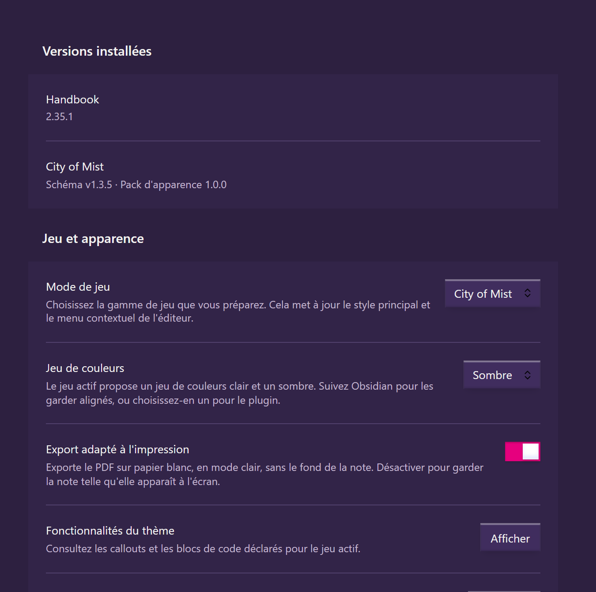
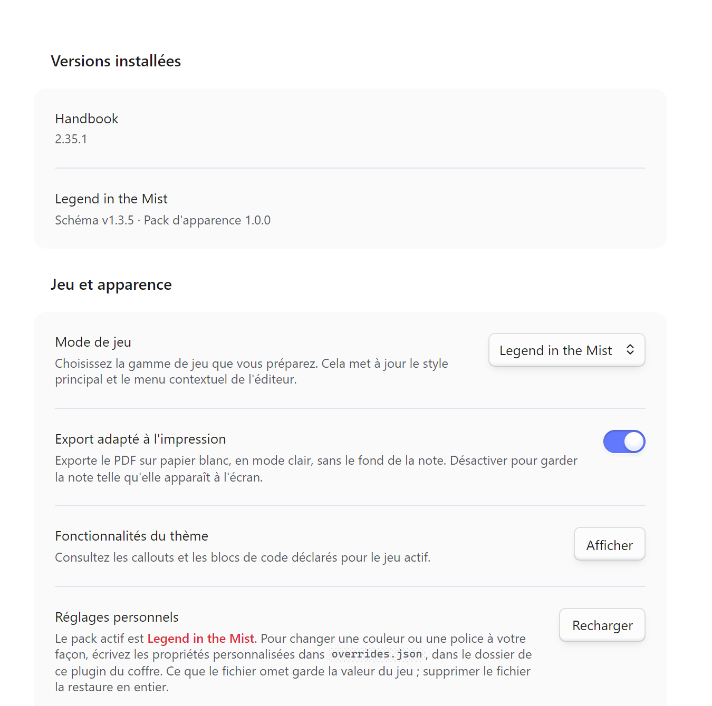
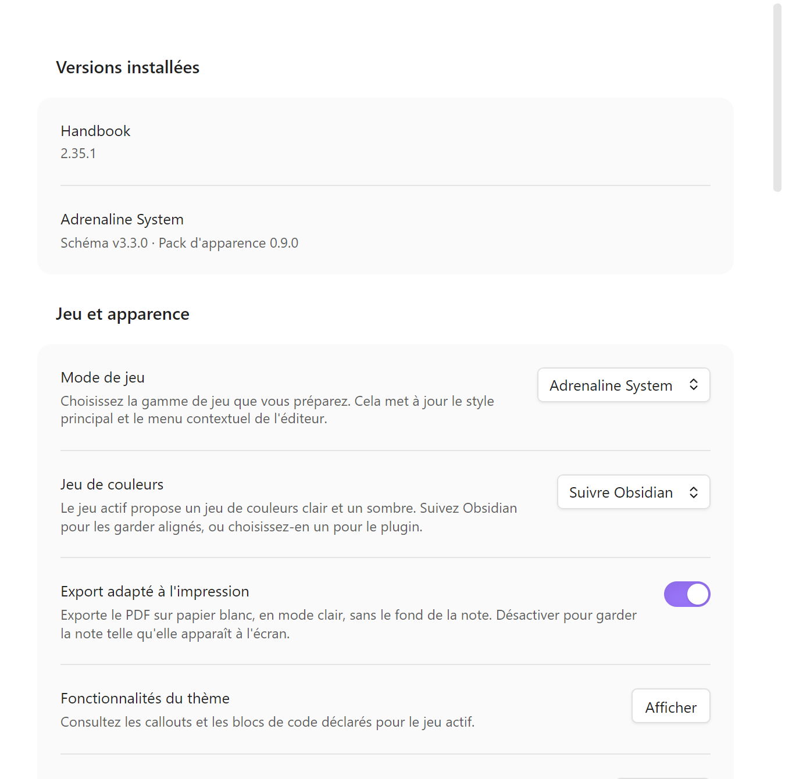
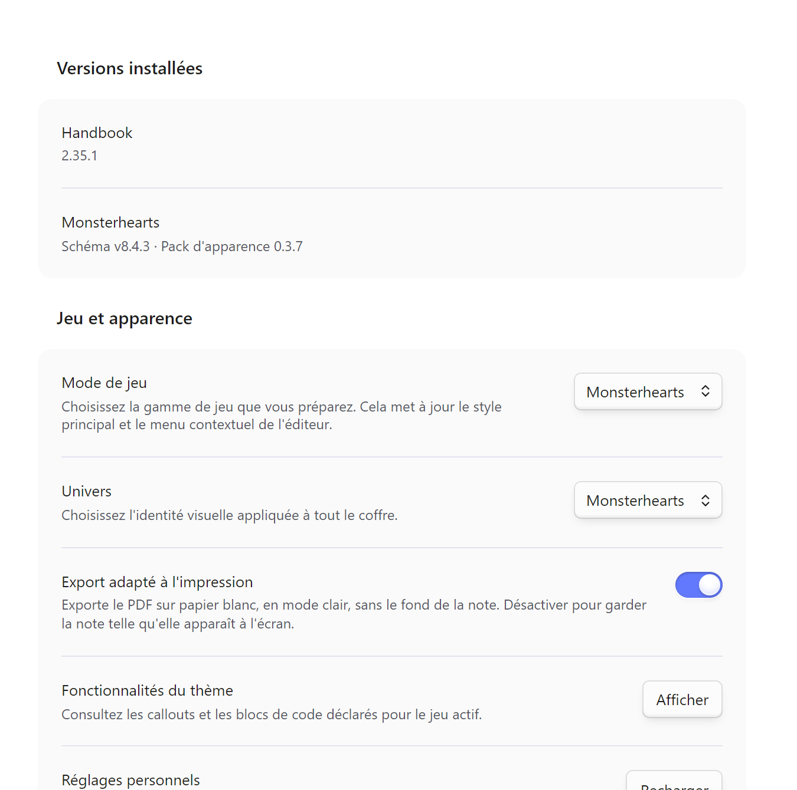

# Handbook

**Français** · [English](#english)

*Plugin [Obsidian](https://obsidian.md/) qui installe les styles et les blocs d'un jeu de rôle depuis des packs publics, sans thème ni plugin de réglages supplémentaire.*

## Aperçu

Les réglages Handbook, ici pour City of Mist, Legend in the Mist, Adrenaline System et Monsterhearts :

| City of Mist | Legend in the Mist |
| --- | --- |
|  |  |
| **Adrenaline System** | **Monsterhearts** |
|  |  |

## État du projet

Alpha. Version actuelle : 2.35.1 (voir le [journal des changements](CHANGELOG.md)). **Prochaine étape :** stabiliser toutes les fonctionnalités core.

- *Fonctionne aujourd'hui :* installation de packs depuis des dépôts de schémas (City of Mist, Legend in the Mist, :Otherscape, Adrenaline System, packs PbtA) ; régions en colonnes ; sections de mode forcé (`<!-- handbook-mode: alternate -->`) ; export PDF sur papier blanc, réglage `printerFriendly` activé par défaut
- *Limites connues :* dans une note en colonnes, la bande d'une section de mode forcé s'arrête au texte, élargi d'une demi-gouttière, et n'atteint pas le bord de la page ; les sections de mode restent unies tant que les packs ne publient pas de texture

## Pourquoi

- **Les packs portent le jeu** : contrats, couleurs et polices viennent des dépôts de schémas, pas du plugin. Handbook gère l'installation, les réglages et le rendu.
- **Un seul élément de style** : le plugin écrit ses variables dans un unique `<style>`. Style Settings et le thème Border ne sont plus des prérequis.
- **Réglages repris de Brumes** : Handbook est issu de [Brumes](https://github.com/4rtamis/obsidian-brumes) et conserve les noms des réglages, ce qui permet de reprendre un coffre existant.

Pertinent si tu écris tes notes de campagne dans Obsidian pour l'un de ces jeux. Probablement pas si tu cherches un outil de table virtuelle.

## Prérequis

- Obsidian 1.12.7 ou plus récent
- Le plugin communautaire [BRAT](https://github.com/TfTHacker/obsidian42-brat)

## Démarrage rapide

1. Active les plugins communautaires d'Obsidian et installe BRAT.
2. Dans BRAT, ajoute `RebelliousSmile/obsidian-handbook`, puis active **Handbook**.
3. Choisis un jeu au premier démarrage. Pour en ajouter un, ouvre **Réglages → Handbook → Schema sources → Add source**.

Le [guide d'installation](https://github.com/RebelliousSmile/obsidian-handbook/wiki/Getting-Started-FR) détaille les sources, les réglages, les illustrations et les personnalisations locales.

## Documentation

| Sujet | Français | English |
| --- | --- | --- |
| Installation et réglages | [Démarrer](https://github.com/RebelliousSmile/obsidian-handbook/wiki/Getting-Started-FR) | [Getting started](https://github.com/RebelliousSmile/obsidian-handbook/wiki/Getting-Started-EN) |
| Tags, callouts, régions et fiches | [Écrire des notes](https://github.com/RebelliousSmile/obsidian-handbook/wiki/Writing-Notes-FR) | [Writing notes](https://github.com/RebelliousSmile/obsidian-handbook/wiki/Writing-Notes-EN) |
| Exemples de fiches Mist | [Fiches Mist](https://github.com/RebelliousSmile/obsidian-handbook/wiki/Mist-Blocks-FR) | [Mist sheets](https://github.com/RebelliousSmile/obsidian-handbook/wiki/Mist-Blocks-EN) |
| Exemples de fiches Adrenaline | [Fiches Adrenaline](https://github.com/RebelliousSmile/obsidian-handbook/wiki/Adrenaline-Sheets-FR) | [Adrenaline sheets](https://github.com/RebelliousSmile/obsidian-handbook/wiki/Adrenaline-Sheets-EN) |
| Packs et contrats | [Packs et architecture](https://github.com/RebelliousSmile/obsidian-handbook/wiki/Packs-and-Architecture-FR) | [Packs and architecture](https://github.com/RebelliousSmile/obsidian-handbook/wiki/Packs-and-Architecture-EN) |
| Adoption des schémas PbtA, Adrenaline et Mist | [Train de release](https://github.com/RebelliousSmile/obsidian-handbook/wiki/Release-Train-FR) | [Release train](https://github.com/RebelliousSmile/obsidian-handbook/wiki/Release-Train-EN) |

Le [wiki complet](https://github.com/RebelliousSmile/obsidian-handbook/wiki) contient les tutoriels dans les deux langues.

## Contribuer

`pnpm supervise` coordonne une correction qui traverse Handbook, Lantern et les trois dépôts de schémas : il suit les issues liées, présente les preuves, publie les fournisseurs pas à pas, vérifie la convergence des consommateurs, publie leurs releases et ferme les issues sur preuves. Une seule commande, `ship`, enchaîne le tout ; rien n'est publié sans une présentation verte. Voir le [guide du superviseur](doc/supervisor.fr.md).

## Migration des anciens packs

Avant une première mise à jour depuis une version antérieure à 2.7.0, copie tes packs personnels et `overrides.json` hors du dossier du plugin, vers `<configDir>/handbook/packs/` et `<configDir>/handbook/overrides.json`. Un programme de mise à jour peut effacer l'ancien dossier avant que Handbook puisse le migrer. Avec la configuration Obsidian habituelle, `<configDir>` vaut `.obsidian`.

## Licence

Le code du plugin est sous [licence MIT](LICENSE) : Brumes par 4rtamis, modifications par François-Xavier Guillois. Les polices ne sont plus embarquées dans le plugin : chaque pack de jeu publie les siennes, et [`licenses/fonts`](licenses/fonts) conserve leurs licences d'origine. Les illustrations des jeux proviennent du coffre et des packs déclarés. L'usage d'assets dérivés de Son of Oak fait encore l'objet de discussions.

## English

*An [Obsidian](https://obsidian.md/) plugin that installs a tabletop game's styles and blocks from public packs, with no extra theme or settings plugin.*

### Preview

Handbook settings, shown for City of Mist, Legend in the Mist, Adrenaline System and Monsterhearts: see the [images above](#aperçu) (the screenshots show the French interface).

### Project status

Alpha. Current version: 2.35.1 (see the [changelog](CHANGELOG.md)). **Next step:** stabilize all core features.

- *Works today:* installing packs from schema repositories (City of Mist, Legend in the Mist, :Otherscape, Adrenaline System, PbtA packs); column regions; forced mode sections (`<!-- handbook-mode: alternate -->`); PDF export on white paper, with the `printerFriendly` setting on by default
- *Known limits:* in a column note, the band of a forced mode section stops at the text, widened by half a gutter, and does not reach the page edge; mode sections stay flat until packs publish a texture

### Why

- **Packs carry the game**: contracts, colours and fonts come from the schema repositories, not from the plugin. Handbook handles installation, settings and rendering.
- **A single style element**: the plugin writes its variables into one `<style>`. Style Settings and the Border theme are no longer prerequisites.
- **Brumes settings kept**: Handbook began as a fork of [Brumes](https://github.com/4rtamis/obsidian-brumes) and retains its settings keys, so an existing vault can migrate.

Relevant if you write campaign notes in Obsidian for one of these games. Probably not if you want a virtual tabletop.

### Requirements

- Obsidian 1.12.7 or later
- The community plugin [BRAT](https://github.com/TfTHacker/obsidian42-brat)

### Quick start

1. Enable Obsidian Community plugins and install BRAT.
2. Add `RebelliousSmile/obsidian-handbook` in BRAT, then enable **Handbook**.
3. Choose a game on first launch. To add another, open **Settings → Handbook → Schema sources → Add source**.

The [getting started guide](https://github.com/RebelliousSmile/obsidian-handbook/wiki/Getting-Started-EN) covers sources, settings, illustrations and local customization. The [documentation table](#documentation) links every guide in both languages, including the schema release train for PbtA, Adrenaline and Mist.

### Contributing

`pnpm supervise` coordinates a correction that spans Handbook, Lantern and the three schema repositories: it tracks the linked issues, presents the evidence, publishes the providers step by step, checks that the consumers converged, publishes their releases and closes the issues on evidence. A single command, `ship`, chains it all; nothing is published without a green presentation. See the [supervisor guide](doc/supervisor.en.md).

### Legacy pack migration

Before first updating from a version older than 2.7.0, copy personal packs and `overrides.json` out of the plugin folder into `<configDir>/handbook/packs/` and `<configDir>/handbook/overrides.json`. An updater may remove the old folder before Handbook can migrate it. With the usual Obsidian configuration, `<configDir>` is `.obsidian`.

### License

Plugin code is [MIT licensed](LICENSE): Brumes by 4rtamis, modifications by François-Xavier Guillois. Fonts are no longer bundled in the plugin: each game pack publishes its own, and [`licenses/fonts`](licenses/fonts) keeps their original licenses. Game illustrations come from the vault and declared packs. Use of Son of Oak-derived assets is still under discussion.
