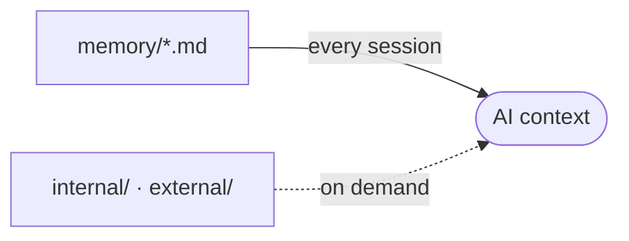

# memory/ - Project Memory

Structured context the AI assistant reads at the start of a session, so it does not rediscover the project each time.

## How it loads

The root files load every session through the project memory block in each AI context file. `internal/` and `external/` load only when relevant.

## Files

Refreshed automatically by the memory hook. Do not edit by hand.

<!-- files:start -->

Read on demand:

- [aidd_docs/memory/internal/assertion-harnesses.md](aidd_docs/memory/internal/assertion-harnesses.md)
- [aidd_docs/memory/internal/ci-and-release.md](aidd_docs/memory/internal/ci-and-release.md)
- [aidd_docs/memory/internal/decisions/forced-mode-section-paints-a-flat-paper.md](aidd_docs/memory/internal/decisions/forced-mode-section-paints-a-flat-paper.md)
- [aidd_docs/memory/internal/decisions/game-capabilities-are-scoped-by-pack-id.md](aidd_docs/memory/internal/decisions/game-capabilities-are-scoped-by-pack-id.md)
- [aidd_docs/memory/internal/decisions/game-data-survives-plugin-replacement.md](aidd_docs/memory/internal/decisions/game-data-survives-plugin-replacement.md)
- [aidd_docs/memory/internal/decisions/game-schema-ownership-and-release-order.md](aidd_docs/memory/internal/decisions/game-schema-ownership-and-release-order.md)
- [aidd_docs/memory/internal/decisions/print-export-joins-blocks-by-rank.md](aidd_docs/memory/internal/decisions/print-export-joins-blocks-by-rank.md)
- [aidd_docs/memory/internal/decisions/rendered-context-actions-are-local.md](aidd_docs/memory/internal/decisions/rendered-context-actions-are-local.md)
- [aidd_docs/memory/internal/decisions/supervisor-orchestrates-github-builds.md](aidd_docs/memory/internal/decisions/supervisor-orchestrates-github-builds.md)
- [aidd_docs/memory/internal/decisions/upstream-metadata-is-proven-not-imported.md](aidd_docs/memory/internal/decisions/upstream-metadata-is-proven-not-imported.md)
- [aidd_docs/memory/internal/game-packs.md](aidd_docs/memory/internal/game-packs.md)
- [aidd_docs/memory/internal/pbta-coverage.md](aidd_docs/memory/internal/pbta-coverage.md)
- [aidd_docs/memory/internal/supervisor-windows.md](aidd_docs/memory/internal/supervisor-windows.md)
- [aidd_docs/memory/external/obsidian-theme-development.md](aidd_docs/memory/external/obsidian-theme-development.md)
<!-- files:end -->

## Maintaining it

The AI writes and refreshes these files. When you edit one by hand:

- One file per concern (architecture, database, vcs, ...).
- Capture the macro and the non-derivable. Point to the code, never copy it.
- Current state only, kept small. No personal notes, no future TODOs.

## Subdirectories

- `internal/`: AIDD workflow traces (the capability profile, audit notes, learn captures).
- `external/`: external references the project pulls in (specs, design docs).
