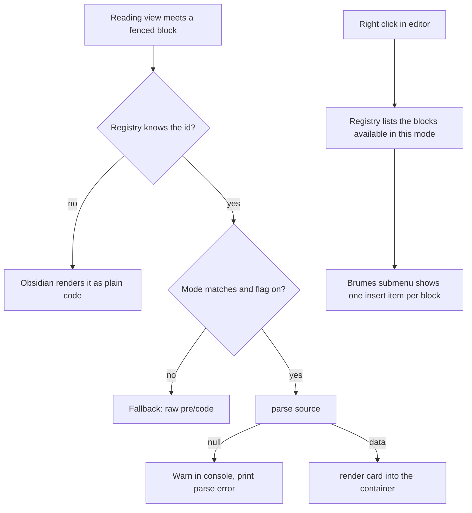

<!-- Fill or omit these sections; never add, rename, or reorder one. -->

# Instruction: Block registry

## Architecture projection

> Tree of the final files. ✅ create · ✏️ modify · ❌ delete

```txt
.
├── src
│   ├── BrumesPlugin.ts                      ✏️ call loadBrumesBlocks instead of loadStoryThemesFeature
│   ├── contextMenu
│   │   └── index.ts                          ✏️ drive the story-theme entry from the registry
│   ├── features
│   │   ├── blocks
│   │   │   ├── types.ts                      ✅ BrumesBlock<T> contract
│   │   │   ├── registry.ts                   ✅ block list, loader, context-menu contributor
│   │   │   ├── fallback.ts                   ✅ raw <pre><code> output when a block is off
│   │   │   ├── themebooks.ts                 ✅ themebook table, neutral of any one block
│   │   │   └── tagSpan.ts                    ✅ classifyTag to a styled span, shared by every card
│   │   └── storyThemes
│   │       ├── block.ts                      ✅ story-theme definition (parser + renderer + template)
│   │       ├── renderer.ts                   ✏️ tag spans built through tagSpan.ts
│   │       ├── index.ts                      ❌ replaced by block.ts
│   │       └── contextMenu.ts                ❌ template moves to block.ts, themebooks to blocks/
│   └── settings
│       └── types.ts                          ✏️ normalizeSettings reads a defaults table
```

## User Journey



## Tasks to do

### `1)` Define the block contract

> One type that carries everything a fenced block needs.

1. Create `src/features/blocks/types.ts` with `BrumesBlock<T>`: `id`, optional `aliases`, `mode: BrumesMode`, `flag: keyof BrumesFeatureSettings`, `label`, `icon`, `parse(source): T | null`, `render(data, doc): HTMLElement`, `template(): string`.
2. Add `isBlockEnabled(block, settings)`: mode matches and the flag is on.

### `2)` Extract the fallback renderer

> The disabled-block path is identical for every format.

1. Create `src/features/blocks/fallback.ts` exporting `renderRawBlock(source, el, language)`, built with `doc.createElement` only, no `innerHTML`.
2. Reuse the exact markup the story-theme processor emits today: `<pre><code class="language-<id>">`.

### `3)` Extract the shared tag span

> Every card is made of tags, and the styles read attributes the story-theme renderer never sets.

1. Create `src/features/blocks/tagSpan.ts` exporting `renderTagSpan(content, doc)`, calling `classifyTag` from `src/features/tags/classifyTag.ts`.
2. Set the attributes the stylesheet reads, exactly as `src/features/tags/postProcessor.ts` does: `dataset.statusName` and `dataset.statusValue` for a status, `dataset.limitName` and `dataset.limitValue` for a limit, `dataset.name` otherwise, plus `brumes-tag` and the classifier's `className`.
3. Export `renderRatedLimit(name, rating, doc)` building the `name:rating` string `classifyTag` expects, so a parser holding a name and a rating separately never has to know the syntax.
4. Rebuild the story-theme renderer's tag spans on top of it, keeping the emitted DOM identical for power and weakness tags.

### `4)` Build the registry

> One list, two consumers.

1. Create `src/features/blocks/registry.ts` holding `BRUMES_BLOCKS: BrumesBlock<unknown>[]`.
2. Export `loadBrumesBlocks(plugin)`: for each block and each of its ids, call `registerMarkdownCodeBlockProcessor`; disabled or mode-mismatched goes to the fallback, `parse` returning null logs a scoped warning and prints the parse error, otherwise append `render`.
3. Export `hasBlockInsertions(settings)` and `contributeBlockInsertions(menu, editor, settings)` returning the number of items added.

### `5)` Migrate story-theme onto the registry

> Same output, new plumbing.

1. Create `src/features/storyThemes/block.ts` exporting the definition, with the template function moved in from `contextMenu.ts`.
2. Move `THEMEBOOKS` to `src/features/blocks/themebooks.ts` and import it, so a later block can share it without depending on this folder.
3. Delete `src/features/storyThemes/index.ts` and `src/features/storyThemes/contextMenu.ts`.
4. Register the definition in `BRUMES_BLOCKS`.

### `6)` Rewire the callers

> Two files stop knowing about story themes.

1. In `src/BrumesPlugin.ts`, replace the `loadStoryThemesFeature` import and call with `loadBrumesBlocks`.
2. In `src/contextMenu/index.ts`, replace the story-theme import pair with `hasBlockInsertions` / `contributeBlockInsertions`, keeping the separator rule.

### `7)` Table-drive the settings normalizer

> Adding a flag must stop meaning adding a block of code.

1. In `src/settings/types.ts`, replace the per-flag `typeof … === "boolean"` blocks with a loop over the keys of `DEFAULT_SETTINGS.features`.
2. Keep `BrumesFeatureSettings` a flat interface of booleans so existing `data.json` values survive.

## Test acceptance criteria

| Task | Acceptance criteria                                                                                                                       |
| ---- | ------------------------------------------------------------------------------------------------------------------------------------------- |
| 1    | `BrumesBlock<T>` compiles under `tsc -noEmit` and a definition missing `parse` or `render` is a type error.                                 |
| 2    | A disabled block shows the same raw code output in reading view as before the refactor.                                                     |
| 3    | `renderTagSpan("distrustful-2", doc)` emits `data-status-name` and `data-status-value`, and `renderRatedLimit("Convince", "2", doc)` emits `data-limit-name` and `data-limit-value`. |
| 3    | A story-theme card rendered through `tagSpan.ts` has the same DOM as on `master`, attribute for attribute.                                   |
| 4    | Registering a second block id requires only appending to `BRUMES_BLOCKS`, no edit to the plugin entry or the context menu.                   |
| 5    | A `story-theme` block renders the same card, with the same classes and the same tag order, as on `master`.                                   |
| 6    | The Brumes submenu still shows Story theme in Legend in the Mist mode and hides it in the other two, separators unchanged.                   |
| 7    | A `data.json` holding `features.storyThemeParser: false` still loads with the parser off, and an absent key still falls back to the default. |
| 7    | `pnpm lint` and `pnpm build` both pass, and the diff carries no `dist/` file.                                             |
