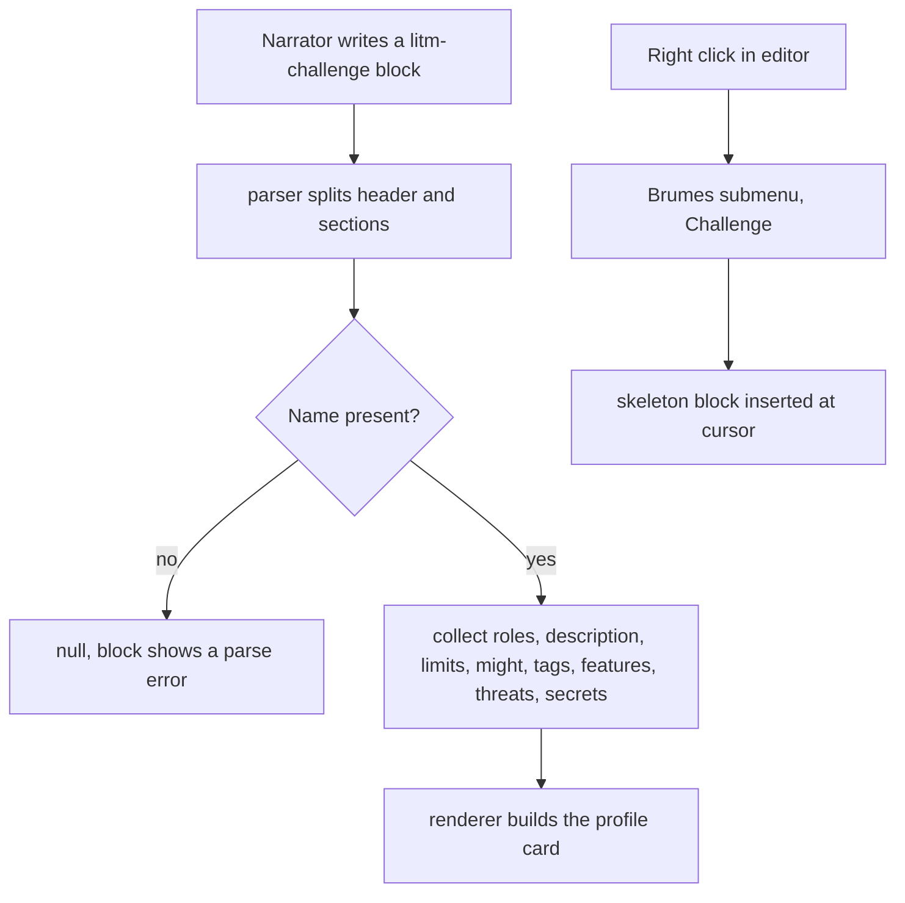

<!-- Fill or omit these sections; never add, rename, or reorder one. -->

# Instruction: Challenge block

## Architecture projection

> Tree of the final files. ✅ create · ✏️ modify · ❌ delete

```txt
.
├── README.md                                 ✏️ document the litm-challenge grammar
├── src
│   ├── features
│   │   ├── blocks
│   │   │   └── registry.ts                   ✏️ register the challenge definition
│   │   └── challenges
│   │       ├── parser.ts                     ✅ section grammar to ChallengeData
│   │       ├── renderer.ts                   ✅ ChallengeData to a profile card
│   │       └── block.ts                      ✅ definition and insertion template
│   ├── settings
│   │   ├── types.ts                          ✏️ add features.challengeParser
│   │   └── index.ts                          ✏️ add the Challenge parser toggle
│   └── styles
│       └── legend-in-the-mist
│           ├── _challenges.scss              ✅ profile card styles
│           └── index.scss                    ✏️ @use and @include the new partial
```

## User Journey



## Wireframe

```txt
┌──────────────────────────────────────────────┐
│ (1) CHALLENGE NAME            (2) roles      │
├──────────────────────────────────────────────┤
│ (3) description paragraph                    │
├────────────────────────┬─────────────────────┤
│ (4) LIMITS             │ (7) THREATS &       │
│   NAME  n              │     CONSEQUENCES    │
│   NAME  n              │  (8) THREAT · desc  │
│     └ progress line    │      · consequence  │
├────────────────────────┤      · consequence  │
│ (5) MIGHT              │  (8) THREAT · desc  │
│   aspect (vuln)        │      · consequence  │
├────────────────────────┤                     │
│ (6) TAGS & STATUSES    │                     │
│   [tag] tag status-2   │                     │
├────────────────────────┤                     │
│ (9) SPECIAL FEATURES   │                     │
│   NAME · effect        │                     │
├────────────────────────┴─────────────────────┤
│ (10) SECRETS · label: text                   │
└──────────────────────────────────────────────┘
```

1. Name: the challenge title, always present.
2. Roles: the comma-separated role list from the `roles:` line, omitted when absent.
3. Description: the `:` prefixed prose lines.
4. Limits: one row per limit, name and rating, a progress limit carrying its consequence underneath.
5. Might: aspect with its vulnerability in parentheses, omitted when absent.
6. Tags and statuses: inline tag run, built through the shared tag-span helper.
7. Threats column: the whole THREATS section.
8. Threat: its name, its trigger line, then its consequence list.
9. Special features: name and effect pairs, omitted when absent.
10. Secrets: label and text pairs, full width, omitted when absent.

## Tasks to do

### `1)` Parse the challenge grammar

> Section keywords drive a small state machine.

1. Create `src/features/challenges/parser.ts` with `ChallengeData`: `name`, `roles: string[]`, `description: string[]`, `limits: {name, rating, consequence?}[]`, `might?: {aspect, vulnerability?}`, `tags: string[]`, `features: {name, effect}[]`, `threats: {name, trigger?, consequences: string[]}[]`, `secrets: {label, text}[]`.
2. Read the header: first non-empty line is the name, an optional `roles:` line, then `:` prefixed description lines.
3. Switch section on the uppercase keywords `LIMITS`, `MIGHT`, `TAGS`, `FEATURES`, `THREATS`, `SECRETS`; ignore an unknown keyword rather than failing.
4. Split a line on ` > ` into subject and consequence, and a threat line on ` : ` into name and trigger.
5. Read a limit line as a name followed by its rating, `Convince 2`, and keep the two apart in `ChallengeData`; the renderer, not the parser, rebuilds the `name:rating` string `classifyTag` expects.
6. Return null when the name is missing or no section was recognised.

### `2)` Render the profile card

> DOM API only, no `innerHTML`, per the lint rules.

1. Create `src/features/challenges/renderer.ts` emitting `div.brumes-challenge` with one `section.brumes-challenge--<section>` per filled section, and omitting empty ones.
2. Build every tag through `renderTagSpan` and every limit through `renderRatedLimit`, both from `src/features/blocks/tagSpan.ts`, so statuses keep their tier and limits keep their value.
3. Never build a tag span by hand here: the `data-status-*` and `data-limit-*` attributes the stylesheet reads live in one module.

### `3)` Wire the block

> One definition, one flag, one toggle.

1. Create `src/features/challenges/block.ts` with id `litm-challenge`, mode `legend-in-the-mist`, flag `challengeParser`, and a template holding one line per section.
2. Add `challengeParser: true` to `BrumesFeatureSettings` and `DEFAULT_SETTINGS.features`.
3. Add the toggle to `renderLegendInTheMistSettings`, disabled outside the mode, saving with `refreshMarkdown: true`.
4. Append the definition to `BRUMES_BLOCKS`.

### `4)` Style the card

> A partial in the Legend in the Mist bundle.

1. Create `src/styles/legend-in-the-mist/_challenges.scss` exporting a `global` mixin: two columns above a stated width, one column below, section headings in the theme header font.
2. Add `@use "./challenges";` and `@include challenges.global;` inside `.brumes--legend-in-the-mist`.

### `5)` Document the grammar

> The README lists the blocks a user can write.

1. Add a `litm-challenge` section next to the existing story-theme one, with the Crafty Rumormonger example.
2. Treat that example as the canonical input: every acceptance check below is run by pasting it into a vault note, so there is one text to keep true and not two.

## Test acceptance criteria

| Task | Acceptance criteria                                                                                                       |
| ---- | --------------------------------------------------------------------------------------------------------------------------- |
| 1    | The README example of task 5 parses into three limits, one of them carrying a progress consequence, and three threats.       |
| 1    | A block whose first line is missing renders the parse error instead of an empty card.                                       |
| 2    | A challenge without MIGHT, FEATURES or SECRETS renders with those sections absent from the DOM, not empty.                  |
| 2    | `Undermine Community 4` renders as a limit span carrying `data-limit-name` and `data-limit-value="4"`, and `distrustful-2` as a status span carrying its tier. |
| 3    | Turning the Challenge parser toggle off shows the raw code block, and back on re-renders the card without a vault reload.   |
| 3    | The Brumes submenu shows Challenge only in Legend in the Mist mode, and inserting it produces a block that parses.          |
| 4    | The card holds two columns on a wide note and one on a narrow one, with no horizontal scroll on the page.                   |
| 4    | `dist/styles.css` grows by less than 20 KB, the partial carrying no inlined raster or SVG data URI.                         |
| 5    | The README example, pasted into a vault note, renders the card shown in the wireframe.                                      |
| 5    | `pnpm lint` and `pnpm build` both pass, and the diff carries no `dist/` file.                                          |
