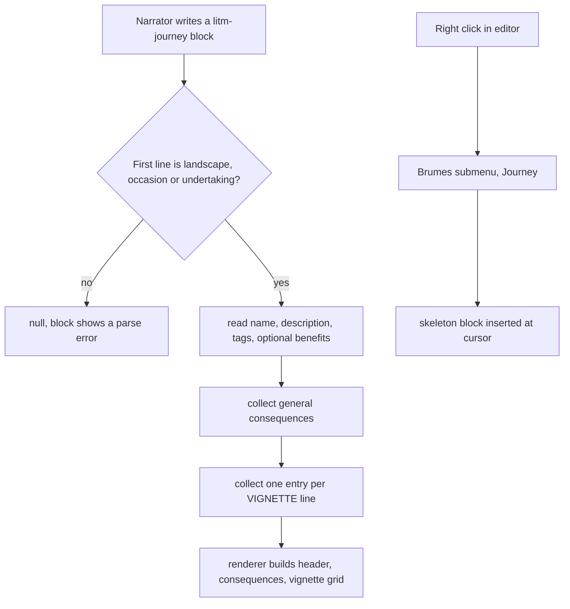

<!-- Fill or omit these sections; never add, rename, or reorder one. -->

# Instruction: Journey block

## Architecture projection

> Tree of the final files. ✅ create · ✏️ modify · ❌ delete

```txt
.
├── README.md                                 ✏️ document the litm-journey grammar
├── src
│   ├── features
│   │   ├── blocks
│   │   │   └── registry.ts                   ✏️ register the journey definition
│   │   └── journeys
│   │       ├── parser.ts                     ✅ type, header, consequences, vignettes
│   │       ├── renderer.ts                   ✅ JourneyData to a journey sheet
│   │       └── block.ts                      ✅ definition and insertion template
│   ├── settings
│   │   ├── types.ts                          ✏️ add features.journeyParser
│   │   └── index.ts                          ✏️ add the Journey parser toggle
│   └── styles
│       └── legend-in-the-mist
│           ├── _journeys.scss                ✅ journey sheet and vignette grid
│           └── index.scss                    ✏️ @use and @include the new partial
```

## User Journey



## Wireframe

```txt
┌──────────────────────────────────────────────┐
│ (1) Journey - TYPE                           │
│ (2) JOURNEY NAME                             │
├──────────────────────────────────────────────┤
│ (3) description paragraph                    │
│ (4) Tags: tag, tag, tag                      │
│ (5) Suggested benefits: text                 │
├──────────────────────────────────────────────┤
│ (6) GENERAL CONSEQUENCES                     │
│   · consequence (effect)                     │
│   · consequence (effect)                     │
├───────────────────────┬──────────────────────┤
│ (7) VIGNETTE NAME     │ (7) VIGNETTE NAME    │
│  (8) trigger text     │  (8) trigger text    │
│   · consequence       │   · consequence      │
│   · consequence       │   · consequence      │
├───────────────────────┼──────────────────────┤
│ (7) VIGNETTE NAME     │ (7) VIGNETTE NAME    │
│  (8) trigger text     │  (8) trigger text    │
└───────────────────────┴──────────────────────┘
```

1. Type: the journey kind, rendered as the card kicker.
2. Name: the journey title.
3. Description: the `:` prefixed prose lines.
4. Tags: the `tags:` line, split on commas, rendered as tag spans.
5. Benefits: the `benefits:` line, present on Undertaking journeys only.
6. General consequences: the shared consequence list, drawn once above the grid.
7. Vignette: one card per `VIGNETTE` line, laid out in a responsive grid.
8. Trigger: the vignette setup line, then its own consequence list.

## Tasks to do

### `1)` Parse the journey grammar

> The type line is the discriminator.

1. Create `src/features/journeys/parser.ts` with `JourneyData`: `type: "landscape" | "occasion" | "undertaking"`, `name`, `description: string[]`, `tags: string[]`, `benefits?`, `consequences: string[]`, `vignettes: {name, trigger?, consequences: string[]}[]`.
2. Accept the type case-insensitively, on its own line or prefixed by `Journey - `.
3. Read `tags:` and `benefits:` as key lines, and `CONSEQUENCES` as a section keyword.
4. Start a vignette on a `VIGNETTE ` line, splitting name and trigger on ` : `; `>` lines attach to the open vignette, or to the general list before the first one.
5. Return null when the type or the name is missing.

### `2)` Render the journey sheet

> Header, shared consequences, then the vignette grid.

1. Create `src/features/journeys/renderer.ts` emitting `div.brumes-journey.brumes-journey--<type>`.
2. Render the benefits line only when present, so Landscape and Occasion sheets carry no empty slot.
3. Build the `tags:` entries through `renderTagSpan` from `src/features/blocks/tagSpan.ts`, so a tiered status written in a journey keeps its tier.

### `3)` Wire the block

> Same three touch points as the challenge.

1. Create `src/features/journeys/block.ts` with id `litm-journey`, flag `journeyParser`, and a template carrying the type, a `tags:` line, a `CONSEQUENCES` section and one `VIGNETTE` entry.
2. Add `journeyParser: true` to `BrumesFeatureSettings` and `DEFAULT_SETTINGS.features`.
3. Add the toggle to `renderLegendInTheMistSettings` and append the definition to `BRUMES_BLOCKS`.

### `4)` Style the sheet

> The vignette grid is the whole layout problem.

1. Create `src/styles/legend-in-the-mist/_journeys.scss` with a `global` mixin: `repeat(auto-fit, minmax(…, 1fr))` for the vignettes, one column on a narrow note.
2. Give each type its own accent through a modifier class rather than three copies of the block.
3. Add the `@use` and the `@include` to `index.scss`.

### `5)` Document the grammar

> Three types, one example.

1. Add a `litm-journey` README section with the Blood and Water Feud occasion as the example, noting that `benefits:` applies to Undertaking journeys.
2. Treat that example as the canonical input: every acceptance check below is run by pasting it into a vault note.

## Test acceptance criteria

| Task | Acceptance criteria                                                                                                         |
| ---- | ----------------------------------------------------------------------------------------------------------------------------- |
| 1    | The README example of task 5, Blood and Water Feud, parses into four general consequences and six vignettes.                 |
| 1    | A block whose first line is not one of the three types renders the parse error.                                              |
| 2    | A Landscape journey renders with no benefits line in the DOM, and an Undertaking renders one.                                |
| 2    | Consequences written before the first `VIGNETTE` land in the general list, not in a vignette.                                |
| 3    | The Journey toggle shows and hides the sheet without a vault reload, and the submenu entry inserts a block that parses.       |
| 4    | The vignette grid reflows to one column on a narrow note with no horizontal scroll.                                           |
| 4    | `dist/styles.css` grows by less than 20 KB, the partial carrying no inlined raster or SVG data URI.                           |
| 5    | The README example renders the sheet shown in the wireframe.                                                                 |
| 5    | `pnpm lint` and `pnpm build` both pass, and the diff carries no `dist/` file.                                            |
