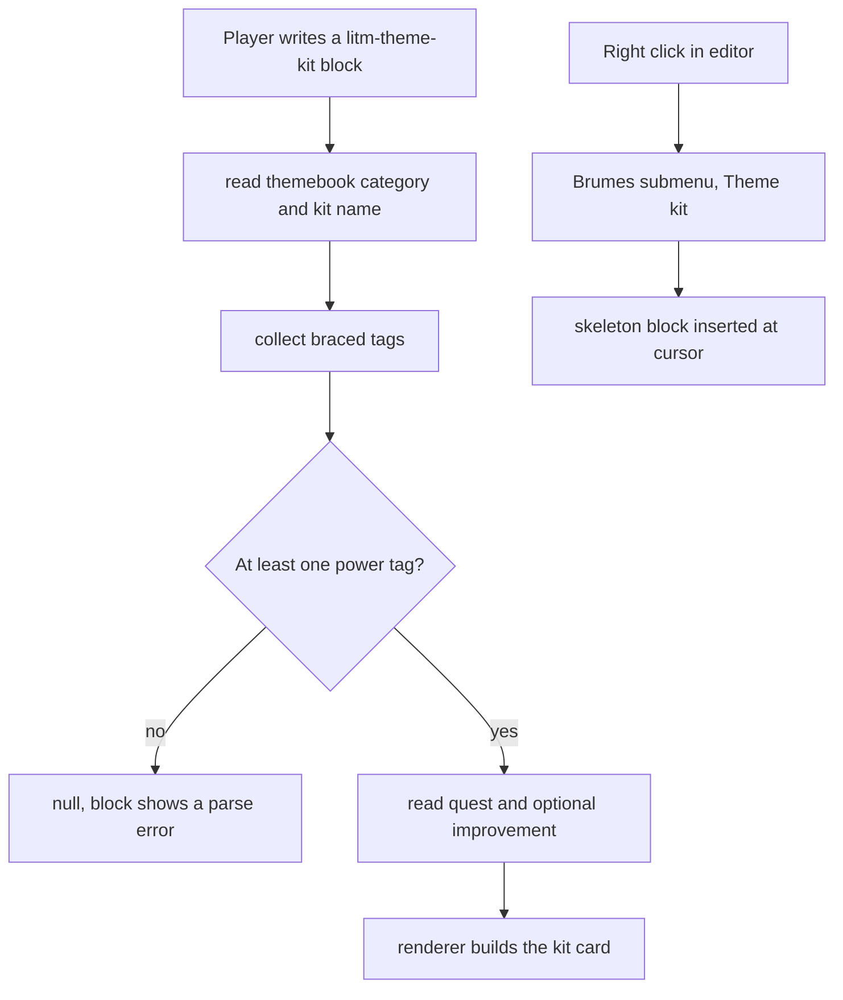

<!-- Fill or omit these sections; never add, rename, or reorder one. -->

# Instruction: Theme kit block

## Architecture projection

> Tree of the final files. ✅ create · ✏️ modify · ❌ delete

```txt
.
├── README.md                                 ✏️ document the litm-theme-kit grammar
├── src
│   ├── features
│   │   ├── blocks
│   │   │   └── registry.ts                   ✏️ register the theme kit definition
│   │   └── themeKits
│   │       ├── parser.ts                     ✅ category, name, tags, quest, improvement
│   │       ├── renderer.ts                   ✅ ThemeKitData to a kit card
│   │       └── block.ts                      ✅ definition and insertion template
│   ├── settings
│   │   ├── types.ts                          ✏️ add features.themeKitParser
│   │   └── index.ts                          ✏️ add the Theme kit parser toggle
│   └── styles
│       └── legend-in-the-mist
│           ├── _story-themes.scss            ✏️ expose the shared card frame as a mixin
│           ├── _theme-kits.scss              ✅ kit card styles
│           └── index.scss                    ✏️ @use and @include the new partial
```

## User Journey



## Wireframe

```txt
┌──────────────────────────────┐
│ (1) THEMEBOOK CATEGORY       │
│ (2) Kit name                 │
├──────────────────────────────┤
│ (3) power tag  power tag     │
│     power tag  power tag     │
│     power tag  power tag     │
├──────────────────────────────┤
│ (4) weakness tag             │
│     weakness tag             │
├──────────────────────────────┤
│ (5) Quest sentence           │
├──────────────────────────────┤
│ (6) Improvement name         │
│     effect text              │
└──────────────────────────────┘
```

1. Category: the themebook the kit belongs to, rendered as the card kicker.
2. Name: the kit title.
3. Power tags: the `{tag}` entries, wrapped in reading order.
4. Weakness tags: the `{!tag}` entries.
5. Quest: the `quest:` line, styled apart from the tags.
6. Improvement: the `improvement:` name and effect, omitted when absent.

## Tasks to do

### `1)` Parse the kit grammar

> Close to the story-theme parser, with two key lines added.

1. Create `src/features/themeKits/parser.ts` with `ThemeKitData`: `category?`, `name`, `powerTags: string[]`, `weaknessTags: string[]`, `quest?`, `improvement?: {name, effect}`.
2. Accept a themebook category on the first line, matched case-insensitively against `src/features/blocks/themebooks.ts`, the table phase 1 already moved out of the story-theme block.
3. Take the following non-braced line as the kit name, then collect `{tag}` and `{!tag}` entries, several per line.
4. Read `quest:` and `improvement:` as key lines, splitting the improvement on the first ` > `.
5. Return null when the name is missing or no power tag was found.

### `2)` Render the kit card

> The card is the story-theme card with a quest and an improvement.

1. Create `src/features/themeKits/renderer.ts` emitting `div.brumes-theme-kit`, building every tag through `renderTagSpan` from `src/features/blocks/tagSpan.ts`.
2. Render the improvement block only when present.

### `3)` Wire the block

> Same three touch points as the other formats.

1. Create `src/features/themeKits/block.ts` with id `litm-theme-kit`, flag `themeKitParser`, and a template seeded with a random themebook drawn from `src/features/blocks/themebooks.ts`, as the story-theme template already does.
2. Add the flag, the toggle and the registry entry.

### `4)` Style the card

> Reuse before inventing.

1. In `_story-themes.scss`, extract the frame geometry of `.brumes-story-theme`, its padding, width, `max-width`, background sizing and column layout, into a `frame` mixin that `global` then includes, so the numbers keep living in one file.
2. Create `src/styles/legend-in-the-mist/_theme-kits.scss` with a `global` mixin that `@use`s the story-theme partial and includes `frame` rather than copying it. Phase 5 renames that partial and owns updating this import.
3. Leave the card art out of the mixin: the frame carries geometry only, so the kit does not duplicate the inlined card image, and the kit paints its own surface.
4. Add the `@use` and the `@include` to `index.scss`.

### `5)` Document the grammar

> One example carrying every optional part.

1. Add a `litm-theme-kit` README section using Trial of the Vulture, which holds nine power tags, four weakness tags, a quest and an improvement.
2. Treat that example as the canonical input: every acceptance check below is run by pasting it into a vault note.

## Test acceptance criteria

| Task | Acceptance criteria                                                                                            |
| ---- | ---------------------------------------------------------------------------------------------------------------- |
| 1    | The README example of task 5 parses into nine power tags, four weakness tags, one quest and one improvement.    |
| 1    | A block holding only weakness tags renders the parse error.                                                     |
| 2    | A kit without an improvement renders with no improvement node in the DOM.                                       |
| 3    | The themebook table is still imported from `src/features/blocks/themebooks.ts`, with no second copy in this folder. |
| 3    | The Theme kit toggle shows and hides the rendered card without a vault reload.                                   |
| 4    | The kit card and the story-theme card share the same frame width, padding and border, `_theme-kits.scss` holding no copy of those numbers. |
| 4    | `dist/styles.css` grows by less than 20 KB, the partial carrying no inlined raster or SVG data URI.             |
| 5    | The README example renders the card shown in the wireframe.                                                     |
| 5    | `pnpm lint` and `pnpm build` both pass, and the diff carries no `dist/` file.                              |
