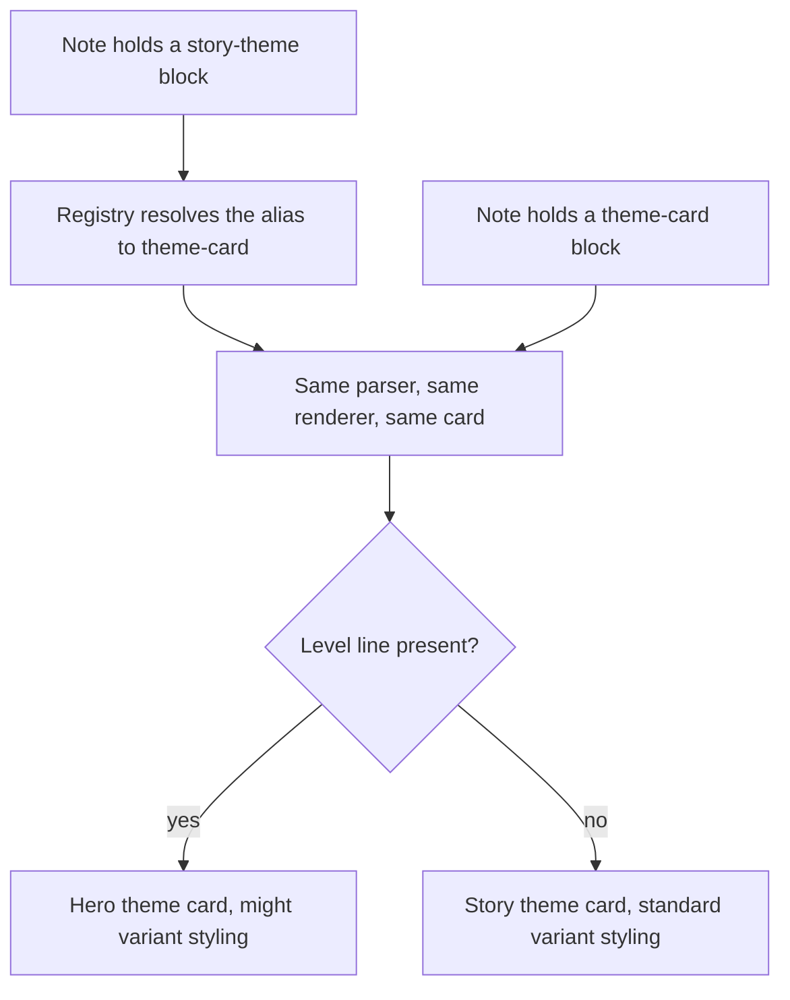

<!-- Fill or omit these sections; never add, rename, or reorder one. -->

# Instruction: Theme card rename

## Architecture projection

> Tree of the final files. ✅ create · ✏️ modify · ❌ delete

```txt
.
├── README.md                                 ✏️ rename the block, document the levelless card
├── src
│   ├── features
│   │   ├── blocks
│   │   │   └── registry.ts                   ✏️ warn once per session on the deprecated id
│   │   └── themeCards                        ✏️ folder renamed from storyThemes
│   ├── settings
│   │   └── index.ts                          ✏️ reword the toggle to Theme card parser
│   └── styles
│       └── legend-in-the-mist
│           ├── _theme-cards.scss             ✏️ renamed from _story-themes.scss, adds the standard variant
│           ├── _theme-kits.scss              ✏️ follow the rename in its @use of the partial
│           └── index.scss                    ✏️ follow the rename in its @use and @include
```

## User Journey



## Wireframe

```txt
┌──────────────────────────────┐      ┌──────────────────────────────┐
│ (1) THEMEBOOK        (2) ◆   │      │                              │
│ (3) Title tag                │      │ (3) Title tag                │
├──────────────────────────────┤      ├──────────────────────────────┤
│ (4) power tag                │      │ (4) power tag                │
│     power tag                │      │     power tag                │
├──────────────────────────────┤      ├──────────────────────────────┤
│ (5) weakness tag             │      │ (5) weakness tag             │
└──────────────────────────────┘      └──────────────────────────────┘
        hero theme                            story theme
```

1. Category: the themebook, present on hero themes only.
2. Might mark: the level badge, present on hero themes only.
3. Title tag: the card title, always present.
4. Power tags: the positive tags.
5. Weakness tags: the negative tags.

## Tasks to do

### `1)` Warn on the deprecated id

> A rename must not break notes already written.

1. The `aliases` field and the per-alias registration already exist from phase 1; add nothing to `src/features/blocks/types.ts`.
2. In `registry.ts`, log a scoped deprecation warning the first time an alias is hit, once per session rather than once per render.

### `2)` Rename the block

> The block renders both a hero theme and a story theme, so the name must cover both.

1. Rename `src/features/storyThemes/` to `src/features/themeCards/`, keeping the parser and renderer logic untouched.
2. Set the definition id to `theme-card` with `aliases: ["story-theme"]`.
3. Keep the `storyThemeParser` settings key as it is, so no saved `data.json` loses its value, and reword only the visible toggle name and description.

### `3)` Style the levelless card

> The standard variant currently falls through to the base class.

1. Rename `_story-themes.scss` to `_theme-cards.scss`, keeping the `frame` mixin phase 4 extracted, and update every `@use` of it in the bundle, `_theme-kits.scss` included, not only the `@use` and `@include` in `index.scss`.
2. Add a `--might-standard` rule that drops the level badge slot and the category colour, so a story theme is not a hero theme missing its parts.

### `4)` Document both objects

> The README is where the naming confusion started.

1. Rename the README section to Theme cards, show a hero theme with a level and a story theme without one.
2. State that `story-theme` still works and names the block that will be dropped.

## Test acceptance criteria

| Task | Acceptance criteria                                                                                                |
| ---- | -------------------------------------------------------------------------------------------------------------------- |
| 1    | A `story-theme` block written before the rename still renders its card, with one deprecation warning for the whole session, not one per note. |
| 2    | A `theme-card` block renders the same DOM as the equivalent `story-theme` block.                                    |
| 2    | A vault whose `data.json` holds `features.storyThemeParser: false` still opens with the parser off.                 |
| 3    | A block with no level line renders without a level badge and without a category slot.                               |
| 4    | The README shows both examples, and each renders the matching card in a vault.                                      |
| 4    | `pnpm lint` and `pnpm build` both pass, sass resolving every `@use` after the rename, and the diff carries no `dist/` file. |
