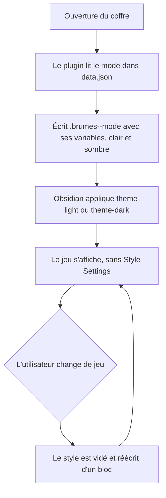

# Instruction: Socle autonome — le plugin écrit ses variables

## Architecture projection

> Tree of the final files. ✅ create · ✏️ modify · ❌ delete

```txt
.
├── src
│   ├── features
│   │   └── modes
│   │       ├── domModeClass.ts        ✏️ inchangé, la liste littérale attend le registre de la phase 2
│   │       └── styleElement.ts        ✅ possède le <style>, l'écrit et le vide
│   ├── settings
│   │   ├── borderPresets.ts           ✏️ ne garde que les snippets Advanced Canvas
│   │   ├── index.ts                   ✏️ retire les boutons de copie de preset, ajoute la note de migration
│   │   └── types.ts                   ✏️ inchangé en surface, sert de point d'ancrage aux valeurs
│   ├── styles
│   │   ├── city-of-mist
│   │   │   └── index.scss             ✏️ les valeurs codées en dur sortent vers le TS
│   │   ├── legend-in-the-mist
│   │   │   └── index.scss             ✏️ idem
│   │   └── _neutralize.scss           ✅ reproduit les neutralisations que Border assurait
│   └── BrumesPlugin.ts                ✏️ applique le style au chargement et à chaque changement de mode
├── themes
│   ├── city-of-mist.settings.json     ❌ valeurs portées en TS
│   └── legend-in-the-mist.settings.json ❌ idem
└── README.md                          ✏️ Style Settings n'est plus un prérequis
```

## User Journey



## Tasks to do

### `1)` L'élément de style possédé

> Un seul point d'écriture, donc un seul point de nettoyage.

1. Créer `styleElement.ts` : `applyGameStyle(vars)` crée ou réutilise un `<style>` identifié, y écrit un unique bloc `.brumes--<mode> { … }` avec ses variantes claire et sombre, remplaçant tout contenu antérieur.
2. Écrire ce `<style>` dans **chaque document ouvert**, pas seulement le principal : Obsidian ouvre des fenêtres détachées avec leur propre `document`, et `domModeClass.ts` utilise déjà `activeDocument` pour cette raison. S'abonner à l'ouverture d'une fenêtre pour y poser le style, et le retirer à sa fermeture.
3. Exposer `removeGameStyle()` pour `onunload`, afin qu'un déchargement du plugin ne laisse rien dans aucun document.
4. Générer les variantes avec les sélecteurs `.theme-light` / `.theme-dark` déjà utilisés par le SCSS existant, pas une media query.
5. Écrire la variante en **sélecteur composé** — `.brumes--<mode>.theme-dark { … }`, jamais `.theme-dark` seul : les deux classes vivent sur le même `body`, à spécificité égale seul l'ordre source trancherait, et rien ne garantit que notre bloc passe après celui du thème actif.
6. Écrire les variables au niveau du `body`, pas sur un conteneur de note : `iceberg.cards` est inclus **hors** du sélecteur de mode pour fonctionner dans le canvas, et ne reçoit ses valeurs que par héritage depuis `body`.

### `2)` Porter les 93 clés traduisibles

> Les valeurs quittent les presets et le SCSS pour un seul endroit.

1. Traduire chaque clé Style Settings retenue vers son nom de variable Obsidian (`Appearance-light@@background-primary@@light` → `--background-primary`, `Editor@@h1-font` → `--h1-font`, etc.).
2. Séparer chaque jeu en deux jeux de valeurs : celles qui habillent la note, celles qui repeignent l'interface. Les secondes ne sont écrites que si `features.workspaceTheme` est actif, sinon le drapeau existant perd son sens.
3. Déplacer les valeurs aujourd'hui codées dans `city-of-mist/index.scss` et `legend-in-the-mist/index.scss` (`--font-text-theme`, `--font-header-theme`, `--h4/h5/h6-font`) vers cette même source, et retirer leur duplication du SCSS.
4. Itérer sur les enregistrements de valeurs avec `for…of` sur les clés — `Object.values` ne compile pas sur la cible ES du dépôt.

### `3)` Restaurer le mode sombre de City of Mist

> Il existait, il a été perdu, il est dans l'historique.

1. Récupérer les valeurs de `4f2258e:theme/CoM_dark.json` (fond `#2a273f`, secondaire `#232136`, tertiaire `#393552`, texte `#E0DEF4`, atténué `#908caa`, estompé `#6e6a86`, accent `#E6007E`).
2. Compléter ce jeu de valeurs pour couvrir les mêmes rôles que la variante claire, plutôt que de s'arrêter aux 10 clés de la v1.
3. Doter Legend in the Mist d'une variante sombre : elle n'en a jamais eu, et un pack sans sombre est incomplet.
4. Vérifier cette variante sur les blocs illustrés : les textures de papier restent claires et embarquées à ce stade, une colorimétrie sombre posée par-dessus peut devenir illisible. Ajuster les jetons de texte plutôt que l'illustration.
5. Vérifier que les quatre blocs `.theme-dark` déjà présents dans le SCSS de City of Mist ne contredisent pas les valeurs écrites.

### `4)` Reprendre les neutralisations qui comptent

> Sans le preset, le thème installé reprend la main sur les décorations.

1. Lister les 32 clés non traduisibles et séparer celles qui éteignaient une décoration Border de celles qui activaient un comportement.
2. Pour les activations, écrire l'équivalent direct : `accent-color-override` devient l'écriture de `--color-accent`, `h1/h2/h3-color-designated` l'écriture des couleurs de titre, `img-center-align` une règle de centrage.
3. Pour les extinctions, écrire dans `_neutralize.scss` seulement celles qui restent visibles sur un thème autre que Border ; laisser tomber celles qui ne parlaient qu'à Border.
4. Vérifier le rendu sur le thème Obsidian par défaut, un jeu à la fois.

### `5)` Retirer le canal Style Settings

> Un chemin, pas deux.

1. Supprimer les deux `themes/*.settings.json` et les imports correspondants dans `borderPresets.ts`, en conservant `ADVANCED_CANVAS_ICEBERG_SNIPPET` et `ADVANCED_CANVAS_MOUNTAIN_SNIPPET` intacts.
2. Retirer de l'onglet de réglages le bouton de copie de preset et sa description mentionnant l'import Style Settings.
3. Y substituer une note courte disant comment retirer les clés devenues orphelines dans Style Settings, pour ceux qui avaient importé un preset.
4. Mettre à jour le README : Style Settings et Border ne sont plus des prérequis.
5. Respecter la sentence case sur toute chaîne d'interface ajoutée, et ne pas y écrire de nom de jeu — la règle de lint le refuse.

## Test acceptance criteria

| Task | Acceptance criteria              |
| ---- | -------------------------------- |
| 1 | Changer de jeu dans les réglages met à jour le rendu sans rechargement, et le style précédent ne laisse aucune règle : basculer City of Mist → Legend in the Mist → City of Mist redonne exactement le premier rendu. |
| 1 | Une note ouverte dans une fenêtre détachée s'affiche avec le même habillage que dans la fenêtre principale, et suit le changement de jeu comme elle. |
| 1 | Désactiver le plugin ne laisse aucun élément de style résiduel dans aucune fenêtre ouverte. |
| 2 | Sur un coffre neuf, sans le plugin Style Settings ni le thème Border installés, un jeu s'affiche avec sa colorimétrie et ses polices complètes. |
| 2 | Désactiver `workspaceTheme` laisse les notes habillées et rend à l'interface son apparence d'origine. |
| 3 | Passer Obsidian en mode sombre avec City of Mist actif donne un fond sombre cohérent et un texte lisible, sans zone restée claire. |
| 3 | Le rendu sombre tient sur un thème tiers installé, pas seulement sur le thème par défaut : la variante sombre l'emporte quel que soit l'ordre de chargement des feuilles. |
| 3 | Le même geste avec Legend in the Mist donne un résultat sombre cohérent, pas le rendu clair sur fond sombre. |
| 3 | En mode sombre, le texte posé sur les illustrations claires de Legend in the Mist reste lisible. |
| 4 | Le rendu d'un jeu sur le thème Obsidian par défaut ne montre ni indicateur de titre parasite, ni case à cocher colorée, ni fond quadrillé. |
| 5 | Le dépôt ne contient plus de fichier `themes/*.settings.json`, l'onglet de réglages n'offre plus de bouton de copie de preset, et les deux boutons de copie de snippet Advanced Canvas fonctionnent toujours. |
| 5 | `rtk proxy pnpm build` passe et `./node_modules/.bin/eslint src --ext .ts` sort à zéro erreur. |
| 5 | Le build est déployé dans les deux coffres de test et le rendu y est vérifié après rechargement, sans écraser leur `data.json`. |
