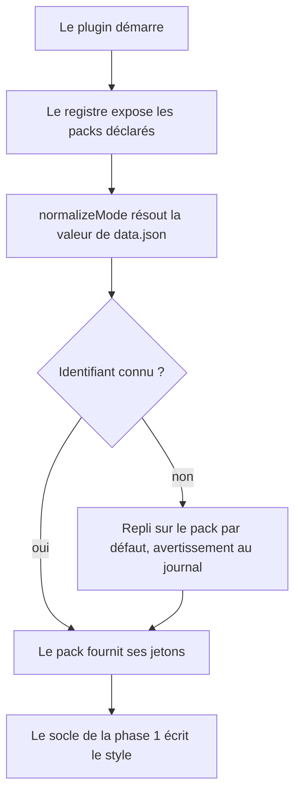

# Instruction: Le jeu devient une donnée — format de pack et registre

## Architecture projection

> Tree of the final files. ✅ create · ✏️ modify · ❌ delete

```txt
.
├── src
│   ├── games
│   │   ├── types.ts                   ✅ la forme d'un pack : identité, jetons, variantes
│   │   ├── registry.ts                ✅ enregistre les packs, résout un identifiant
│   │   ├── city-of-mist.ts            ✅ les valeurs de la phase 1, en pack
│   │   ├── legend-in-the-mist.ts      ✅ idem
│   │   └── otherscape.ts              ✅ pack minimal, étoffé en phase 3
│   ├── features
│   │   └── modes
│   │       └── domModeClass.ts        ✏️ la liste des classes vient du registre
│   ├── settings
│   │   ├── types.ts                   ✏️ BrumesMode devient un identifiant de pack
│   │   └── index.ts                   ✏️ la liste déroulante se construit depuis le registre
│   └── BrumesPlugin.ts                ✏️ résout le pack puis applique ses jetons
└── src/__assert_game_packs.ts         ✅ harnais jetable, supprimé avant build
```

## User Journey



## Wireframe

```txt
┌──────────────────────────────────────────────┐
│ (1) Réglages — Handbook                       │
├──────────────────────────────────────────────┤
│ (2) Jeu                                       │
│     ┌────────────────────────────────┐        │
│     │ [ liste déroulante des packs ] │        │
│     └────────────────────────────────┘        │
│     note courte sur le pack actif              │
├──────────────────────────────────────────────┤
│ (3) Apparence                                 │
│     [x] Repeindre l'interface                 │
├──────────────────────────────────────────────┤
│ (4) Fonctionnalités                           │
│     [x] ... (inchangé)                        │
├──────────────────────────────────────────────┤
│ (5) Canvas                                    │
│     [ copier le snippet ] (inchangé)          │
└──────────────────────────────────────────────┘
```

1. En-tête de l'onglet, inchangé.
2. Le choix du jeu : une liste construite depuis le registre au lieu de trois entrées écrites à la main, et une ligne indiquant ce que le pack actif couvre.
3. La bascule de peinture de l'interface, qui commande l'écriture des jetons d'interface.
4. Les drapeaux de fonctionnalités, dont les clés ne changent pas.
5. Les boutons de snippet Advanced Canvas, conservés depuis la phase 1.

## Tasks to do

### `1)` La forme d'un pack

> Décrire un jeu sans écrire de CSS.

1. Définir dans `games/types.ts` : un identifiant, un libellé affiché, les jetons de note, les jetons d'interface, et les deux variantes claire et sombre.
2. Prévoir dès maintenant les champs que la phase 4 remplira (chemins d'assets), sans les exploiter, pour ne pas rouvrir le format.
3. Ne pas nommer un jeu dans une chaîne d'interface générée — la règle de lint refuse les noms propres ; le libellé vient de la donnée, pas d'un littéral d'interface.
4. Contraindre l'identifiant à une forme sûre comme nom de classe CSS — minuscules, chiffres et tirets — et rejeter au chargement un pack qui n'y satisfait pas. Il vient du code aujourd'hui, d'un document externe en phase 5.

### `2)` Le registre

> Ajouter un jeu doit être ajouter un fichier.

1. `registry.ts` déclare la liste des packs et expose une résolution par identifiant, sur le modèle de `BRUMES_BLOCKS` qui fait déjà exactement ça pour les blocs.
2. `domModeClass.ts` dérive `MODE_CLASSES` du registre au lieu de la liste littérale de trois entrées.
3. Un identifiant inconnu retombe sur le pack par défaut et journalise un avertissement, sans faire échouer le chargement.

### `3)` Ouvrir le type de mode sans casser les coffres

> La valeur est écrite dans le `data.json` des utilisateurs.

1. Remplacer l'union fermée `BrumesMode` par un identifiant de pack, en conservant `normalizeMode` comme unique point d'entrée.
2. Garder la normalisation existante de `":otherscape"` vers `"otherscape"`, et vérifier que les trois valeurs déjà écrites chez les utilisateurs résolvent toujours.
3. Ne renommer aucune clé de `features.*` : elles vivent dans le `data.json` de l'utilisateur.

### `4)` Le pack de surcharge personnelle

> Ce qui remplace les curseurs perdus avec Style Settings.

1. Permettre un pack de surcharge propre à l'utilisateur, qui prend le dessus sur le pack du jeu actif pour les seules valeurs qu'il déclare.
2. Le stocker hors de `data.json`, dans un fichier du dossier du plugin dans le coffre, éditable à la main et rechargeable sans redémarrer.
3. Réutiliser le même format que les packs de jeu : un mécanisme, pas deux. Un champ absent laisse la valeur du jeu.
4. Traiter un fichier illisible ou un champ mal formé comme les blocs traitent leurs valeurs : la valeur fautive se perd, journalisée une fois, le reste du pack s'applique. Aucun échec de chargement.
5. Documenter dans le README que c'est le remplaçant des réglages fins qu'offrait Style Settings.

### `5)` Migrer les valeurs de la phase 1 vers les packs

> Un seul endroit de vérité, la donnée.

1. Déplacer les jeux de valeurs écrits en phase 1 dans les trois fichiers de pack.
2. Vérifier qu'aucune valeur ne subsiste en double dans le SCSS.
3. Prouver le résultat par un harnais jetable `src/__assert_game_packs.ts` : le registre résout les trois identifiants, chaque pack produit un bloc de style contenant ses variantes, un identifiant inconnu retombe sur le défaut.
4. Supprimer `src/__assert_*.ts` et les `.cjs` produits avant tout `pnpm build` — `tsc -noEmit` balaie tout `src/`.

## Test acceptance criteria

| Task | Acceptance criteria              |
| ---- | -------------------------------- |
| 1 | Un pack se lit d'un coup d'œil : identité, jetons de note, jetons d'interface, variantes claire et sombre, sans CSS. |
| 1 | Un pack dont l'identifiant contient un caractère invalide pour un nom de classe est refusé au chargement, avec un message au journal, sans casser les autres packs. |
| 2 | Ajouter un quatrième fichier de pack et l'enregistrer suffit à le faire apparaître dans la liste déroulante et à le rendre sélectionnable, sans toucher au SCSS ni au DOM. |
| 3 | Un coffre dont le `data.json` porte `city-of-mist`, `legend-in-the-mist` ou `:otherscape` retrouve son jeu après mise à jour, sans réglage perdu. |
| 3 | Un `data.json` portant un identifiant inconnu charge le plugin sur le jeu par défaut et laisse un avertissement au journal, sans erreur visible. |
| 4 | Un fichier de surcharge déclarant deux couleurs les impose au jeu actif, les autres valeurs restant celles du pack du jeu. |
| 4 | Retirer le fichier de surcharge redonne exactement le rendu du pack du jeu, sans résidu. |
| 4 | Un fichier de surcharge invalide ou partiellement fautif ne bloque pas le chargement : la valeur fautive est ignorée, journalisée une fois, le reste s'applique. |
| 5 | Le harnais s'exécute sous `node` et passe ses assertions, puis `rtk proxy pnpm build` passe une fois le harnais supprimé. |
| 5 | Le rendu des deux jeux après migration est identique à celui de la fin de phase 1, dans les deux coffres de test. |
