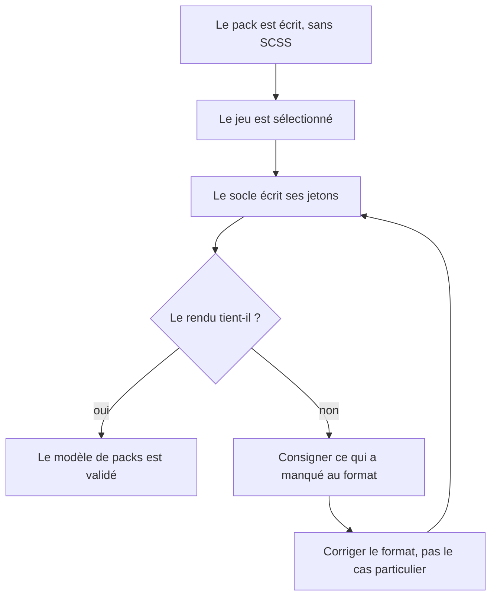

# Instruction: :Otherscape, premier jeu né comme pack

## Architecture projection

> Tree of the final files. ✅ create · ✏️ modify · ❌ delete

```txt
.
├── src
│   ├── games
│   │   ├── types.ts                   ✏️ corrigé si le jeu révèle une lacune du format
│   │   └── otherscape.ts              ✏️ le pack minimal de la phase 2 devient complet
│   └── styles
│       ├── otherscape
│       │   └── index.scss             ❌ supprimé si le pack suffit, sinon réduit au nécessaire
│       └── styles.scss                ✏️ son @use suit le sort du partial
└── README.md                          ✏️ le jeu rejoint la liste des jeux couverts
```

## User Journey



## Tasks to do

### `1)` Écrire le pack sans écrire de CSS

> C'est le test du modèle, pas l'ajout d'un jeu.

1. Établir la colorimétrie et la typographie du jeu, variantes claire et sombre, et les poser dans le pack.
2. Déclarer les jetons de note et les jetons d'interface séparément, comme les deux autres packs.
3. Déclarer les illustrations que le jeu attend dans les champs d'assets prévus au format en phase 2, sans les résoudre : la phase 4 les exploitera.
4. S'interdire d'ajouter du SCSS tant qu'on n'a pas constaté ce qui manque réellement.

### `2)` Constater et consigner les manques

> Le résultat de la phase est un verdict sur le format, pas seulement un jeu de plus.

1. Lister ce que le pack n'a pas pu exprimer et qui a exigé du code.
2. Pour chaque manque, trancher : lacune du format à corriger, ou forme de bloc nouvelle qui relève légitimement du code.
3. Corriger le format pour les premières, de sorte que les trois packs en bénéficient. Documenter les secondes comme la frontière assumée.
4. Faire cette correction **maintenant**, avant que la phase 4 ne s'appuie sur le format pour 23 illustrations : c'est la raison d'être de cette phase à cette place.

### `3)` Statuer sur le partial résiduel

> Un fichier d'une ligne n'est pas une architecture.

1. Si le pack suffit, supprimer `src/styles/otherscape/index.scss` et son `@use` dans `styles.scss`.
2. S'il reste du code nécessaire, y laisser seulement ce que le format ne peut pas porter, avec un commentaire disant pourquoi.
3. Mettre à jour le README pour refléter la couverture réelle du jeu.

## Test acceptance criteria

| Task | Acceptance criteria              |
| ---- | -------------------------------- |
| 1 | Le jeu sélectionné affiche une colorimétrie et une typographie qui lui sont propres, en clair comme en sombre, sans qu'aucune ligne de SCSS ait été ajoutée pour lui. |
| 1 | Ses blocs se rendent avec les jetons du pack et restent lisibles là où le jeu n'a pas encore d'illustration propre. |
| 2 | La liste des manques constatés est écrite, chaque entrée tranchée en lacune de format ou en frontière assumée. |
| 2 | Toute lacune de format identifiée est corrigée dans le format, et les trois packs en bénéficient, pas seulement celui-ci. |
| 3 | Le dépôt ne conserve un partial pour ce jeu que si un commentaire y justifie ce qui ne pouvait pas être une donnée. |
| 3 | `rtk proxy pnpm build` passe, le lint reste à zéro, et les deux autres jeux sont inchangés à l'écran. |
| 3 | Le build est déployé dans les deux coffres de test et le rendu du nouveau jeu y est vérifié après rechargement. |
