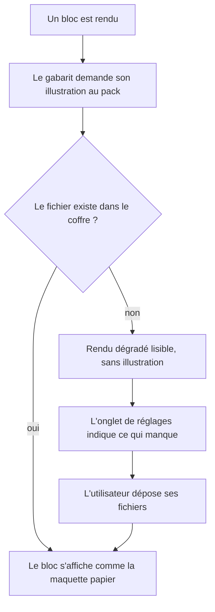

# Instruction: Assets dans le coffre et gabarits paramétrés

## Architecture projection

> Tree of the final files. ✅ create · ✏️ modify · ❌ delete

```txt
.
├── src
│   ├── games
│   │   ├── types.ts                   ✏️ les champs d'assets prévus en phase 2 sont exploités
│   │   ├── assets.ts                  ✅ résout un chemin de coffre en URL, signale l'absent
│   │   ├── city-of-mist.ts            ✏️ déclare ses chemins d'illustrations
│   │   └── legend-in-the-mist.ts      ✏️ idem
│   ├── settings
│   │   └── index.ts                   ✏️ section de mise en place des assets, état par jeu
│   └── styles
│       ├── legend-in-the-mist
│       │   ├── _theme-cards.scss      ✏️ 2,48 Mo d'images sortent, la géométrie reste
│       │   ├── _mountain.scss         ✏️ 3 images sortent
│       │   ├── _tags.scss             ✏️ 3 images sortent
│       │   ├── _lists.scss            ✏️ 3 images sortent
│       │   ├── _headings.scss         ✏️ 2 images sortent
│       │   └── _separators.scss       ✏️ 1 image sort
│       ├── city-of-mist
│       │   ├── _iceberg.scss          ✏️ 3 images sortent
│       │   └── _callouts.scss         ✏️ 1 image sort
│       └── _fallbacks.scss            ✅ rendu dégradé quand une illustration manque
└── README.md                          ✏️ documente la mise en place des assets
```

## User Journey



## Tasks to do

### `1)` Résoudre un asset du coffre

> Le pack pointe, le plugin résout.

1. `assets.ts` traduit un chemin de coffre déclaré par un pack en URL utilisable par le CSS, via le chemin de ressource que fournit l'adaptateur du coffre — pas une URL relative à la feuille de style, qui ne résoudrait pas.
2. Vérifier la présence d'un fichier avant de l'utiliser, et retenir l'absence sans relancer la vérification à chaque rendu.
3. Exposer l'inventaire de ce qui manque pour un jeu, afin que les réglages puissent l'afficher.
4. Ne pas lire ces chemins dans le SCSS : le pack les fournit au runtime, le SCSS ne connaît que des variables.

### `2)` Sortir les 23 images du bundle

> 6,21 Mo de CSS pour deux jeux ne passe pas à cinq. Les images en font 2,48 Mo.

1. Extraire chaque `data:` URI des 8 partials concernés vers un fichier image, en conservant nom et rôle.
2. Remplacer chaque usage par une variable que le pack renseigne, sans toucher à la géométrie qui l'entoure.
3. Conserver le mixin partagé `theme-cards.frame` : la géométrie reste du code, seule l'image devient une donnée.
4. Ne jamais afficher intégralement `_theme-cards.scss` : le lire par plages avec `grep -n` et `-A`, ou `sed -n`.

### `3)` Statuer sur les polices, mesure à l'appui

> C'est l'autre moitié du poids, et elle ne part pas avec les images.

1. Mesurer le bundle après extraction des images et le confronter à la décision du plan : les polices restent embarquées, la cible est donc ~3,7 Mo, pas moins.
2. Vérifier que chaque police embarquée est bien sous licence libre redistribuable ; sortir vers le coffre celle qui ne le serait pas, par le même mécanisme d'assets.
3. Si le poids devient gênant, ne charger que les polices du jeu actif plutôt que de toutes les embarquer dans une seule feuille — à décider sur la mesure, pas par principe.

### `4)` Le rendu dégradé

> Un bloc sans son image reste utilisable.

1. `_fallbacks.scss` donne à chaque bloc illustré une apparence de repli : fond plat tiré des jetons du pack, bordure, structure conservée.
2. Le repli s'applique par une classe posée au rendu quand l'asset manque, jamais par une règle qui devine.
3. Vérifier chaque bloc illustré dans les deux états, plein et dégradé.

### `5)` Paramétrer les gabarits par le pack

> Le gabarit est du code, ses valeurs viennent de la donnée.

1. Faire lire aux renderers de blocs les valeurs du pack actif plutôt que des constantes de mode.
2. Conserver le contrat `BrumesBlock<T>` et le registre `BRUMES_BLOCKS` inchangés : un bloc reste un bloc, il apprend seulement d'où viennent ses couleurs et ses images.
3. Un jeu qui ne déclare pas d'illustration pour un bloc obtient le rendu dégradé, pas une erreur.

### `6)` Mise en place côté utilisateur

> Ce n'est plus turnkey, ça doit être guidé.

1. Ajouter à l'onglet de réglages une section qui liste, pour le jeu actif, les fichiers attendus et ceux qui manquent, avec le dossier où les déposer.
2. Documenter la mise en place dans le README, ainsi que le fait qu'un jeu s'affiche en dégradé tant que rien n'est déposé.
3. Sentence case sur les chaînes ajoutées, aucun nom de jeu écrit en dur.

## Test acceptance criteria

| Task | Acceptance criteria              |
| ---- | -------------------------------- |
| 1 | Un pack déclarant un chemin inexistant charge sans erreur et signale l'absence dans les réglages. |
| 2 | `dist/styles.css` ne contient plus aucune `data:image`, et son poids tombe de 6,21 Mo à environ 3,7 Mo — le reste étant les polices, conservées par décision. |
| 2 | Avec les fichiers déposés dans le coffre, une carte de thème s'affiche exactement comme avant la phase — même géométrie, même illustration. |
| 3 | Le poids mesuré après extraction est consigné, et la licence de chaque police embarquée est vérifiée redistribuable. |
| 4 | Sur un coffre vierge d'assets, chaque bloc illustré reste lisible et structuré, sans zone vide ni image cassée. |
| 5 | Changer de jeu change les illustrations des blocs sans rechargement du plugin. |
| 5 | Un bloc dont le pack ne déclare aucune illustration se rend en dégradé, pas en erreur. |
| 6 | La section de mise en place liste les fichiers manquants du jeu actif et se vide au fur et à mesure des dépôts. |
| 6 | `rtk proxy pnpm build` passe, le lint reste à zéro erreur, et le rendu est vérifié dans les deux coffres de test après dépôt des assets. |
