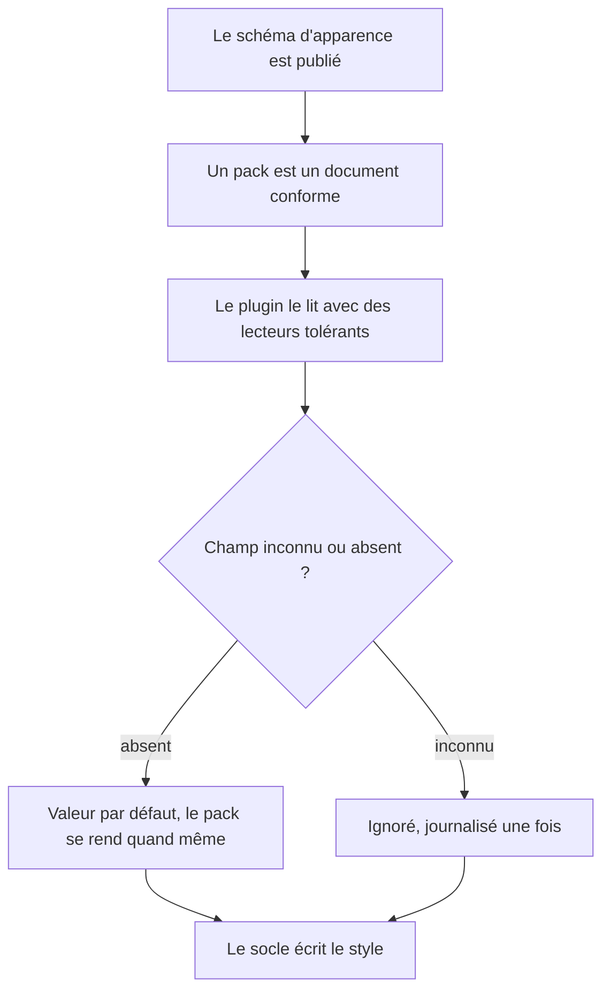

# Instruction: Schéma graphique frère dans schema-in-the-mist

## Architecture projection

> Tree of the final files. ✅ create · ✏️ modify · ❌ delete

```txt
.
├── src
│   ├── games
│   │   ├── types.ts                   ✏️ les types dérivent du schéma publié
│   │   └── fromSchema.ts              ✅ lit un document de pack et produit un pack
│   └── features
│       └── blocks
│           └── schemaValues.ts        ✏️ ses lecteurs tolérants servent aussi les packs
└── (dépôt schema-in-the-mist)
    └── appearance/                     ✅ schéma frère, hors de ce dépôt
```

## User Journey



## Tasks to do

### `1)` Séparer les deux contrats

> Le contenu et l'apparence n'ont pas le même public.

1. Poser noir sur blanc ce que le schéma d'apparence décrit — identité d'un jeu, jetons, variantes, chemins d'assets — et ce qu'il ne décrit pas : rien de ce que `ChallengeDocument` ou les profils de Danger portent déjà.
2. Ne pas mêler les deux : le consommateur du schéma de contenu n'a pas d'usage du second.

### `2)` Négocier l'hébergement

> Le dépôt est partagé, la décision ne nous appartient pas seule.

1. Proposer le schéma d'apparence comme schéma frère, avec son propre espace et son propre rythme de version.
2. Obtenir l'accord avant de dépendre du dépôt distant dans le code. En cas de refus, replier sur un dépôt à nous et n'en changer que le point d'origine.
3. Traiter ce point comme bloquant pour cette phase seule : les phases 1 à 4 n'en dépendent pas.

### `3)` Aligner le plugin sur le schéma publié

> Le format interne devient une projection du contrat, pas l'inverse.

1. Faire dériver `games/types.ts` de la forme publiée, et lire un pack via `fromSchema.ts`.
2. Traiter le format posé en phase 2 et corrigé en phase 3 comme **gelé** : le schéma publié le décrit, il ne le redessine pas. Tout écart imposé par la publication est traité comme une migration explicite, avec lecture des deux formes, jamais comme une réécriture silencieuse des trois packs.
3. Réutiliser les lecteurs tolérants de `schemaValues.ts` : un champ mal formé se perd, il ne fait pas échouer le rendu — c'est déjà la règle des blocs.
4. Journaliser une seule fois par session un champ inconnu, sur le modèle de la dépréciation d'alias du registre de blocs.
5. Itérer sur les documents avec `for…of` et `reduce` : ni `Object.values` ni `Array.prototype.flat` ne compilent sur la cible ES du dépôt.

### `4)` Prouver la lecture

> Pas de runner de tests dans le dépôt, mais pas d'excuse.

1. Harnais jetable `src/__assert_pack_schema.ts` : un document complet produit un pack complet ; un document amputé produit un pack aux défauts ; un champ inconnu est ignoré sans erreur.
2. Bundler avec esbuild en `platform: node`, `format: cjs`, exécuter sous `node`.
3. Supprimer `src/__assert_*.ts` et les `.cjs` avant tout `pnpm build`.

## Test acceptance criteria

| Task | Acceptance criteria              |
| ---- | -------------------------------- |
| 1 | La frontière entre les deux schémas est écrite et ne laisse aucun champ dans les deux à la fois. |
| 2 | L'hébergement est tranché et consigné, et le code ne dépend d'un dépôt distant qu'après cet accord. |
| 3 | Un document dont l'identifiant n'est pas un nom de classe CSS valide est refusé, comme pour un pack du code. |
| 3 | Les trois packs existants se chargent depuis un document conforme et donnent le même rendu qu'à la fin de la phase 4, vérifié dans les deux coffres de test. |
| 3 | Aucun champ du format gelé n'est renommé ni supprimé sans un chemin de lecture de l'ancienne forme. |
| 3 | Un document amputé de champs se charge, se rend avec des valeurs par défaut, et ne produit aucune erreur visible. |
| 3 | Un champ inconnu laisse un avertissement une fois par session, pas un par rendu. |
| 4 | Le harnais passe sous `node`, puis `rtk proxy pnpm build` passe une fois le harnais supprimé, avec un lint à zéro erreur. |
