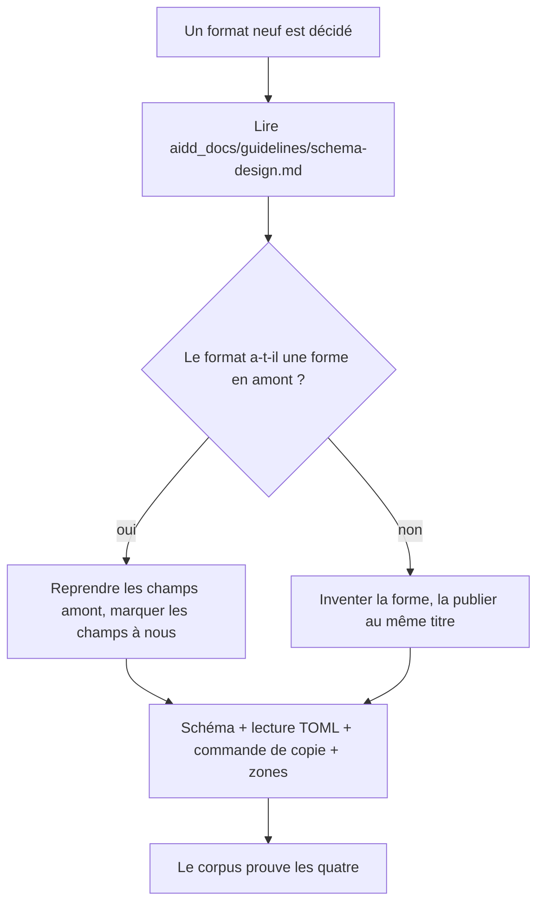

# Instruction: La règle écrite et ses issues

## Architecture projection

```txt
.
├── aidd_docs/
│   ├── guidelines/
│   │   └── schema-design.md          ✅ la règle qui manquait
│   └── tasks/2026_09/2026_09_08_schema-design-guidelines/
│       └── issues.md                 ✅ les issues à ouvrir hors handbook, prêtes à copier
└── CLAUDE.md                         ✏️ renvoie vers la guideline depuis « Registre de blocs »
```

## User Journey



## Tasks to do

### `1)` Écrire `aidd_docs/guidelines/schema-design.md`

> La règle absente, celle dont l'assert a mesuré le manque.

1. Ouvrir sur le constat : six blocs, quatre comportements différents, aucune règle.
2. Poser la **checklist d'un format** — quatre obligations, aucune facultative :
   un schéma publié, une lecture TOML tolérante, une commande de copie, une forme
   en zones nommées.
3. Poser la **règle de zéro exemption** et son motif : un format sans amont
   invente sa forme, il n'est pas dispensé.
4. Poser la **frontière valeurs / forme / pixels** : le schéma tient les valeurs
   et les zones, le SCSS tient les pixels, rien ne traverse.
5. Poser la **règle de polarité** : un pack déclare ce qu'il supporte, il ne
   dérive ni n'invente une variante.
6. Poser la **tension strict / tolérant** : le schéma rejette, le consommateur
   dégrade ; le même corpus alimente les deux assertions.
7. Poser la **règle de langue** : l'anglais existant reste, le nouveau contenu est
   français d'abord, la règle s'applique par schéma et non par champ.
8. Poser l'**échappatoire SCSS** : autorisée, mais déclarée et motivée dans le
   partial lui-même.

### `2)` Écrire `issues.md`

> Tout ce que le plan ne peut pas faire lui-même, formulé pour être ouvert ailleurs.

1. Une section par dépôt cible : `schema-in-the-mist`, `schema-adrenaline`,
   `schema-pbta`, `lantern`, le futur dépôt d'apparence.
2. Chaque entrée porte un titre, un corps, et le dépôt destinataire.
3. Issues à formuler, au minimum :
   - extraire `appearance/game-pack.schema.json` vers son propre dépôt, avec le
     chemin de lecture de l'ancien emplacement ;
   - étendre `game-pack` au vocabulaire de zones et aux polarités déclarées ;
   - publier les formes de `journey` et de `theme kit`, qui n'existent pas en amont ;
   - généraliser le corpus refus/témoins aux trois dépôts de schéma ;
   - porter `audit-schemas.ts` d'adrenaline vers les deux autres ;
   - porter `validate:refs` de pbta vers les deux autres ;
   - côté `lantern`, lire les blocs que Handbook sait désormais copier.
4. Écrire en tête, en clair : **aucune issue n'est ouverte par ce plan.**
   L'ouverture est une action sortante, elle demande un accord explicite.

### `3)` Renvoyer depuis `CLAUDE.md`, et le corriger

1. Dans la section « Registre de blocs », ajouter le renvoi vers la guideline.
2. Remplacer l'énumération des quatre points d'ajout d'un bloc par la checklist
   de la guideline, pour qu'il n'y ait qu'une source.
3. **Corriger trois affirmations fausses**, vérifiées sur le dépôt :
   - « `pnpm build` lance `tsc -noEmit` sur tout `src/` » → `tsconfig.json` porte
     `"include": ["**/*.ts"]`, donc **tout le dépôt**. C'est l'extension d'un
     fichier qui le protège, pas son dossier.
   - le lint a **deux portées** : `pnpm lint` vaut `eslint .`
     (`files: ["**/*.ts"]`, n'ignore que `node_modules`, `dist`, `demo`) quand le
     fichier prescrit `eslint src --ext .ts`. Dire laquelle fait foi, ou exiger
     les deux vertes.
   - `src/settings/borderPresets.ts` est listé mais **n'existe plus** : le dossier
     tient `canvasSnippets.ts`, `index.ts`, `types.ts`.
4. Signaler l'écart de version sans le trancher ici : `package.json` porte
   `1.1.0-beta`, `CLAUDE.md` annonce `2.0.0-beta`.

## Test acceptance criteria

| Task | Acceptance criteria                                                                                                       |
| ---- | ------------------------------------------------------------------------------------------------------------------------- |
| 1    | La guideline répond seule à « que dois-je écrire pour un format neuf ? » sans qu'on ait à lire un bloc existant             |
| 2    | Chaque issue nomme son dépôt, et aucune n'est ouverte                                                                      |
| 3    | `CLAUDE.md` ne redit plus ce que la guideline dit ; il y renvoie                                                            |
