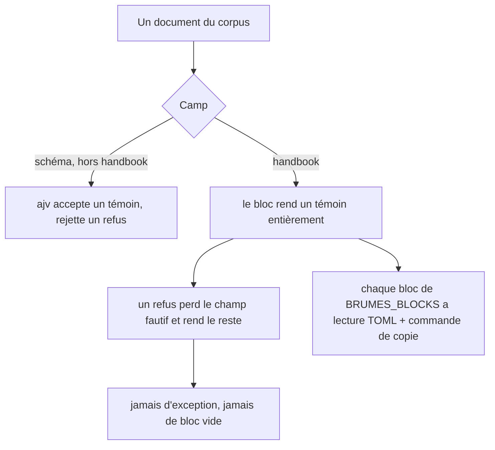

# Instruction: Le corpus et son harnais

> Portée : **les deux blocs qui savent déjà lire un document TOML**,
> `litm-challenge` et `com-danger`. Les quatre autres rejoignent le corpus dans
> la phase 3, au moment où ils gagnent leur lecture. Une phase qui exigerait un
> témoin pour un bloc sans parser échouerait par construction.

## Architecture projection

```txt
.
├── corpus/                            ✅ les documents qui prouvent, partagés par les deux camps
│   ├── README.md                      ✅ ce que refus et témoins veulent dire ici
│   ├── temoins/                       ✅ documents valides : le schéma les accepte, le plugin les rend
│   │   ├── com-danger.toml            ✅
│   │   └── litm-challenge.toml        ✅
│   └── refus/                         ✅ documents fautifs : le schéma les rejette, le plugin les dégrade
│       └── *.toml                     ✅ un fichier par faute, nommé par la faute
├── tools/
│   ├── assert-corpus.mjs              ✅ bundle le harnais par esbuild, puis l'exécute
│   └── assertCorpus.harness.mts       ✅ les assertions ; extension .mts, hors de la portée de tsc
└── package.json                       ✏️ script `assert:corpus`
```

## User Journey



## Tasks to do

### `1)` Poser le corpus

> Un dossier, deux camps, et un README qui dit pourquoi les deux sont nécessaires.

1. Créer `corpus/temoins/` et `corpus/refus/`.
2. Un témoin pour `litm-challenge` et un pour `com-danger` : document complet,
   tous les champs renseignés, y compris les champs à nous (`is_countdown`,
   `on_max`, `secrets`).
3. Un refus par faute réelle, pas par faute imaginée : type erroné sur un champ,
   champ requis absent, tableau là où un objet est attendu, valeur hors bornes.
4. Nommer chaque refus par sa faute, pas par un numéro.
5. Le README reprend le motif du témoin, mot pour mot :
   « Sans le témoin, une série de refus ne prouve rien — un schéma qui rejette
   tout les passerait tous. »
6. Le README dit aussi que le corpus grandit avec la phase 3 : deux blocs
   aujourd'hui, six à la fin.

### `2)` Écrire le harnais

> Le dépôt n'a **pas de runner** : ni vitest, ni jest, ni `tsx`. Il a une
> convention. La formaliser une fois plutôt que de la réinventer par bloc.

1. `tools/assert-corpus.mjs` bundle puis exécute — **pas de dépendance neuve**,
   `tsx` n'est pas installé et n'a pas à l'être :
   `esbuild.buildSync({ platform: 'node', format: 'cjs', external: ['obsidian', 'fs'] })`,
   puis `node` sur le fichier produit.
2. **Le script vit à la racine du dépôt** — ailleurs, `node` ne résout pas
   `esbuild` et sort `ERR_MODULE_NOT_FOUND: Cannot find package 'esbuild'`.
3. Les assertions vont dans `tools/assertCorpus.harness.mts`. **L'extension
   compte, pas l'emplacement** : `tsconfig.json` porte `"include": ["**/*.ts"]`,
   donc `tsc -noEmit` balaie tout le dépôt, `tools/` compris. Un `.mts` y échappe ;
   un `.ts` posé dans `tools/` casserait le build exactement comme dans `src/`.
4. Même raison côté lint : `eslint.config.mjs` déclare `files: ["**/*.ts"]` et
   n'ignore que `node_modules`, `dist`, `demo`. Vérifier après coup que
   `pnpm lint` (soit `eslint .`) reste vert, pas seulement `eslint src`.
5. Reprendre la convention `src/__assert_*.ts` : classe `El` bouchon, faux
   `Document` avec `createElement`.
6. Appeler `log.setLevel("warn")` avant toute assertion sur un avertissement :
   `currentLogLevel` démarre à `error` et `shouldLog` compare
   `LEVEL_ORDER[currentLogLevel] <= LEVEL_ORDER[level]` — un harnais qui l'oublie
   mesure un silence et le prend pour un échec.
7. Pour chaque témoin : `block.parse(source)` rend non-`null`, et
   `block.render(data, doc)` produit un élément.
8. Pour chaque refus : `parse` ne jette pas, et rend soit `null`, soit une donnée
   amputée du seul champ fautif.
9. Sortir en code non nul au premier échec, avec le nom du fichier fautif.

### `3)` Faire vérifier la règle par le harnais

> La phase 1 écrit une guideline. Une guideline que rien ne contrôle est
> exactement le mode de défaillance qu'elle prétend corriger, un cran plus haut.

1. Boucler sur `BRUMES_BLOCKS` et affirmer, pour chaque bloc, qu'il a une lecture
   de document TOML et une commande de copie déclarée.
2. Tant que la phase 3 n'a pas fermé l'écart, tenir une **liste nommée des blocs
   encore en dette**, et faire échouer le harnais dès qu'un bloc *absent* de
   cette liste manque à la règle.
3. La phase 3 vide la liste. Elle vidée, un bloc neuf ajouté sans schéma casse le
   harnais au lieu d'être découvert par un assert six mois plus tard.
4. **Ne pas utiliser `Object.values` ni `Array.prototype.flat`** :
   `tsconfig.json` vise `target: ES6` avec `lib: ["DOM","ES5","ES6","ES7"]`, ils
   ne compilent pas. `reduce`, `indexOf`, `for…of`.

### `4)` Brancher le script

1. `package.json` : `"assert:corpus": "node tools/assert-corpus.mjs"`.
2. `rm -f src/__assert_*.ts __assert_*.cjs` puis `rtk proxy pnpm build` : vert
   avec le harnais présent sur le disque.
3. Ajouter le produit du bundle au `.gitignore` s'il est écrit dans l'arbre.

## Test acceptance criteria

| Task | Acceptance criteria                                                                                                             |
| ---- | --------------------------------------------------------------------------------------------------------------------------------- |
| 1    | `litm-challenge` et `com-danger` ont chacun un témoin et au moins un refus ; le nom d'un refus dit la faute qu'il porte             |
| 2    | Le harnais échoue si l'on casse volontairement un parser, et nomme le fichier qui a échoué ; aucune dépendance n'a été ajoutée      |
| 3    | Retirer la commande de copie d'un bloc hors dette fait échouer le harnais                                                          |
| 4    | `pnpm assert:corpus` passe, `rtk proxy pnpm build` reste vert, et `pnpm lint` reste vert avec `tools/` présent                      |
