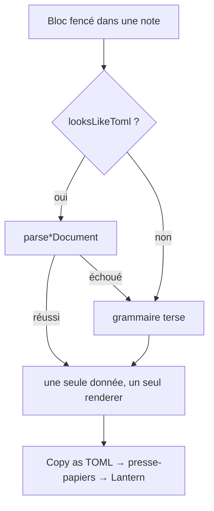

# Instruction: Parité schéma sur les six blocs

## Architecture projection

```txt
.
└── src/features/
    ├── themeCards/
    │   ├── toml.ts                    ✏️ export seul aujourd'hui → gagne parse + looksLikeToml
    │   └── parser.ts                  ✏️ tente le document avant la grammaire
    ├── comThemeCards/
    │   ├── schema.ts                  ✅ document, conversions, parse, toToml
    │   └── parser.ts                  ✏️ tente le document avant la grammaire
    ├── journeys/
    │   ├── schema.ts                  ✅ forme inventée, publiée au même titre
    │   └── parser.ts                  ✏️ tente le document avant la grammaire
    ├── themeKits/
    │   ├── schema.ts                  ✅ forme inventée, publiée au même titre
    │   └── parser.ts                  ✏️ tente le document avant la grammaire
    └── blocks/
        └── tomlExports.ts             ✏️ six commandes au lieu de trois, le commentaire de dispense disparaît
```

## User Journey



## Tasks to do

### `1)` `theme-card` (LitM) : lui donner la lecture qui lui manque

> Il sait déjà écrire du TOML. Il ne sait pas le relire — la moitié d'un aller-retour.

1. **Renommer `themeCards/toml.ts` en `themeCards/schema.ts`** — décidé, pas à
   arbitrer : ses cinq pairs portent ce nom, et il va cesser d'être un
   sérialiseur seul. Mettre à jour l'import dans `blocks/tomlExports.ts`.
2. Y ajouter `documentToThemeCard` puis `parseThemeCardDocument`, sur le modèle
   exact de `comDangers/schema.ts`.
3. Dans `themeCards/parser.ts`, tenter le document avant la grammaire.

### `2)` `com-theme-card` : la chaîne complète

> Le bloc que l'assert a trouvé nu.

1. Écrire `comThemeCards/schema.ts` : `ComThemeCardDocument`,
   `documentToComThemeCard`, `comThemeCardToDocument`,
   `parseComThemeCardDocument`, `comThemeCardToToml`.
2. Reprendre les champs amont de la carte de thème ; marquer d'un commentaire
   « Ours » tout champ que l'amont ne décrit pas, comme le fait `com-danger`.
3. Brancher la lecture dans `comThemeCards/parser.ts`.
4. Ajouter la commande `copy-com-theme-card-as-toml` dans `tomlExports.ts`.

### `3)` `litm-journey` et `litm-theme-kit` : inventer la forme

> Aucune forme en amont. Ce n'est pas une dispense, c'est une invention à publier.

1. Écrire `journeys/schema.ts` et `themeKits/schema.ts` avec la même structure.
2. Marquer chaque champ comme nôtre, puisque tous le sont, et documenter dans
   l'en-tête que la forme est publiée pour être reprise en amont.
3. Brancher les deux lectures.
4. Ajouter `copy-journey-as-toml` et `copy-theme-kit-as-toml`.

### `4)` Retirer la dispense de `tomlExports.ts`

1. Supprimer le commentaire « a journey and a theme kit have no shape upstream,
   so they have nothing to be copied into » : il est faux dès la tâche 3.
2. Le remplacer par un renvoi vers la guideline de la phase 1.
3. Vérifier que chaque `commandId` est écrit en toutes lettres, jamais dérivé de
   l'id du bloc — un renom de bloc ne doit pas casser un raccourci.

### `5)` Étendre le corpus et vider la dette

1. Ajouter à `corpus/temoins/` un témoin par bloc nouvellement branché, et à
   `corpus/refus/` au moins un refus chacun.
2. **Vider la liste des blocs en dette** du harnais de la phase 2 : elle doit
   finir vide. Un bloc ajouté ensuite sans schéma casse alors le harnais.

### `6)` Vérifier

1. `rm -f src/__assert_*.ts __assert_*.cjs` avant tout build.
2. `rtk proxy pnpm build` vert.
3. `./node_modules/.bin/eslint src --ext .ts` à zéro erreur, **et** `pnpm lint`
   (soit `eslint .`) vert : les deux portées diffèrent, la seconde couvre `tools/`.
4. `pnpm assert:corpus` vert sur les six blocs.

## Test acceptance criteria

| Task | Acceptance criteria                                                                                                        |
| ---- | ---------------------------------------------------------------------------------------------------------------------------- |
| 1    | Une carte de thème LitM copiée en TOML, recollée dans un bloc, se rend à l'identique                                          |
| 2    | Idem pour une carte de thème City of Mist, et la commande apparaît dans la palette quand le curseur est dans le bloc          |
| 3    | Idem pour un journey et un theme kit ; leur schéma dit en en-tête que la forme est nôtre                                      |
| 4    | Les six blocs ont une commande de copie ; aucun commentaire du dépôt ne prétend plus qu'un format est dispensé                |
| 5    | Le corpus couvre les six blocs et la liste de dette du harnais est vide                                                       |
| 6    | Build vert, les deux portées de lint à zéro, corpus vert                                                                       |
