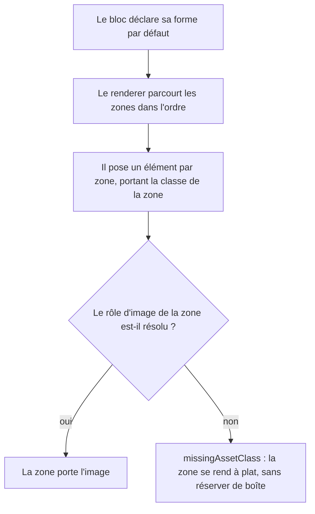

# Instruction: Vocabulaire de zones nommées

> Portée : **décrire l'existant, ne rien changer à l'écran.** Le vocabulaire est
> posé et les six blocs déclarent leur forme actuelle. La surcharge par le pack
> est la phase 5. Une phase qui ferait les deux toucherait six renderers, cinq
> fichiers de `src/games/` et les partials du même coup.

## Architecture projection

```txt
.
├── src/features/blocks/
│   ├── shape.ts                       ✅ le vocabulaire : zone, ordre, rôle d'image
│   └── types.ts                       ✏️ BrumesBlock gagne une forme par défaut
└── src/features/*/
    ├── block.ts                       ✏️ chacun des six déclare sa forme
    └── renderer.ts                    ✏️ pose les zones dans l'ordre, une classe par zone
```

## User Journey



## Tasks to do

### `1)` Écrire le vocabulaire dans `src/features/blocks/shape.ts`

> Le squelette et le sens. Jamais les pixels.

1. Définir une zone : un nom, un rôle d'image optionnel, un ordre.
2. Définir une forme : la liste ordonnée de ses zones.
3. Documenter en en-tête la frontière : les zones disent **quoi et dans quel
   ordre**, le SCSS dit **où et de quelle taille**. Rien ne traverse.
4. Ne rien y mettre qui ressemble à du CSS sérialisé — un consommateur qui n'est
   pas Handbook doit pouvoir dessiner sans moteur de rendu.
5. **Une forme est une liste, pas un dictionnaire à parcourir par valeurs** :
   `tsconfig.json` vise `target: ES6` avec `lib: ["DOM","ES5","ES6","ES7"]`,
   `Object.values` et `Array.prototype.flat` ne compilent pas. `src/` n'en
   contient aujourd'hui aucune occurrence — c'est ici que la contrainte mordra.

### `2)` Ajouter la forme par défaut au bloc

1. `BrumesBlock<T>` gagne un champ de forme.
2. Renseigner la forme des six blocs à partir de ce que leurs renderers font
   **déjà** : la forme décrit l'existant, elle ne le corrige pas.
3. Là où un renderer produit une structure qu'aucune zone ne décrit proprement,
   **noter l'écart plutôt que de le lisser** — c'est une matière pour la phase 5,
   pas une refonte à glisser ici.

### `3)` Faire poser les zones par les renderers

> Le SCSS ne lit rien. C'est le renderer qui pose la classe, le partial la cible.

1. Chaque renderer parcourt les zones déclarées dans l'ordre et pose **un élément
   par zone, portant une classe dérivée du nom de la zone**.
2. Les partials existants ciblent ces classes. Le préfixe `brumes-*` reste : des
   centaines d'occurrences, et les presets déjà importés chez l'utilisateur s'y
   appuient.
3. Une zone dont le rôle d'image manque **dégrade** : `missingAssetClass`, la
   zone se rend à plat, elle ne réserve pas une boîte vide.
4. Interdire toute nouvelle recopie de géométrie entre partials : extraire un
   `@mixin` et l'`@include`, jamais dupliquer les valeurs ni l'image.

### `4)` Vérifier que rien n'a bougé à l'écran

1. **Ne jamais lire ces fichiers entièrement** : `dist/styles.css` et les partials
   de polices (`fonts/caveat.scss` 670 Ko, `im-fell-great-primer.scss` 596 Ko,
   `im-fell-english.scss` 508 Ko) se lisent par `grep -n … -A n` ou `sed -n`.
2. `rm -f src/__assert_*.ts __assert_*.cjs`, puis `rtk proxy pnpm build`.
3. `./node_modules/.bin/eslint src --ext .ts` à zéro, **et** `pnpm lint` vert.
4. `pnpm assert:corpus` vert : le rendu des témoins ne doit pas avoir changé.
5. Déployer dans les deux coffres de jeu **sans écraser leur `data.json`**, puis
   comparer le rendu des six blocs avant / après : identique.

## Test acceptance criteria

| Task | Acceptance criteria                                                                                                          |
| ---- | ------------------------------------------------------------------------------------------------------------------------------ |
| 1    | Le vocabulaire se lit seul : quelqu'un qui n'a pas le SCSS comprend la structure d'un bloc                                      |
| 2    | Les six blocs déclarent une forme ; les écarts non descriptibles sont notés, pas lissés                                        |
| 3    | Chaque zone apparaît dans le DOM avec sa classe, et un rôle d'image absent produit un bloc à plat, jamais une boîte vide        |
| 4    | Build vert, les deux portées de lint à zéro, corpus vert, rendu identique dans les deux coffres, `data.json` de chacun intact   |
