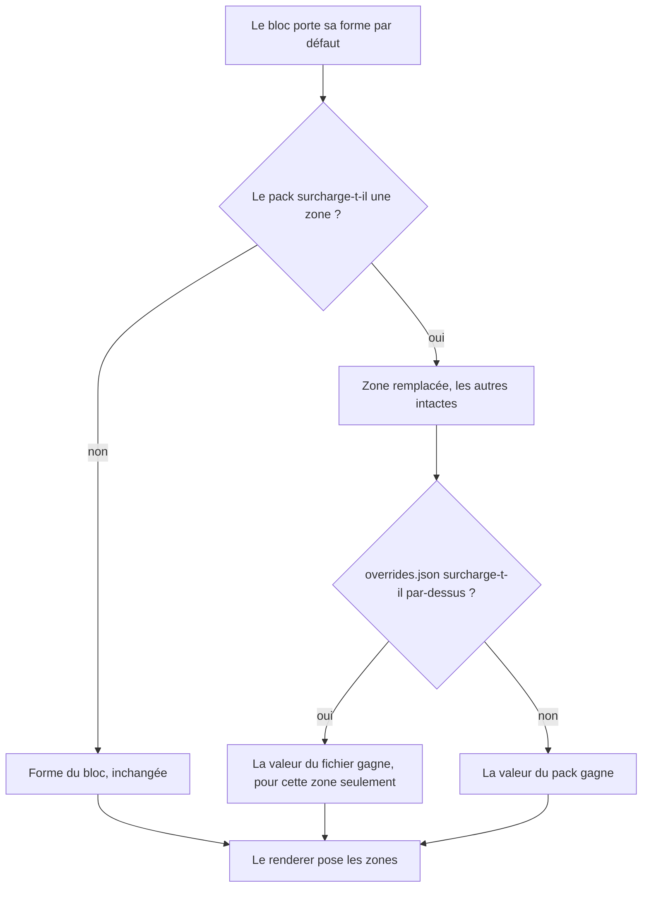

# Instruction: Surcharge de forme par le pack

> **Cette phase ne dépend pas d'un dépôt tiers.** `fromSchema.ts` lit un document
> et ignore ce qu'il ne connaît pas, avec un avertissement unique : il peut donc
> lire des zones avant que `game-pack.schema.json` les décrive. Le schéma publié
> **suit** l'usage, il ne le précède pas. L'issue correspondante (phase 1) reste
> à ouvrir, elle ne bloque rien ici.

## Architecture projection

```txt
.
└── src/games/
    ├── types.ts                       ✏️ GamePack gagne des surcharges de forme, zone par zone
    ├── fromSchema.ts                  ✏️ lit les zones, avertit une fois par session sur l'inconnu
    └── overrides.ts                   ✏️ la surcharge de forme suit le chemin tracé pour les jetons
```

## User Journey



## Tasks to do

### `1)` Ouvrir la surcharge dans `GamePack`

1. `GamePack` gagne des surcharges de forme, indexées par id de bloc puis par nom
   de zone.
2. Une surcharge est **partielle par construction** : ce qu'elle ne nomme pas
   reste la forme du bloc.
3. Reprendre `isValidGamePackId` comme modèle de contrôle : un identifiant fautif
   écarte sa seule entrée, jamais le pack entier.

### `2)` Lire les zones dans `fromSchema.ts`

1. Suivre le motif de `readPackTokens` : une zone inconnue laisse un
   avertissement **une fois par session**, jamais un par rendu.
2. Une valeur fautive **se perd elle-même** ; le reste du pack s'applique. C'est
   la règle déjà tenue par les jetons et les assets.
3. `resetGamePackReports` remet à zéro les avertissements de zones comme il le
   fait pour les autres.

### `3)` Brancher `overrides.json`

1. Une zone se surcharge comme un jeton se surcharge.
2. **Retirer le fichier redonne exactement la forme du bloc** — contrat déjà
   annoncé pour les jetons, il ne souffre pas d'exception ici.

### `4)` Traiter les écarts notés en phase 4

1. Reprendre les structures qu'aucune zone ne décrivait proprement.
2. Les exprimer en zones, ou consigner pourquoi elles n'en sont pas.

### `5)` Vérifier

1. `rm -f src/__assert_*.ts __assert_*.cjs`, puis `rtk proxy pnpm build`.
2. `./node_modules/.bin/eslint src --ext .ts` à zéro, **et** `pnpm lint` vert.
3. `pnpm assert:corpus` vert.
4. Poser un `overrides.json` surchargeant une zone, observer, le retirer,
   observer à nouveau. Déployer sans écraser le `data.json` des coffres.

## Ce qui a été fait

L'aller-retour du fichier est **mesuré**, pas constaté à l'œil :
`tools/overrideRoundTrip.harness.mts`, lancé par `pnpm assert:override`, rend un
témoin du corpus sans fichier, avec un fichier qui renomme une zone et en cache
une autre, puis sans fichier à nouveau, et compare les deux rendus nus caractère
par caractère. Un œil ne distingue pas « identique » de « presque identique » :
c'est justement la promesse du point 3, donc c'est la machine qui la tient.

Le même harnais vérifie qu'une zone qu'aucune forme ne connaît est signalée
**une fois** et non une fois par rendu, et qu'un fichier ne nommant qu'un bloc
laisse les cinq autres exactement où ils étaient.

Côté coffre, `overrides.json` est posé dans
`legend-in-the-mist/.obsidian/plugins/obsidian-handbook/` :

```json
{
	"shapes": {
		"litm-challenge": {
			"threats": { "heading": "Menaces et conséquences" },
			"secrets": { "hidden": true }
		}
	}
}
```

Le retirer — un `rm` — redonne le bloc d'origine, et la commande « Reload
illustrations and personal overrides » relit le fichier sans recharger le
greffon.

### Les écarts de la phase 4

Trois ont été absorbés : la classe qu'une section partage avec ses sœurs est
devenue `family`, et le libellé imprimé qu'elle ouvre est devenu `heading`. Ce
sont des places et des étiquettes, donc du vocabulaire.

Cinq sont restés, chacun avec son motif écrit au-dessus de lui dans son
`shape.ts`, et la règle qui les tient est montée dans l'en-tête de
`src/features/blocks/shape.ts` : une classe qui dépend d'une **valeur à
l'intérieur** du bloc est un état du contenu, pas une place dans une mise en
page. La nommer ferait du vocabulaire le miroir du modèle de données d'un seul
renderer, dont un consommateur qui a le sien ne pourrait rien faire.

## Test acceptance criteria

| Task | Acceptance criteria                                                                                                        |
| ---- | ---------------------------------------------------------------------------------------------------------------------------- |
| 1    | Un pack peut surcharger une seule zone ; les autres gardent la forme du bloc                                                  |
| 2    | Une zone inconnue avertit une fois par session, et le reste du pack charge malgré elle                                        |
| 3    | Retirer `overrides.json` restaure le rendu à l'identique                                                                     |
| 4    | Aucun écart de la phase 4 ne reste sans zone ni sans motif écrit                                                             |
| 5    | Build vert, les deux portées de lint à zéro, corpus vert, `data.json` de chaque coffre intact                                 |
