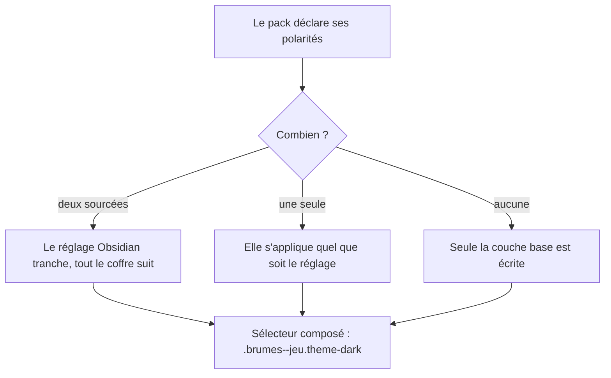

# Instruction: Polarités déclarées et skin

> **Cette phase ne dépend pas d'un dépôt tiers**, pour la même raison que la
> phase 5 : `fromSchema.ts` peut lire une déclaration de polarité avant que
> `game-pack.schema.json` la décrive. L'issue de publication reste à ouvrir, elle
> ne bloque rien ici.

## Architecture projection

```txt
.
├── src/games/
│   ├── types.ts                       ✏️ GamePack déclare les polarités qu'il supporte
│   ├── fromSchema.ts                  ✏️ lit la déclaration, n'en dérive aucune
│   ├── city-of-mist.ts                ✏️ déclare clair et sombre : les deux sont sourcées
│   ├── legend-in-the-mist.ts          ✏️ déclare ce qui est sourcé, rien de plus
│   └── otherscape.ts                  ✏️ idem
├── src/features/modes/
│   └── styleElement.ts                ✏️ n'écrit une couche que si le pack la déclare
├── src/settings/
│   └── index.ts                       ✏️ l'onglet dit ce que le jeu actif supporte
└── src/styles/*/                      ✏️ chaque échappatoire SCSS gagne son motif écrit
```

## User Journey



## Tasks to do

### `1)` Déclarer les polarités

1. `GamePack` gagne la liste des polarités supportées.
2. City of Mist déclare clair **et** sombre : les pages de maquette blanches et
   noires les sourcent toutes les deux.
3. Les autres packs déclarent ce qui est réellement sourcé — **rien n'est dérivé,
   rien n'est inventé**.
4. `fromSchema.ts` lit la déclaration ; un pack muet ne se voit attribuer aucune
   polarité par défaut.

### `2)` Faire respecter la déclaration à `buildGameStyle`

1. Une couche non déclarée n'est **pas écrite**, plutôt qu'écrite en copie de `base`.
2. Une seule polarité déclarée : elle s'applique quel que soit le réglage du thème.
3. **Garder les sélecteurs composés** — `.brumes--<jeu>.theme-dark`, jamais
   `.theme-dark` seul. Les deux classes sont sur le même `body` : à spécificité
   égale seul l'ordre des feuilles trancherait, et rien ne garantit que la nôtre
   passe après celle du thème actif.
4. `sanitizeValue` continue de nettoyer `{};<>` sur toute valeur venue d'un pack.
5. Vérifier que `GameStyleWriter` nettoie toujours les fenêtres Obsidian détachées.

### `3)` Dire au réglage ce que le jeu supporte

1. L'onglet vit dans `src/settings/index.ts` — il n'y a pas de `tab.ts` ; le
   dossier tient `canvasSnippets.ts`, `index.ts` et `types.ts`.
2. Il indique les polarités du jeu actif, comme il liste déjà les illustrations
   manquantes.
3. Un jeu à polarité unique le dit, pour qu'un thème sans effet ne passe pas pour
   un bug.
4. **Sentence case** sur les chaînes d'interface ; ne pas y placer de nom propre
   de jeu — `eslint-plugin-obsidianmd` veut l'abaisser, autant écrire la phrase
   autrement que désactiver la règle.

### `4)` Déclarer les échappatoires SCSS

1. Parcourir les partials par jeu et repérer ce qui ne passe pas par un jeton.
2. Chaque échappatoire gagne un commentaire en tête disant **pourquoi un jeton ne
   suffisait pas** — un partial muet est une dette invisible.
3. Ce qui peut devenir un jeton le devient ; ce qui ne le peut pas se justifie.
4. Lire ces fichiers par `grep -n … -A n` ou `sed -n`, **jamais par `cat`**.

### `5)` Vérifier

1. `rm -f src/__assert_*.ts __assert_*.cjs`, puis `rtk proxy pnpm build`.
2. `./node_modules/.bin/eslint src --ext .ts` à zéro erreur, **et** `pnpm lint`
   (soit `eslint .`) vert.
3. `pnpm assert:corpus` vert.
4. Basculer le thème d'Obsidian dans chaque coffre et observer les trois jeux.
5. Déployer sans écraser le `data.json` de chaque coffre.

## Test acceptance criteria

| Task | Acceptance criteria                                                                                                        |
| ---- | ---------------------------------------------------------------------------------------------------------------------------- |
| 1    | Chaque pack déclare ses polarités, et aucune n'a été inventée pour combler un trou                                            |
| 2    | Basculer le thème change le rendu de City of Mist ; un pack à polarité unique reste stable au lieu de dégrader vers `base`     |
| 3    | Le réglage dit ce que le jeu actif supporte, sans qu'on ait à ouvrir le code pour le savoir                                    |
| 4    | Aucun partial ne contourne les jetons sans dire pourquoi                                                                      |
| 5    | Build vert, les deux portées de lint à zéro, corpus vert, les trois jeux corrects dans les deux thèmes, `data.json` intact     |

## Ce qui a été fait

### `1)` Polarités déclarées

`GamePolarity`, `GAME_POLARITIES` et `isGamePolarity` vivent dans
`src/games/types.ts` ; `GamePack.polarities` est optionnel et un pack muet ne se
voit rien attribuer. Chaque pack déclare ce que ses maquettes sourcent :

| Pack | Déclaration | Motif |
| --- | --- | --- |
| City of Mist | `["light", "dark"]` | les pages de maquette existent en blanc et en noir |
| :Otherscape | `["light", "dark"]` | idem |
| Legend in the Mist | `["light"]` | le jeu n'imprime que du parchemin |

**Un changement visible** : la couche `dark` de Legend in the Mist a été vidée.
Elle avait été inventée — son commentaire disait en toutes lettres « the game
never had a dark scheme », ce que le critère 1 interdit. Conséquence : sous un
Obsidian sombre, une note Legend in the Mist reste parchemin au lieu de basculer
vers un registre cuir qu'aucun livre ne source.

`fromSchema.ts` lit la déclaration par `readPolarities`, `PACK_FIELDS` connaît
`polarities`, `toGamePackDocument` la réécrit, et `GameOverride` permet de la
corriger depuis `overrides.json`.

### `2)` `buildGameStyle` tenu à la déclaration

Le writer reçoit les polarités en quatrième argument. Une couche non déclarée
n'est pas écrite. Une polarité unique s'écrit sur le sélecteur de mode nu, après
`base`, donc elle gagne à spécificité égale quel que soit le réglage du thème.
Deux polarités s'écrivent en sélecteurs composés. `sanitizeValue` est inchangé.

### `3)` Le réglage dit ce que le jeu supporte

`renderPolarities` / `createPolarityDescription` dans `src/settings/index.ts`,
en sentence case et sans nom propre de jeu.

### `4)` Échappatoires SCSS déclarées

`src/styles/styles.scss` porte en tête la règle générale : ce qui habille **la
page** appartient au pack, ce qui tient à **l'anatomie d'un bloc** reste dans le
SCSS, parce qu'un pack atteint déjà un bloc par `shapes` et que deux portes
seraient deux vérités.

Quatorze partials revus. Ce qui est devenu jeton :

- les tables des deux jeux — City of Mist déclare deux polarités mais écrivait
  ses tables en aveugle : un coffre sombre recevait un en-tête beige à encre
  noire ;
- les quatre surligneurs (pouvoir, statut, limite, faiblesse) des deux jeux, avec
  un jeu de valeurs par polarité pour City of Mist ;
- les trois teintes de might de Legend in the Mist, la case à cocher, la plaque
  derrière l'iceberg.

Deux dérives trouvées et corrigées au passage : `#402312` écrit à la main contre
`--table-header-color: #422513` déjà déclaré et lu par personne, et
`#7d3c3c` / `#5c5c91` contre la palette `#7D3C3D` / `#5C5C92`.

Ce qui reste écrit, avec son motif en tête de fichier : les callouts (un vocabulaire
`data-callout` qu'Obsidian possède et qu'un pack ne peut pas énumérer), les
cartes de montagne et l'iceberg (une carte de canvas ouvre sa note dans une
iframe où aucune propriété personnalisée du pack n'arrive), l'anatomie des
profils de danger et des cartes de thème, la texture des tables de Legend in the
Mist, et la couche `workspace` de City of Mist, qui est une décision unique
plutôt qu'une liste de valeurs.

Le dernier `.theme-dark` nu du dépôt a disparu : il se déclenchait sur le réglage
du coffre pour n'importe quel jeu, y compris un qui n'a jamais eu de nuit.

### `5)` Vérification

```txt
dist\main.js  111.4kb
./node_modules/.bin/eslint src --ext .ts   exit=0
eslint .                                   exit=0
pnpm assert:corpus                         vert
pnpm assert:override                       vert
pnpm dump:dom                              identique à l'avant-phase
```

Le CSS compilé ne contient aucun sélecteur de thème nu :

```txt
.brumes--city-of-mist.brumes--workspace-theme.theme-dark
.brumes--city-of-mist.theme-dark .brumes-com-danger
.brumes--city-of-mist.brumes--workspace-theme.theme-light
```

Déployé dans les deux coffres, illustrations comprises ; le `data.json` de
Legend in the Mist est intact et le coffre City of Mist n'en a pas.

**Reste à la main de l'utilisateur** : basculer le thème d'Obsidian dans chaque
coffre et regarder — City of Mist doit suivre le thème, Legend in the Mist rester
parchemin.
