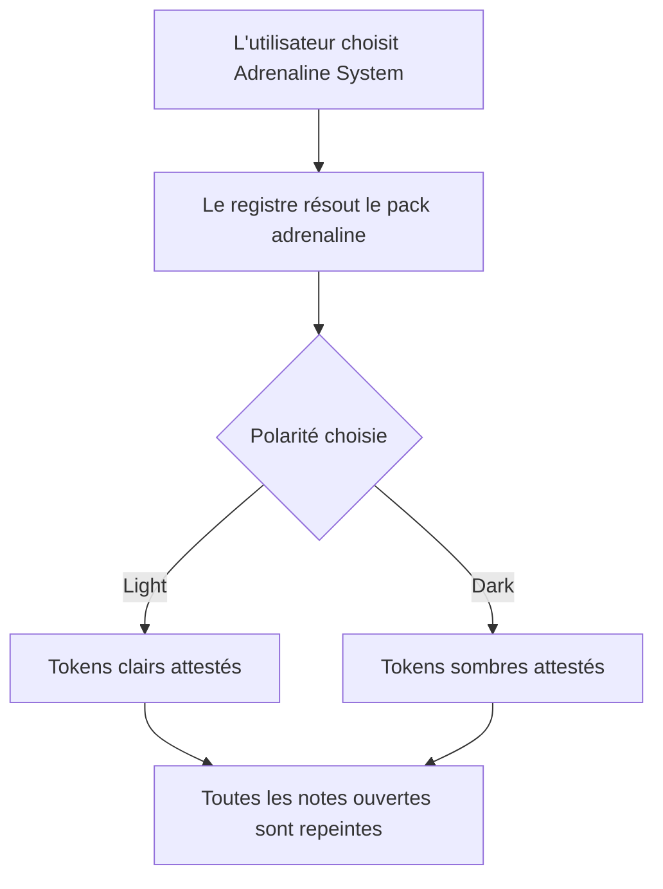
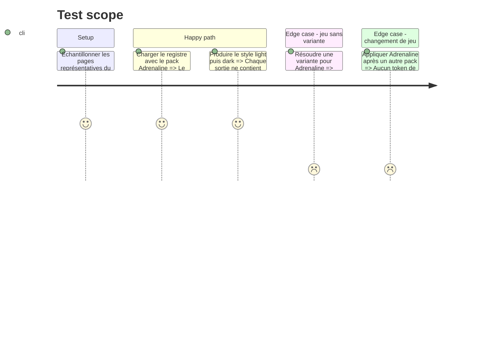

# Instruction: Sources visuelles et pack Adrenaline

## Architecture projection

> Tree of the final files. ✅ create · ✏️ modify · ❌ delete

```txt
.
├── aidd_docs/tasks/2026_09/2026_09_09_adrenaline-game
│   └── visual-findings.md                       ✅ consigne les preuves light/dark et les choix génériques
├── src/games
│   ├── adrenaline.ts                            ✅ déclare l'identité, les polarités et les tokens sourcés
│   └── registry.ts                              ✏️ enregistre le quatrième pack statique
├── tools
│   ├── assertGameVariants.harness.mts           ✏️ accepte Adrenaline comme jeu sans variante
│   └── assertStyleScope.harness.mts             ✏️ couvre les deux couches et leur isolation
├── esbuild.config.mjs                           ✏️ généralise la bannière au nouveau jeu
├── manifest.json                                ✏️ généralise la description visible
└── package.json                                 ✏️ généralise la description et les mots-clés

Aucune suppression de fichier.
```

## User Journey



## Test Scope



## Tasks to do

### `1)` Établir les preuves visuelles

> Distinguer l'identité réutilisable d'Adrenaline des motifs propres à Zombiology.

1. Échantillonner des pages courantes claires, ouvertures rouge-noir, tableaux, encadrés et la feuille de PJ du PDF de 254 pages.
2. Relever les numéros PDF et imprimés, palette, contraste, hiérarchie, séparateurs, densité et substituts de fontes redistribuables.
3. Classer chaque choix comme Adrenaline réutilisable, Zombiology à exclure ou incertain, avec sa preuve dans `visual-findings.md`.
4. Retenir uniquement des textures et ornements reproductibles en CSS ; ne copier aucune image ni fonte du livre.

### `2)` Déclarer le pack

> Faire d'Adrenaline un game autonome, sélectionnable et utilisable hors ligne.

1. Créer `adrenalinePack` avec l'id `adrenaline`, le label `Adrenaline System` et `polarities: ["light", "dark"]`.
2. Placer les métriques et fontes communes dans `base`, puis les couleurs de note et d'interface dans les couches `light` et `dark`.
3. Utiliser les helpers de tokens existants et laisser `assets.images` vide tant qu'aucun actif original ou redistribuable n'est requis.
4. Ajouter une registration portant seulement `pack: adrenalinePack` à `DECLARED_GAMES`, sans `variants` ni `defaultVariantId`, sans modifier le repli par défaut ni le format publié du game pack.

### `3)` Aligner les surfaces publiques et les assertions

> Ne plus présenter Handbook comme limité aux trois jeux Son of Oak.

1. Généraliser les descriptions du manifeste, du paquet et de la bannière de build ; ajouter Adrenaline aux mots-clés sans changer l'identifiant du plugin.
2. Étendre l'assertion des variantes pour attendre quatre registrations, conserver les trois univers de :Otherscape et prouver que `normalizeGameVariantId("adrenaline", ...)` rend `null`.
3. Étendre l'assertion de portée pour prouver les sélecteurs composés light/dark et le remplacement intégral du style lors d'un changement de game.
4. Vérifier que la liste des réglages reçoit automatiquement Adrenaline depuis le registre et que le sélecteur de polarité annonce deux choix de couleur, sans afficher le contrôle d'univers réservé aux jeux à variantes.

## Test acceptance criteria

| Task | Acceptance criteria |
| ---- | ------------------- |
| 1 | `visual-findings.md` rattache chaque token retenu à une page vérifiée et sépare explicitement l'identité Adrenaline des éléments zombifiques exclus. |
| 1 | Aucun fichier extrait du PDF ni aucune fonte propriétaire n'apparaît dans `assets/` ou dans le bundle. |
| 2 | `resolveGamePack("adrenaline")` rend un pack portant exactement les polarités light et dark, sans fetch ni import du dépôt frère. |
| 2 | `resolveGameRegistration("adrenaline")` ne porte aucune variante, sa normalisation de variante rend `null` et les trois variantes de :Otherscape restent inchangées. |
| 2 | Basculer entre les deux polarités change les fonds, encres et accents ; basculer vers un autre game retire toutes les valeurs Adrenaline. |
| 3 | `pnpm assert:game-variants` accepte les quatre games, n'ajoute aucune classe de variante Adrenaline et conserve les classes metro, cairo et tokyo. |
| 3 | Adrenaline System apparaît dans le sélecteur de game, aucun sélecteur d'univers n'apparaît pour lui et le contrôle de couleur permet Follow Obsidian, Light et Dark. |
| 3 | Le manifeste, le paquet et la bannière décrivent Handbook sans l'attribuer exclusivement aux jeux Son of Oak. |
