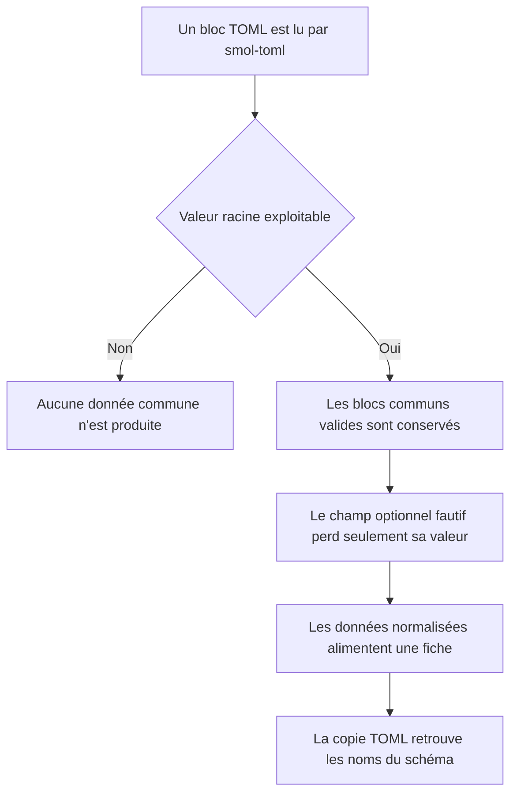
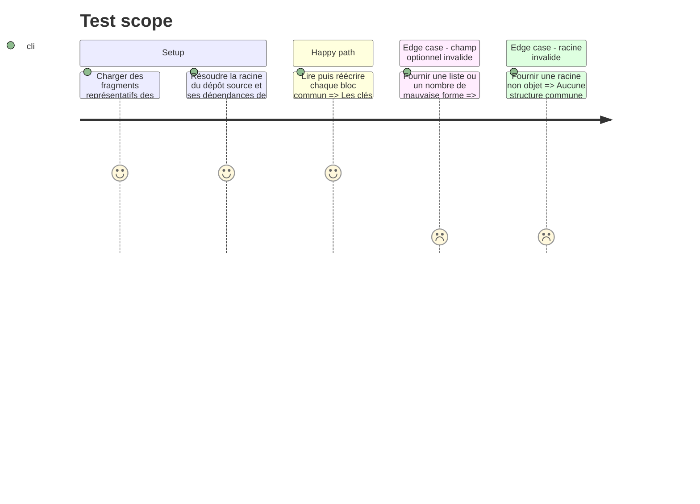

# Instruction: Socle documentaire commun

## Architecture projection

> Tree of the final files. ✅ create · ✏️ modify · ❌ delete

```txt
.
├── src/features/adrenaline
│   ├── document.ts                              ✅ lit et réécrit les blocs communs des trois schémas
│   └── view.ts                                  ✅ construit les sections et valeurs partagées des fiches
├── tools
│   ├── assert-adrenaline-documents.mjs          ✅ lance le harnais documentaire sans nouveau runner
│   ├── assertAdrenalineDocuments.harness.mts    ✅ vérifie lecture tolérante et aller-retour des blocs communs
│   ├── assert-adrenaline-source.mjs              ✅ lance la validation croisée depuis le dépôt frère
│   └── assertAdrenalineSource.harness.mts        ✅ valide les exemples et les TOML réémis par Handbook
└── package.json                                 ✏️ expose les deux assertions documentaires

Aucune suppression de fichier.
```

## User Journey



## Test Scope



## Tasks to do

### `1)` Modéliser le vocabulaire partagé

> Représenter une seule fois les structures réellement communes aux trois cibles.

1. Définir les types de lecture pour identité, caractéristiques, santé, protections, formations, compétences, équipement, narratif et provenance, chacun partagé par au moins deux cibles.
2. Réutiliser seulement les primitives génériques de `schemaValues.ts`; définir une provenance Adrenaline distincte avec `typeDePublication`, `auteurs`, `page`, `source` et `licence`, sans appeler `readMeta`.
3. Respecter les clés, bornes et optionalités de `schemas/adrenaline/0.1.0/*.schema.json`; ne pas transformer les trois racines en union permissive.
4. Préserver les valeurs libres seulement là où le schéma publie un catalogue ouvert ; ignorer et signaler une fois les clés inconnues, puis dégrader les champs optionnels mal formés sans jeter.
5. Laisser contagion, état alternatif et autres structures propres à une seule cible dans son module de fiche au lieu de les abstraire par anticipation.

### `2)` Préparer l'aller-retour TOML

> Permettre aux trois blocs de lire et copier le même document interopérable.

1. Centraliser l'appel protégé à `smol-toml` et la construction des sous-documents communs.
2. Émettre les noms de champs du schéma source et omettre les objets ou listes vides optionnels.
3. Préserver `competence.total` à la copie, mais afficher un total recalculé seulement lorsque la caractéristique référencée est présente ; sinon afficher le pourcentage de base sans promouvoir le total stocké.
4. Signaler une fois les invariants sémantiques non exprimables par le schéma, telle une santé mentale de monstre sans caractéristique mentale, tout en préservant la donnée au rendu et à la copie.
5. Garder toute validation stricte dans `schema-adrenaline`; Handbook reste un lecteur tolérant adapté à une note en cours d'édition.

### `3)` Poser les primitives de rendu

> Donner aux trois fiches une famille DOM commune sans leur imposer la même forme.

1. Créer des helpers documentaires pour en-têtes de section, grilles de caractéristiques, seuils de santé, listes et lignes de provenance.
2. Retourner des éléments construits avec le `Document` reçu, sans HTML injecté ni dépendance au document global.
3. Laisser chaque renderer posséder l'ordre de ses zones et ses champs requis ; les helpers ne décident ni de la géométrie ni de la présence d'une zone.

### `4)` Prouver le socle

> Tester les structures partagées avant de les engager dans trois renderers.

1. Ajouter un harnais `.mts` bundlé par esbuild, sur le modèle des assertions durables existantes.
2. Couvrir un fragment complet, des absences optionnelles, des types fautifs et un aller-retour TOML stable par structure commune.
3. Exposer `pnpm assert:adrenaline-documents` sans ajouter vitest, jest, tsx ni dépendance d'exécution.
4. Ajouter un second harnais qui appelle directement `PersonnageJoueur`, `PersonnageNonJoue` ou `Monstre` avec le `tsx` du dépôt source : résoudre d'abord `SCHEMA_ADRENALINE_ROOT`, puis le sibling du checkout courant, puis le sibling du checkout principal déduit de `git rev-parse --git-common-dir` pour fonctionner aussi depuis un worktree sous `/tmp`.
5. Lui faire valider d'abord les six exemples sources, puis, pour chaque témoin Adrenaline enregistré, enchaîner parseur Handbook, entrée `TOML_EXPORTS`, sérialisation, reparsing TOML et cible Zod correspondante.
6. Si `node_modules/.bin/tsx` manque dans le dépôt source, arrêter la phase avec un message demandant l'autorisation d'y exécuter `npm ci`; ne pas installer silencieusement, ne pas ajouter `tsx` à Handbook et ne modifier aucun fichier suivi du dépôt frère.
7. Échouer avec un message actionnable donnant les chemins essayés et l'override `SCHEMA_ADRENALINE_ROOT` si la racine reste introuvable ; ne coder aucun chemin absolu et ne charger aucune cible Zod à l'exécution du plugin.

## Test acceptance criteria

| Task | Acceptance criteria |
| ---- | ------------------- |
| 1 | Les huit caractéristiques, les quatre seuils physiques et mentaux et leurs protections gardent les noms et optionalités publiés. |
| 1 | Une provenance complète ressort avec ses cinq clés françaises, y compris `licence`, sans clé snake_case inventée. |
| 1 | Un champ facultatif mal typé disparaît seul ; une racine non objet ne produit aucune structure commune. |
| 2 | Lire puis réécrire les fragments publiés conserve toutes les valeurs reconnues sous les clés attendues par `schema-adrenaline`. |
| 2 | Un total de compétence incohérent n'est jamais présenté comme une valeur calculée fiable. |
| 2 | Une santé mentale de monstre sans caractéristique mentale reste visible et copiable, avec un seul avertissement par session. |
| 3 | Les helpers produisent du texte et des classes communes sans fixer l'ordre des zones propres au PJ, PNJ ou monstre. |
| 4 | Le harnais documentaire couvre les trois familles sans nouveau runner ; le harnais source termine sans erreur après satisfaction explicite de la précondition `npm ci` dans `schema-adrenaline`. |
| 4 | Une source présente sans `tsx` produit une instruction d'amorçage actionnable et aucune écriture automatique hors du worktree. |
| 4 | `pnpm assert:adrenaline-source` trouve le même dépôt source depuis le checkout principal et depuis le worktree isolé, ou explique comment fournir sa racine sans chemin machine committé. |
| 4 | Le harnais source accepte les six exemples publiés puis chaque TOML réémis par Handbook, refuse une correspondance bloc/cible inconnue et rapporte chaque erreur Zod avec le chemin et la cible. |
