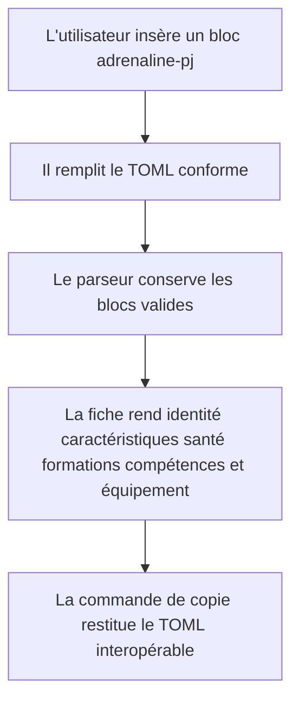
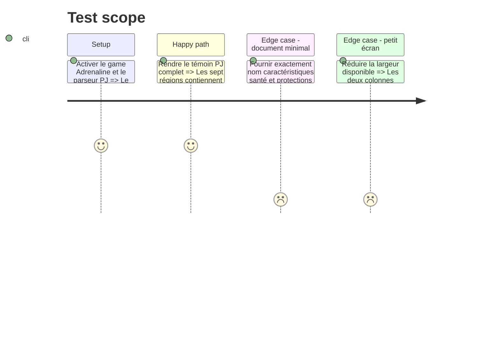

# Instruction: Fiche PJ

## Architecture projection

> Tree of the final files. ✅ create · ✏️ modify · ❌ delete

```txt
.
├── corpus
│   ├── refus
│   │   ├── adrenaline-pj.nom-absent.toml                  ✅ prouve le refus de la racine invalide
│   │   ├── adrenaline-pj.caracteristiques-manquantes.toml ✅ prouve une obligation de fiche jouable
│   │   ├── adrenaline-pj.sante-absente.toml               ✅ prouve une obligation de fiche jouable
│   │   ├── adrenaline-pj.protections-absentes.toml         ✅ prouve une obligation de fiche jouable
│   │   └── adrenaline-pj.identite-age-en-texte.toml        ✅ prouve la dégradation locale
│   └── temoins
│       └── adrenaline-pj.toml                    ✅ porte une fiche PJ complète conforme
├── src/features
│   ├── adrenalinePj
│   │   ├── block.ts                              ✅ déclare le bloc et son modèle d'insertion
│   │   ├── parser.ts                             ✅ projette le document PJ publié
│   │   ├── renderer.ts                           ✅ rend les sept régions de la fiche
│   │   ├── schema.ts                             ✅ lit et réécrit la racine PJ
│   │   └── shape.ts                              ✅ publie les zones nommées du PJ
│   └── blocks
│       ├── registry.ts                           ✏️ enregistre `adrenaline-pj`
│       └── tomlExports.ts                        ✏️ ajoute la copie conforme du PJ
├── src/settings
│   ├── index.ts                                  ✏️ ajoute la section Adrenaline et le contrôle PJ
│   └── types.ts                                  ✏️ persiste et normalise le feature flag PJ
└── src/styles
    ├── adrenaline
    │   ├── _pj.scss                              ✅ pose la géométrie responsive de la fiche PJ
    │   └── index.scss                            ✅ assemble les styles Adrenaline
    └── styles.scss                               ✏️ charge le nouveau module de styles

Aucune suppression de fichier.
```

## User Journey



## Test Scope



## Wireframe

```txt
┌──────────────────────────────────────────────────────────────┐
│ (1) PJ : identité · nom · paramètres de partie               │
├────────────────────────────┬─────────────────────────────────┤
│ (2) Caractéristiques       │ (3) Santé et protections       │
│     physiques · mentales   │     physique · mentale          │
├────────────────────────────┼─────────────────────────────────┤
│ (4) Formations             │ (5) Compétences des formations │
│     groupes et valeurs     │     spécialités et totaux       │
├────────────────────────────┴─────────────────────────────────┤
│ (6) Équipement · armes · possessions                         │
├──────────────────────────────────────────────────────────────┤
│ (7) Provenance                                                │
└──────────────────────────────────────────────────────────────┘
```

1. En-tête PJ : identité principale et données de partie.
2. Caractéristiques : les huit scores groupés par nature.
3. Santé : seuils et protections mis en regard.
4. Formations : groupes structurants du personnage.
5. Compétences : valeurs imbriquées dans `formations[].competences`, présentées à part sans créer de clé racine.
6. Équipement : possessions, protections et armes.
7. Provenance : source, auteurs, page, type de publication et licence lorsqu'ils existent.

## Tasks to do

### `1)` Lire et réécrire le PJ

> Brancher la racine `pj.schema.json` sans en créer une copie divergente.

1. Définir le modèle PJ à partir des champs publiés et composer les lecteurs communs de la phase 2.
2. Exiger le nom et les structures requises par le schéma ; perdre seulement les blocs optionnels fautifs.
3. Produire un TOML sérialisable par `smol-toml`, fidèle aux clés et listes imbriquées du document d'entrée.
4. Utiliser `survivante-complete.toml` comme base du témoin local, lui ajouter un bloc `meta` portant les cinq champs publiés, et garder une fiche minimale pour le repli.

### `2)` Rendre la fiche PJ

> Faire tenir une fiche longue dans une note desktop comme mobile.

1. Construire les sept zones confirmées, avec classes de zone issues de `shape.ts` et omission des zones optionnelles vides.
2. Mettre les caractéristiques physiques et mentales en groupes lisibles, puis rapprocher seuils, armure et caractère.
3. Présenter formations, compétences imbriquées et équipement sans tronquer les listes longues, masquer les spécialités ni inventer une collection `competences` à la racine PJ.
4. Replier la grille en une colonne à largeur étroite et empêcher tout débordement des tableaux et libellés.

### `3)` Intégrer le bloc aux surfaces du plugin

> Donner au PJ les mêmes portes d'entrée et de sortie que les formats existants.

1. Déclarer le bloc sous `adrenaline-pj`, en mode `adrenaline`, avec son template TOML et son feature flag activé par défaut.
2. L'enregistrer dans `BRUMES_BLOCKS` et `TOML_EXPORTS`, puis ajouter le contrôle à la section Adrenaline des réglages.
3. Garder la forme finale sur le bloc et la géométrie dans `_pj.scss`; ne pas recopier les mêmes zones dans `adrenalinePack.shapes`.
4. Ajouter les témoins et refus du nom, des trois blocs jouables requis et d'un champ d'identité optionnel fautif, puis vérifier que le dump DOM expose chaque zone.

## Test acceptance criteria

| Task | Acceptance criteria |
| ---- | ------------------- |
| 1 | Le témoin PJ complet conserve identité, huit caractéristiques, santé, protections, paramètres, formations, compétences, équipement et les cinq champs de provenance. |
| 1 | La copie du témoin est acceptée par la cible Zod PJ du dépôt frère via `pnpm assert:adrenaline-source`. |
| 2 | Chaque donnée du wireframe, provenance comprise, apparaît dans sa zone ; une zone optionnelle vide n'occupe aucun espace. |
| 2 | À largeur étroite, la fiche devient une colonne lisible sans défilement horizontal imposé par sa géométrie. |
| 3 | Le bloc et son insertion ne sont actifs qu'en mode Adrenaline et peuvent être désactivés depuis les réglages. |
| 3 | Le corpus accepte le témoin, refuse séparément le nom, les caractéristiques, la santé ou les protections absents, dégrade l'âge d'identité fautif et trouve une commande de copie. |
