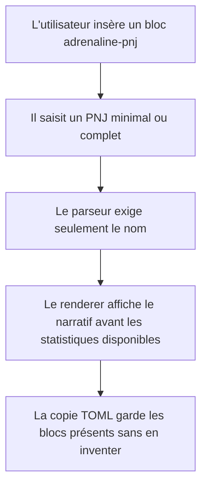
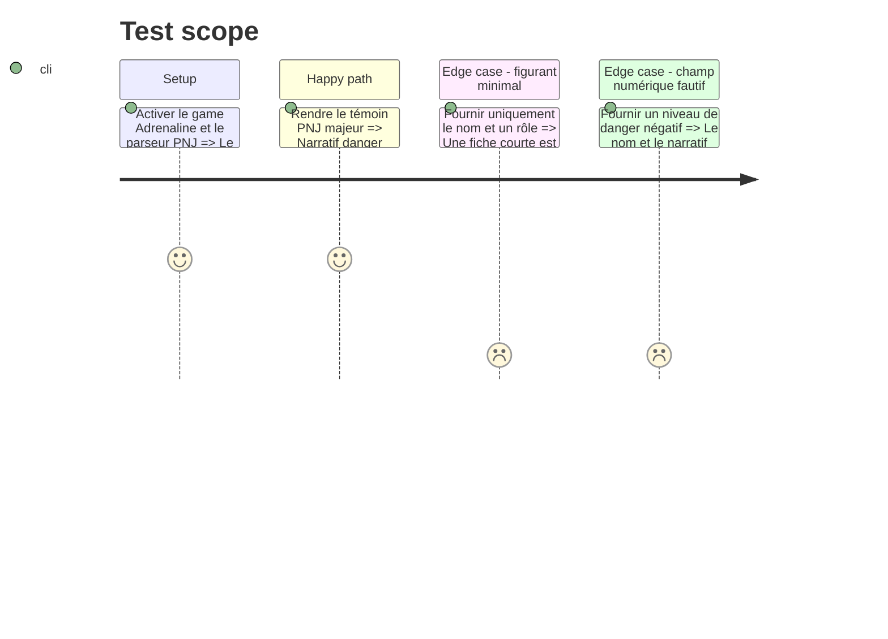

# Instruction: Fiche PNJ

## Architecture projection

> Tree of the final files. ✅ create · ✏️ modify · ❌ delete

```txt
.
├── corpus
│   ├── refus
│   │   ├── adrenaline-pnj.nom-absent.toml       ✅ prouve le refus de la racine invalide
│   │   └── adrenaline-pnj.niveau-danger-negatif.toml ✅ prouve la dégradation d'une valeur fautive
│   └── temoins
│       └── adrenaline-pnj.toml                   ✅ porte un PNJ majeur conforme
├── src/features
│   ├── adrenalinePnj
│   │   ├── block.ts                              ✅ déclare le bloc et son modèle d'insertion
│   │   ├── parser.ts                             ✅ projette le document PNJ publié
│   │   ├── renderer.ts                           ✅ rend les sept régions de la fiche
│   │   ├── schema.ts                             ✅ lit et réécrit la racine PNJ
│   │   └── shape.ts                              ✅ publie les zones nommées du PNJ
│   └── blocks
│       ├── registry.ts                           ✏️ enregistre `adrenaline-pnj`
│       └── tomlExports.ts                        ✏️ ajoute la copie conforme du PNJ
├── src/settings
│   ├── index.ts                                  ✏️ ajoute le contrôle PNJ à la section Adrenaline
│   └── types.ts                                  ✏️ persiste et normalise le feature flag PNJ
└── src/styles/adrenaline
    ├── _pnj.scss                                 ✅ pose la géométrie responsive du PNJ
    └── index.scss                                ✏️ charge le partial PNJ

Aucune suppression de fichier.
```

## User Journey



## Test Scope



## Wireframe

```txt
┌──────────────────────────────────────────────────────────────┐
│ (1) PNJ : nom · rôle · niveau de danger                      │
├──────────────────────────────────────────────────────────────┤
│ (2) Présentation narrative · attitude · répliques            │
├────────────────────────────┬─────────────────────────────────┤
│ (3) Caractéristiques       │ (4) Santé et protections       │
├────────────────────────────┼─────────────────────────────────┤
│ (5) Formations · compétences│ (6) Équipement                │
├────────────────────────────┴─────────────────────────────────┤
│ (7) Provenance                                                │
└──────────────────────────────────────────────────────────────┘
```

1. En-tête PNJ : identification immédiatement exploitable.
2. Narratif : éléments utiles à l'interprétation.
3. Caractéristiques : scores présents sur la fiche.
4. Santé : seuils et défenses lorsqu'ils existent.
5. Formations et compétences : capacités saillantes, groupées ou indépendantes selon le document.
6. Équipement : possessions et armes éventuelles.
7. Provenance : source, auteurs, page, type de publication et licence lorsqu'ils existent.

## Tasks to do

### `1)` Lire et réécrire le PNJ

> Respecter une racine dont seul le nom est structurellement indispensable.

1. Composer les champs PNJ et les structures partagées sans réutiliser les obligations du PJ.
2. Préserver niveau de danger, description, identité, caractéristiques, santé, protections, formations, compétences hors formation, équipement, narratif et provenance lorsqu'ils sont valides.
3. Omettre les blocs absents au lieu de produire des valeurs par défaut qui n'existent pas dans le schéma.
4. Utiliser `pnj-majeur.toml` comme base du témoin complet, lui ajouter un bloc `meta` portant les cinq champs publiés, et garder `pnj-secondaire.toml` comme cas minimal de référence.

### `2)` Rendre les formes courte et complète

> Faire du PNJ une aide de jeu lisible, pas un PJ rempli de cases vides.

1. Mettre nom, rôle et danger en tête, puis le narratif avant les statistiques détaillées.
2. Construire les zones statistiques seulement lorsqu'une donnée les justifie.
3. Réutiliser les composants visuels du PJ pour caractéristiques, santé et équipement sans recopier sa grille entière.
4. Garantir une lecture linéaire lorsque le bloc est étroit ou ne contient qu'un figurant minimal.

### `3)` Intégrer et prouver le bloc

> Brancher le PNJ sur le registre, les réglages, la copie et le corpus.

1. Déclarer `adrenaline-pnj` en mode Adrenaline avec son template TOML et son feature flag activé par défaut.
2. Enregistrer le bloc et son export, puis ajouter son contrôle sous la même section de réglages que le PJ.
3. Ajouter la forme par défaut du bloc et le partial PNJ sans dupliquer les zones dans le pack ni introduire de couleur qui devrait y vivre.
4. Verser les cas complet, minimal et fautif au corpus et comparer leur DOM au wireframe.

## Test acceptance criteria

| Task | Acceptance criteria |
| ---- | ------------------- |
| 1 | Le témoin majeur conserve tous les blocs publiés, provenance complète comprise ; le témoin secondaire reste valide sans statistiques détaillées. |
| 1 | La copie des deux formes est acceptée par la cible Zod PNJ du dépôt frère via `pnpm assert:adrenaline-source`. |
| 2 | Un PNJ minimal rend un en-tête et son narratif sans grille vide ; un PNJ complet rend les sept régions dans l'ordre confirmé. |
| 2 | La fiche reste lisible en une colonne et ne reprend ni paramètres de partie ni obligations propres au PJ. |
| 3 | Le bloc est proposé seulement en mode Adrenaline, possède son contrôle et sa commande de copie. |
| 3 | Le niveau de danger fautif disparaît seul tandis que le nom et les données valides restent visibles. |
