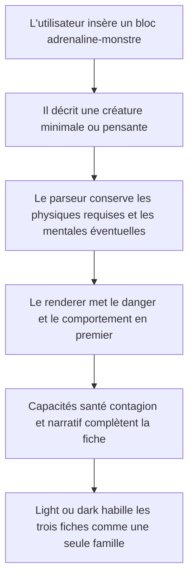
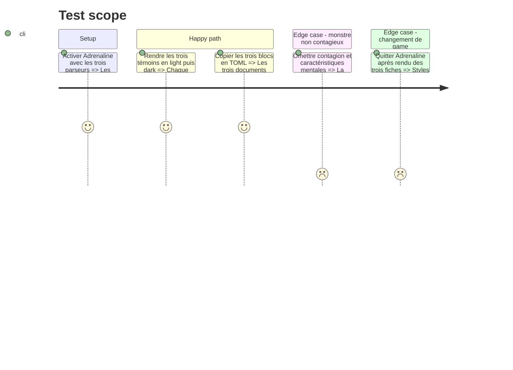

# Instruction: Monstre, cohérence et livraison

## Architecture projection

> Tree of the final files. ✅ create · ✏️ modify · ❌ delete

```txt
.
├── corpus
│   ├── README.md                                 ✏️ décrit le corpus extensible et les trois formats Adrenaline
│   ├── refus
│   │   ├── adrenaline-monstre.nom-absent.toml                  ✅ prouve le refus de la racine invalide
│   │   ├── adrenaline-monstre.caracteristique-physique-manquante.toml ✅ prouve une obligation
│   │   └── adrenaline-monstre.actions-par-round-negatives.toml ✅ prouve la dégradation locale
│   └── temoins
│       └── adrenaline-monstre.toml               ✅ porte un monstre pensant conforme
├── src/features
│   ├── adrenalineMonstre
│   │   ├── block.ts                              ✅ déclare le bloc et son modèle d'insertion
│   │   ├── parser.ts                             ✅ projette le document monstre publié
│   │   ├── renderer.ts                           ✅ rend les sept régions de la créature
│   │   ├── schema.ts                             ✅ lit et réécrit la racine monstre
│   │   └── shape.ts                              ✅ publie les zones nommées du monstre
│   ├── blocks
│   │   ├── registry.ts                           ✏️ enregistre `adrenaline-monstre`
│   │   └── tomlExports.ts                        ✏️ ajoute la copie conforme du monstre
│   └── tags
│       └── widgets.ts                            ✏️ restaure la baseline lint avec le helper DOM supporté
├── src/settings
│   ├── index.ts                                  ✏️ complète la section Adrenaline avec le contrôle monstre
│   └── types.ts                                  ✏️ persiste et normalise le feature flag monstre
├── src/styles/adrenaline
│   ├── _monstre.scss                             ✅ pose la géométrie responsive du monstre
│   └── index.scss                                ✏️ charge le partial et harmonise la famille de fiches
├── tools
│   ├── assert-adrenaline-theme.mjs               ✅ lance les contrôles de contrat visuel
│   ├── assertAdrenalineTheme.harness.mts         ✅ vérifie polarités portée et classes des trois fiches
│   └── assert-settings-ui.mjs                    ✏️ couvre la section et les trois contrôles
├── package.json                                  ✏️ expose l'assertion finale Adrenaline
├── README.md                                     ✏️ documente le game et les trois syntaxes TOML
└── CLAUDE.md                                     ✏️ actualise l'architecture et les commandes durables

Aucune suppression de fichier.
```

## User Journey



## Test Scope



## Wireframe

```txt
┌──────────────────────────────────────────────────────────────┐
│ (1) Monstre : nom · type · niveau de danger                  │
├────────────────────────────┬─────────────────────────────────┤
│ (2) Détection · déplacement│ (3) Actions · comportement     │
├────────────────────────────┼─────────────────────────────────┤
│ (4) Caractéristiques       │ (5) Santé et protections       │
├────────────────────────────┴─────────────────────────────────┤
│ (6) Capacités · état · équipement · contagion · narratif     │
├──────────────────────────────────────────────────────────────┤
│ (7) Provenance                                                │
└──────────────────────────────────────────────────────────────┘
```

1. En-tête monstre : identification et danger.
2. Mobilité : perception de la cible et déplacement.
3. Comportement : économie d'action et conduite en jeu.
4. Caractéristiques : physiques requises, mentales éventuelles.
5. Santé : résistance et protections.
6. Capacités : traits, état alternatif, compétences, équipement, contagion et compléments narratifs.
7. Provenance : source, auteurs, page, type de publication et licence lorsqu'ils existent.

## Tasks to do

### `1)` Lire et réécrire le monstre

> Respecter une cible distincte, y compris les monstres non contagieux ou sans mental.

1. Composer les champs propres au monstre avec les lecteurs communs sans lui ajouter formations, paramètres de partie ou équipement de départ.
2. Exiger le nom et les caractéristiques physiques publiées ; garder les mentales et le bloc contagion entièrement optionnels.
3. Préserver type de corps, instinct, type d'infecté, description, danger, détection, déplacement, actions par round, état alternatif, comportement, traits spéciaux, compétences, équipement et narratif.
4. Construire le témoin complet depuis `predateur-pensant.toml`, compléter état alternatif et contagion depuis `infecte-rodeur.toml`, puis ajouter équipement et les cinq champs `meta`; garder le rôdeur non contagieux comme cas minimal distinct.

### `2)` Rendre la fiche de monstre

> Prioriser ce que le meneur consulte pendant une confrontation.

1. Mettre nom, type et danger en tête, suivis de détection, déplacement, actions et comportement.
2. Réutiliser la famille visuelle des statistiques et de la santé, en omettant proprement le mental absent.
3. Regrouper état alternatif, traits spéciaux, compétences, équipement, contagion et narratif dans des zones distinctes mais compactes.
4. Replier la grille en une colonne étroite et garder listes et valeurs lisibles pendant le jeu.

### `3)` Fermer la chaîne fonctionnelle

> Donner au monstre et à la famille entière toutes les garanties d'un format Handbook.

1. Déclarer `adrenaline-monstre` en mode Adrenaline avec template, feature flag, registre et commande de copie.
2. Ajouter les témoins et refus du nom, d'une caractéristique physique requise et des actions négatives, actualiser `corpus/README.md` sans figer un total fragile, puis faire couvrir chaque bloc du registre par le corpus et le dump DOM.
3. Vérifier que les trois fiches partagent les mêmes rythmes, bordures, fontes et tokens sans perdre leurs zones propres.
4. Ajouter une assertion durable des deux polarités, des sélecteurs scopés et des classes racines des trois renderers.

### `4)` Documenter et vérifier la livraison

> Rendre le nouveau game utilisable et maintenable sans connaissance de cette conversation.

1. Documenter la sélection du game, le choix de polarité, les trois code fences, leurs templates TOML, la provenance des schémas et l'attribution de l'Adrenaline System, sans revendiquer de licence ou de marque au-delà des termes sourcés.
2. Actualiser la mémoire projet pour quatre games, les trois blocs Adrenaline et les nouvelles commandes d'assertion.
3. Restaurer la baseline lint observée sur le snapshot :Otherscape : utiliser le helper `createSpan` dans `widgets.ts` et conserver `display()` dans `settings/index.ts` pour la compatibilité avec `minAppVersion: 1.12.7`, avec des suppressions `no-deprecated` strictement locales et justifiées puisque `getSettingDefinitions` n'existe qu'à partir d'Obsidian 1.13.
4. Capturer les deux portées de lint avant et après ce correctif, attribuer chaque nouvel écart aux fichiers du chantier, puis vérifier build, lint global et `src`, corpus, documents Adrenaline, variantes, overrides, réglages, portée des styles et thème Adrenaline.
5. Capturer le DOM des blocs présents au démarrage de cette phase et le comparer après ; seuls les trois nouveaux témoins Adrenaline doivent ajouter des sorties.
6. Tester les trois fiches dans une note desktop et étroite, en light puis dark, et consigner dans `visual-findings.md` les douze combinaisons vérifiées ainsi que tout écart corrigé, sans publier les pages ou actifs extraits du PDF.

## Test acceptance criteria

| Task | Acceptance criteria |
| ---- | ------------------- |
| 1 | Le témoin complet exerce chaque champ racine publié, provenance comprise ; le rôdeur valide sans mental ni contagion. |
| 1 | Un monstre sans nom ou sans l'une des quatre caractéristiques physiques est refusé ; des actions par round négatives disparaissent seules. |
| 1 | La copie des deux formes est acceptée par la cible Zod monstre du dépôt frère via `pnpm assert:adrenaline-source`. |
| 2 | Le wireframe place les informations de confrontation avant les compléments, conserve équipement et provenance, et n'affiche aucune zone vide pour les blocs optionnels absents. |
| 2 | La fiche reste lisible sans débordement en largeur étroite, dans les deux polarités. |
| 3 | Chaque bloc enregistré possède un témoin et une commande de copie ; tous les refus produisent le repli attendu sans exception. |
| 3 | Aucun sélecteur light ou dark Adrenaline n'est global, et changer de game retire tout style Adrenaline actif. |
| 4 | Le README permet de créer et copier un PJ, un PNJ et un monstre sans consulter le code ni le dépôt frère, et crédite le système sans extrapoler ses conditions juridiques. |
| 4 | Tous les blocs présents avant ce chantier produisent le même DOM qu'au départ et les trois nouveaux blocs apparaissent uniquement en mode Adrenaline. |
| 4 | Build, les deux portées de lint et toutes les assertions durables terminent sans erreur. |
| 4 | La correction de baseline n'altère ni le contenu des réglages ni le rendu des tags et chaque suppression de déprécation est limitée à l'API `display()` requise par Obsidian 1.12.7. |
| 4 | Le rapport de livraison distingue les erreurs observées dans la baseline des régressions introduites par Adrenaline ; aucune baseline rouge n'est présentée comme une livraison verte. |
| 4 | `visual-findings.md` atteste les trois fiches en desktop et en largeur étroite dans les deux polarités, avec le résultat observable de chacun des douze contrôles. |
