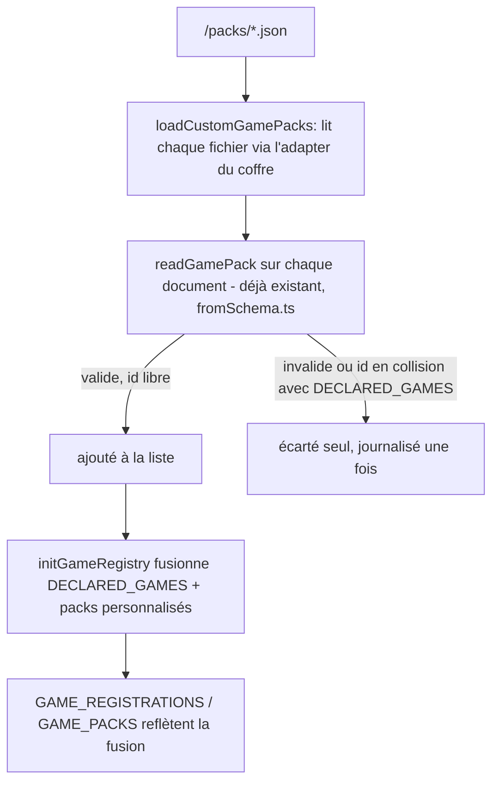

<!-- Fill or omit these sections; never add, rename, or reorder one. -->

# Instruction: Lecture et fusion des packs personnalisés

## Architecture projection

> Tree of the final files. ✅ create · ✏️ modify · ❌ delete

```txt
.
└── src/
    └── games/
        ├── customPacks.ts        ✅ lit <dossier du plugin>/packs/*.json, renvoie des GamePack valides
        └── registry.ts           ✏️ GAME_REGISTRATIONS/GAME_PACKS passent de const figées à un état rempli par initGameRegistry()
```

## User Journey



## Tasks to do

### `1)` Lecteur de dossier de packs

> Un fichier fautif ne bloque pas les autres ; aucun fichier ne bloque le démarrage.

1. Créer `src/games/customPacks.ts`, exportant `loadCustomGamePacks(plugin: Plugin): Promise<GamePack[]>`.
2. Résoudre `<dossier du plugin>/packs/` via `plugin.manifest.dir`, comme `overridePath` le fait dans `overrides.ts`.
3. Si le dossier n'existe pas (`adapter.exists`), renvoyer `[]` sans avertir — l'absence du dossier est l'état normal d'un coffre sans pack personnalisé.
4. Lister les fichiers `.json` du dossier (`adapter.list`), lire chacun (`adapter.read`), le parser en JSON.
5. Passer chaque document à `readGamePack` (`fromSchema.ts`, déjà écrit, jamais branché). `readGamePack(source: unknown)` ne prend pas de nom de fichier et journalise déjà ses propres échecs de façon générique (id absent, id invalide) — c'est `loadCustomGamePacks` qui doit journaliser le nom du fichier, en plus de ce que `readGamePack` a déjà dit, quand le parsing JSON échoue ou que `readGamePack` renvoie `null` ; une seule fois par fichier par session, puis le document est ignoré.
6. Une erreur de lecture du dossier ou d'un fichier (permission, I/O) dégrade vers `[]` pour ce fichier, jamais vers une exception qui remonterait jusqu'à `onload()`.

### `2)` Registre fusionné

> Le registre reste consultable en synchrone par tout le code existant ; seul son remplissage devient asynchrone. `GAME_PACKS` et `GAME_REGISTRATIONS` sont importés directement comme valeurs par cinq fichiers hors du module — `src/settings/index.ts` (peuple la liste déroulante des réglages, `GAME_PACKS.find` pour le libellé d'un scope), `src/settings/calloutsModal.ts` (même peuplement de liste déroulante), `src/features/callouts/commands.ts` (`GAME_PACKS.find`), `src/settings/types.ts` (`GAME_REGISTRATIONS`, lu dans `normalizeGameVariants`) et `src/BrumesPlugin.ts` lui-même (`missingAssetRoles(this.assets, GAME_PACKS)` dans `dressDocument`) — pas seulement via les fonctions d'accès ci-dessous : leur identité de tableau doit donc rester stable.

1. Dans `registry.ts`, **garder** `GAME_REGISTRATIONS`/`GAME_PACKS` en `export const`, comme aujourd'hui — ne jamais les réassigner. Le bundle du dépôt est `esbuild --format=cjs` (`esbuild.config.mjs`) ; un `import { GAME_PACKS }` s'y traduit en un accès qualifié à la propriété du module à chaque usage, mais seulement tant que le module continue d'exposer le **même tableau**. Réassigner l'export (`GAME_PACKS = nouveauTableau`) romprait cette lecture pour tout fichier qui l'importe directement plutôt que via une fonction — `commands.ts` en particulier ne le remarquerait qu'à l'usage, aucune erreur de compilation ne le signale.
2. Ajouter `initGameRegistry(customPacks: GamePack[]): void` : construit les `GameRegistration` correspondant aux packs personnalisés (un pack personnalisé n'a pas de variantes, contrairement à :Otherscape), les fait passer par `acceptRegistrations` aux côtés de `DECLARED_GAMES`, puis **vide et remplit en place** `GAME_REGISTRATIONS` et `GAME_PACKS` (`.length = 0` puis `.push(...)`) plutôt que de leur assigner un nouveau tableau. Avant le premier appel, les deux valent exactement ce qu'ils valent aujourd'hui (`DECLARED_GAMES` seul).
3. Un pack personnalisé dont l'id collide avec un id déjà déclaré dans `DECLARED_GAMES` est écarté (le déclaré gagne), journalisé une fois — même règle que pour deux packs déclarés en collision.
4. Deux packs personnalisés qui déclarent le même id : les fichiers du dossier `packs/` sont triés par nom avant lecture (ordre déterministe, indépendant du système de fichiers) ; le premier à revendiquer l'id gagne, les suivants sont écartés et journalisés une fois chacun, par nom de fichier — même traitement qu'un champ fautif.
5. Toutes les fonctions déjà exportées (`gamePackClasses`, `gameVariantClasses`, `findGameRegistration`, `findGamePack`, `resolveGamePack`, `resolveGameRegistration`, `normalizeGameVariantId`) lisent l'état de module sans changer de signature — aucun appelant n'a à changer dans cette phase.
6. Les cinq consommateurs directs listés ci-dessus n'ont besoin d'aucune modification une fois l'identité de tableau préservée (étape 1), qu'ils lisent le tableau à l'affichage d'une commande/modale ou dans une méthode appelée au rendu (`dressDocument`) : `initGameRegistry` s'exécute avant `loadSettings()`/`applySettings()` (phase 2), donc avant que l'onglet de réglages, une modale ou un rendu de document ne s'exécutent. Vérifié, pas supposé.

## Test acceptance criteria

<!-- Each criterion is an observable behavior, not a command. -->

| Task | Acceptance criteria                                                                                                       |
| ---- | ----------------------------------------------------------------------------------------------------------------------- |
| 1    | `loadCustomGamePacks` sur un dossier absent renvoie `[]` sans avertissement ; sur un dossier avec un fichier valide et un fichier invalide, renvoie un seul `GamePack` et journalise une fois le nom du fichier invalide. |
| 2    | Avant tout appel à `initGameRegistry`, `GAME_PACKS`/`GAME_REGISTRATIONS` valent exactement ce qu'ils valaient avant cette phase (comportement inchangé par défaut). |
| 2    | Après `initGameRegistry([pack])` avec un id neuf, `findGamePack(pack.id)` le retrouve et `GAME_PACKS` le contient. |
| 2    | Après `initGameRegistry([pack])` avec un id déjà dans `DECLARED_GAMES`, le pack déclaré reste celui retourné par `findGamePack`, et un avertissement signale la collision une fois. |
| 2    | La référence de tableau de `GAME_PACKS` (`===`) est identique avant et après `initGameRegistry` — seul son contenu change. |
| 2    | Deux packs personnalisés partageant un id : celui dont le nom de fichier trie en premier est retenu, l'autre journalisé une fois ; répéter l'appel ne journalise pas une seconde fois. |
