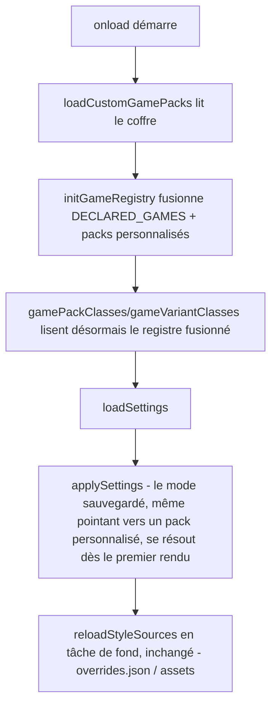

<!-- Fill or omit these sections; never add, rename, or reorder one. -->

# Instruction: Branchement au cycle de vie et harnais

## Architecture projection

> Tree of the final files. ✅ create · ✏️ modify · ❌ delete

```txt
.
├── src/
│   ├── BrumesPlugin.ts                     ✏️ onload() charge et fusionne les packs personnalisés avant loadSettings()/applySettings()
│   └── features/modes/domModeClass.ts      ✏️ MODE_CLASSES/VARIANT_CLASSES supprimées, remplacées par des appels directs à gamePackClasses()/gameVariantClasses(), plus figées à l'import
├── tools/
│   ├── customPacks.harness.mts             ✅ preuve : ordre du chargement, pack valide visible, pack fautif écarté seul, collision d'id
│   └── assert-custom-packs.mjs             ✅ lanceur esbuild du harnais, même motif que assert-override.mjs
├── package.json                            ✏️ script pnpm assert:custom-packs
└── CLAUDE.md                               ✏️ la note « le registre est statique par choix » est mise à jour : il ne l'est plus
```

## User Journey



## Tasks to do

### `1)` Ordre du cycle de vie

> Le pack doit exister avant le premier rendu, pas après.

1. Dans `BrumesPlugin.ts::onload()`, insérer avant l'appel à `loadSettings()` : `const customPacks = await loadCustomGamePacks(this); initGameRegistry(customPacks);`.
2. Ne rien changer à l'appel existant `void this.reloadStyleSources()` — `overrides.json` et les assets restent un chargement en tâche de fond, ce n'est que le registre lui-même qui doit exister plus tôt.
3. Dans `domModeClass.ts`, supprimer les deux `const` de module `MODE_CLASSES`/`VARIANT_CLASSES` et appeler `gamePackClasses()`/`gameVariantClasses()` directement à chacun de leurs quatre usages (`setBrumesModeClass`, `setBrumesVariantClass`, `clearBrumesModeClasses` ×2) — ces fonctions existent déjà dans `registry.ts` et relisent `GAME_PACKS`/`GAME_REGISTRATIONS` à chaque appel, sans cache ; aucun recalcul explicite n'est donc nécessaire, seulement la suppression du figeage à l'import.

### `2)` Harnais de non-régression

> Le motif déjà en place pour `overrides.json` (`tools/overrideRoundTrip.harness.mts` + `tools/assert-override.mjs`), reproduit pour les packs personnalisés.

1. Créer `tools/customPacks.harness.mts` : construit un adaptateur de coffre en mémoire (mêmes stubs `exists`/`read`/`list` qu'un faux `Document` ailleurs dans `tools/`), avec un dossier `packs/` fictif portant un pack valide, un pack au JSON invalide, et un pack dont l'id collide avec un jeu de `DECLARED_GAMES`.
2. Affirmer : le pack valide apparaît dans `GAME_PACKS` et sa classe dans `gamePackClasses()` après `initGameRegistry` ; le pack invalide est absent et journalisé une fois, pas deux fois au second appel ; le pack en collision ne remplace pas le pack déclaré ; une référence à `GAME_PACKS` prise avant `initGameRegistry` (comme le fait `src/features/callouts/commands.ts` en l'important directement) voit le pack personnalisé après coup, sans ré-import.
3. Affirmer l'ordre : simuler `onload()` (ou au minimum la séquence `loadCustomGamePacks → initGameRegistry → resolveGamePack`) et vérifier qu'un `mode` de réglages pointant vers l'id du pack personnalisé se résout vers ce pack, pas vers le pack par défaut.
4. Créer `tools/assert-custom-packs.mjs`, bundle esbuild du harnais avec `external: ['obsidian', 'fs']`, copié sur `tools/assert-override.mjs`.
5. Ajouter `"assert:custom-packs": "node tools/assert-custom-packs.mjs"` dans `package.json`.

### `3)` Documentation

> `CLAUDE.md` affirme aujourd'hui que le registre est statique par choix ; ce n'est plus vrai après cette phase.

1. Dans `CLAUDE.md`, remplacer la puce « Le registre est statique par choix… » par une description du mécanisme réel : un pack déposé dans `<dossier du plugin>/packs/*.json` rejoint le registre au démarrage, avant `DECLARED_GAMES` seul ne suffise à décrire ce qui peut apparaître dans la liste déroulante.
2. Ajouter la commande `pnpm assert:custom-packs` au tableau des commandes du dépôt.

## Test acceptance criteria

<!-- Each criterion is an observable behavior, not a command. -->

| Task | Acceptance criteria                                                                                                                    |
| ---- | ----------------------------------------------------------------------------------------------------------------------------------------- |
| 1    | Un `mode` de réglages sauvegardé pointant vers un id de pack présent uniquement dans `<dossier du plugin>/packs/` se résout vers ce pack dès le premier `applySettings()`, sans retomber sur le pack par défaut. |
| 1    | `gamePackClasses()`/`gameVariantClasses()` contiennent la classe du pack personnalisé après `onload()`, alors qu'ils ne la contenaient pas avant cette phase (import seul, sans `onload`). |
| 2    | `pnpm assert:custom-packs` sort vert sur les trois cas (pack valide, pack invalide, collision d'id) et l'ordre de résolution du mode. |
| 3    | `CLAUDE.md` ne décrit plus le registre comme statique par choix ; `pnpm assert:custom-packs` figure dans le tableau des commandes. |
