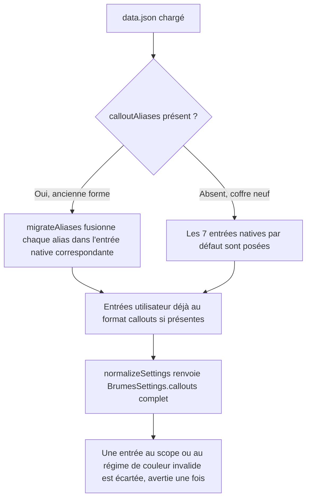

<!-- Fill or omit these sections; never add, rename, or reorder one. -->

# Instruction: Modèle de données et migration

## Architecture projection

> Tree of the final files. ✅ create · ✏️ modify · ❌ delete

```txt
.
├── src/features/callouts
│   ├── types.ts                ✅ vocabulaire fermé : scope, régime de couleur, rôle de police, template, CalloutDefinition
│   ├── nativeCallouts.ts       ✅ les 7 entrées historiques, verrouillées, avec leur styleKey d'origine
│   └── migrateAliases.ts       ✅ ancienne forme (calloutAliases) → liste de CalloutDefinition
├── src/settings/types.ts       ✏️ remplace calloutAliases par callouts: CalloutDefinition[], normalizeSettings appelle la migration
└── tools
    ├── assert-callouts.mjs               ✅ lance le harnais de migration
    └── assertCallouts.harness.mts        ✅ vérifie migration, valeurs par défaut, entrées inconnues

Aucune suppression de fichier à cette phase (aliasSupport.ts et contextMenu.ts restent sur l'ancienne forme jusqu'à la phase 3).
```

## User Journey



## Tasks to do

### `1)` Définir le vocabulaire fermé

> Poser les types que le constructeur et le registre natif partagent, sans laisser passer une valeur hors de la liste fermée.

1. `CalloutScope` : `"all"` ou l'identifiant d'un pack déclaré (`city-of-mist`, `legend-in-the-mist`, `otherscape`, `adrenaline`).
2. `CalloutColorRegime` : `{ kind: "fixed"; hex: string }` ou `{ kind: "theme" }` — jamais un jeton du pack actif.
3. `CalloutFontRole` : `"header"` ou `"text"`, résolu à `--font-header-theme` / `--font-text-theme` au rendu, jamais un nom de police libre.
4. `CalloutTemplate` : reprend `title-body` | `body-only` déjà présent dans `contextMenu.ts`.
5. `CalloutDefinition` : `id`, `name`, `aliases: string[]`, `scope: CalloutScope`, `template: CalloutTemplate`, `icon?: string`, `font: CalloutFontRole`, `color: CalloutColorRegime`, `native: boolean`, `styleKey: string` (la valeur écrite dans `data-brumes-callout-style`). Pour une entrée utilisateur, `styleKey` est **toujours égal à `id`** — jamais un champ saisi séparément dans l'écran B ; seules les 7 entrées natives ont un `styleKey` distinct de leur `id`, repris tel quel de `aliasSupport.ts`.
6. Une entrée native (`native: true`) porte en plus les champs verrouillés en lecture par le futur écran de réglages ; le type ne distingue pas deux interfaces, un champ `native` suffit — la phase 2 empêche l'édition, pas le type.

### `2)` Construire le registre natif

> Représenter les 7 styles historiques sans changer une seule valeur qu'ils produisent aujourd'hui.

1. Une entrée par style existant : `clue`, `red-clue`, `move`, `description` (City of Mist), `note` (City of Mist), `note` (Legend in the Mist), `read-aloud` (Legend in the Mist) — `styleKey` et `scope` repris tels quels de `aliasSupport.ts` et `_callouts.scss`/`_callouts.scss` (Legend in the Mist).
2. `aliases` par défaut copiés de `DEFAULT_CITY_OF_MIST_CALLOUT_ALIASES` / `DEFAULT_LEGEND_IN_THE_MIST_CALLOUT_ALIASES` (`src/settings/types.ts`).
3. `color`/`font`/`template` de chaque entrée native ne sont lus par aucun générateur de CSS : leur rendu reste le SCSS déjà écrit (`_callouts.scss` des deux jeux), ces champs sont renseignés pour la cohérence du type mais ignorés par le futur écrivain de style de la phase 3.

### `3)` Migrer l'ancienne forme

> Faire disparaître `calloutAliases` de `BrumesSettings` sans perdre un seul alias personnalisé déjà enregistré par un utilisateur.

1. `migrateAliases(old: Partial<BrumesCalloutAliasesSettings> | undefined): CalloutDefinition[]` part du registre natif et, pour chaque entrée, remplace `aliases` par la valeur sauvegardée si elle existe (`sanitizeAliases` déjà en place), sinon garde la valeur par défaut de l'entrée native.
2. `BrumesSettings.calloutAliases` disparaît, remplacé par `callouts: CalloutDefinition[]`.
3. `normalizeSettings` : si `data.callouts` existe déjà (coffre déjà migré), valider chaque entrée champ par champ (scope connu, régime de couleur bien formé, rôle de police connu) et écarter silencieusement — avec un avertissement une fois par entrée — celle qui échoue ; sinon appeler `migrateAliases(data.calloutAliases)`.
4. Une entrée utilisateur (`native: false`) sans `id` reconnu déclenche la génération d'un id stable (slug du nom, dédupliqué contre les `id` et `styleKey` déjà pris, natifs compris) à la première normalisation ; `styleKey` est posé à cette même valeur dans le même passage, jamais généré séparément.

### `4)` Prouver la migration

> Mesurer l'aller-retour plutôt que le constater à l'œil, dans l'esprit de `pnpm assert:override`.

1. Harnais `.mts` bundlé par esbuild sur le modèle existant (`tools/<nom>.harness.mts`).
2. Cas couverts : coffre neuf (aucun `calloutAliases`) produit les 7 entrées natives avec leurs alias par défaut ; un `calloutAliases` avec des alias personnalisés sur `clue` migre exactement ces alias sur l'entrée native `clue` ; un `callouts` déjà au nouveau format avec une entrée au scope inconnu est écarté avec un seul avertissement, le reste de la liste survit.
3. Exposer `pnpm assert:callouts` dans `package.json`, sans nouveau runner ni dépendance d'exécution.

## Test acceptance criteria

<!-- Each criterion is an observable behavior, not a command. -->

| Task | Acceptance criteria |
| ---- | -------------------- |
| 1 | `CalloutColorRegime` et `CalloutFontRole` n'acceptent aucune valeur en dehors de leur vocabulaire fermé (vérifié par le typage, aucune valeur `string` libre acceptée). |
| 2 | Les 7 entrées natives portent des `styleKey` identiques aux valeurs `data-brumes-callout-style` déjà écrites par `aliasSupport.ts` et lues par `_callouts.scss`. |
| 3 | Un `data.json` existant avec des alias personnalisés sur `move` et `redClue` migre ces alias exacts sur les entrées natives correspondantes, sans toucher aux autres. |
| 3 | Un coffre neuf, sans `calloutAliases` ni `callouts`, obtient les 7 entrées natives avec leurs alias par défaut d'origine. |
| 4 | `pnpm assert:callouts` couvre coffre neuf, migration avec alias personnalisés, et entrée invalide écartée ; échoue si l'un des trois cas régresse. |
