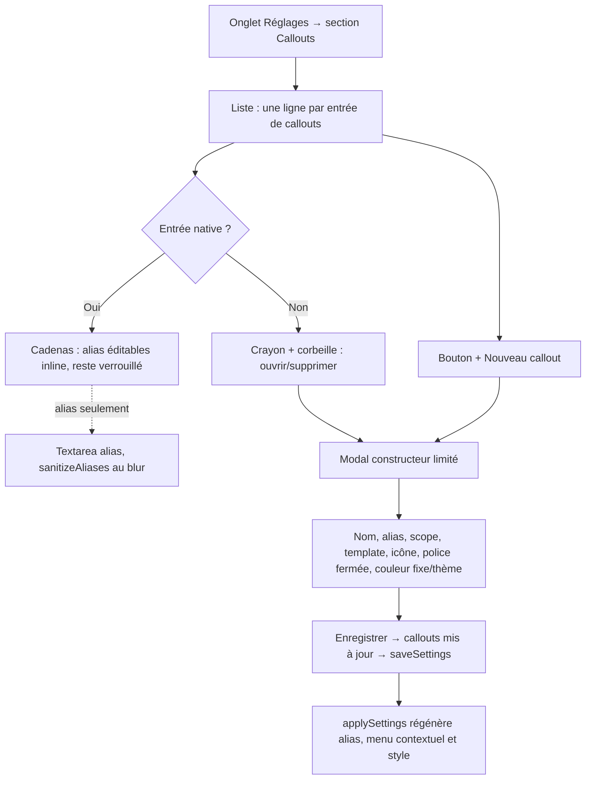

<!-- Fill or omit these sections; never add, rename, or reorder one. -->

# Instruction: Écran de réglages — liste et constructeur

## Architecture projection

> Tree of the final files. ✅ create · ✏️ modify · ❌ delete

```txt
.
└── src/settings
    ├── index.ts             ✏️ retire renderCityOfMistSettings/renderLegendInTheMistSettings (addAliasSetting ×7), ajoute renderCalloutsSection
    └── calloutsModal.ts     ✅ Modal du constructeur limité (écran B), ouverte depuis l'écran A

Aucune suppression de fichier ; addAliasSetting reste utilisé pour l'édition des alias des entrées natives (verrouillées sur le reste).
```

## User Journey



## Wireframe

<!-- UI phase only. No UI => omit the section, don't invent one. -->

```txt
Écran A — Section « Callouts » de l'onglet de réglages
┌ Callouts ──────────────────────────────────────────────────────┐
│ Chaque ligne = un callout disponible. Les entrées verrouillées  │
│ (🔒) viennent du jeu et gardent leur rendu ; seuls leurs alias   │
│ se modifient. Les autres (✏️/🗑️) sont les vôtres.               │
│                                                                    │
│ 🔒 Indice                 [note, aside]              City of Mist │
│ 🔒 Indice rouge           [red-clue]                 City of Mist │
│ 🔒 Mouvement               [move]                     City of Mist │
│ 🔒 Description             [description, read-aloud]  City of Mist │
│ 🔒 Note                    [note]                     City of Mist │
│ 🔒 Note                    [note]              Legend in the Mist │
│ 🔒 Lecture à voix haute     [read-aloud]        Legend in the Mist │
│ ✏️🗑️ Secret de faction      [secret]                   Tous les jeux │
│                                                                    │
│ [ + Nouveau callout ]                                             │
└──────────────────────────────────────────────────────────────────┘

Écran B — Modal du constructeur limité (nouvelle entrée ou édition d'une entrée utilisateur)
┌ Nouveau callout ───────────────────────────────────────────────┐
│ Nom            [ Secret de faction________________ ]            │
│ Alias          [ secret                            ]            │
│                 une valeur par ligne, comme aujourd'hui         │
│ Scope          ( ) Tous les jeux  (•) Un seul jeu : [City of Mist ▾] │
│ Mise en page   (•) Titre + corps   ( ) Corps seul                │
│ Icône          [ lock ▾ ]  (icônes Lucide déjà connues d'Obsidian) │
│                                                                    │
│ Police                                                            │
│ (•) Police de titre du jeu   ( ) Police de texte                 │
│     hérite du pack actif — jamais un choix libre, jamais une      │
│     police nouvelle.                                              │
│                                                                    │
│ Couleur                                                            │
│ (•) Fixe        [ 🎨 #e2c6c5 ]   posée une fois, jamais reconfigurée │
│ ( ) Liée au thème — suit clair/sombre, non modifiable ici          │
│                                                                    │
│                          [ Annuler ]   [ Enregistrer ]            │
└──────────────────────────────────────────────────────────────────┘
```

## Tasks to do

### `1)` Écran A — la liste

> Une ligne par entrée de `callouts`, sans jamais afficher un champ pour un callout qui n'existe pas.

1. Remplacer les deux sections `renderCityOfMistSettings`/`renderLegendInTheMistSettings` (appels à `addAliasSetting`) par une seule `renderCalloutsSection`, appelée une fois, indépendamment du jeu actif.
2. Une ligne = nom, badge de scope (« Tous les jeux » ou le nom du jeu), et soit 🔒 (natif) soit ✏️/🗑️ (utilisateur).
3. Une entrée native garde son alias éditable exactement comme `addAliasSetting` le fait déjà aujourd'hui (textarea, une valeur par ligne, `sanitizeAliases` au blur) ; rien d'autre n'est éditable dessus depuis cet écran.
4. Le bouton « + Nouveau callout » ouvre l'écran B vide.

### `2)` Écran B — le constructeur limité

> Un formulaire dont chaque champ n'accepte que le vocabulaire fermé posé en phase 1 — jamais de CSS libre, jamais un alias vers un style déjà pris par une autre entrée.

1. `calloutsModal.ts`, une `Modal` Obsidian classique, réutilisant le pattern de validation déjà présent (`sanitizeAlias`/`sanitizeAliases`).
2. Champs : nom (texte), alias (textarea), scope (radio tous/un jeu + liste déroulante des 4 packs déclarés), mise en page (radio `title-body`/`body-only`), icône (texte libre validé contre le jeu d'icônes Lucide qu'Obsidian expose déjà, pas de nouvel import — `getIconIds()` est disponible depuis Obsidian 1.0, donc couvert par `minAppVersion: 1.12.7` ; un nom hors de cette liste est rejeté avec un message inline plutôt que silencieusement accepté), police (radio titre/texte), couleur (radio fixe avec sélecteur natif Obsidian / liée au thème sans sélecteur).
3. Un alias déjà utilisé par une autre entrée dont le scope **recoupe** celui en cours de saisie (même jeu précis, ou l'une des deux entrées au scope `"all"`) est rejeté avec un message inline, pas silencieusement absorbé. Deux entrées scopées chacune à un jeu différent peuvent partager le même alias sans conflit, puisqu'elles ne sont jamais actives simultanément (cohérent avec le filtrage par scope de `phase-3.md`).
4. « Enregistrer » calcule `id` (slug du nom, dédupliqué) s'il n'existe pas encore, pose `styleKey = id` — jamais un champ saisi séparément dans ce formulaire — met à jour `settings.callouts`, appelle `saveSettings`, ferme la modal ; « Annuler » ne modifie rien.

### `3)` Suppression et verrouillage

> Une entrée native ne peut jamais disparaître de la liste ni changer de rendu depuis cet écran.

1. Le bouton 🗑️ n'apparaît que sur `native: false`, avec confirmation avant suppression (pas de suppression silencieuse d'une entrée qui a des alias en cours d'usage dans des notes).
2. Le bouton ✏️ sur une entrée utilisateur rouvre l'écran B pré-rempli, mêmes règles de validation qu'à la création.

## Test acceptance criteria

<!-- Each criterion is an observable behavior, not a command. -->

| Task | Acceptance criteria |
| ---- | -------------------- |
| 1 | La section Callouts affiche exactement une ligne par entrée de `settings.callouts`, quel que soit le jeu actif au moment de l'ouverture des réglages. |
| 1 | Modifier les alias d'une entrée native met à jour uniquement `aliases` de cette entrée ; `name`, `color`, `font`, `scope` restent ceux du registre natif. |
| 2 | Un scope « Un seul jeu » sans jeu sélectionné empêche l'enregistrement plutôt que de sauver un scope vide. |
| 2 | Une couleur « Fixe » sans valeur choisie empêche l'enregistrement ; une couleur « Liée au thème » n'affiche aucun sélecteur. |
| 2 | Un même alias sur deux entrées scopées chacune à un jeu différent s'enregistre sans erreur ; le même alias sur deux entrées dont les scopes se recoupent (même jeu, ou l'une des deux à « Tous les jeux ») est rejeté. |
| 3 | Une tentative de suppression d'une entrée native ne présente aucun bouton 🗑️ ; le DOM ne l'expose pas, désactivé ou non. |
