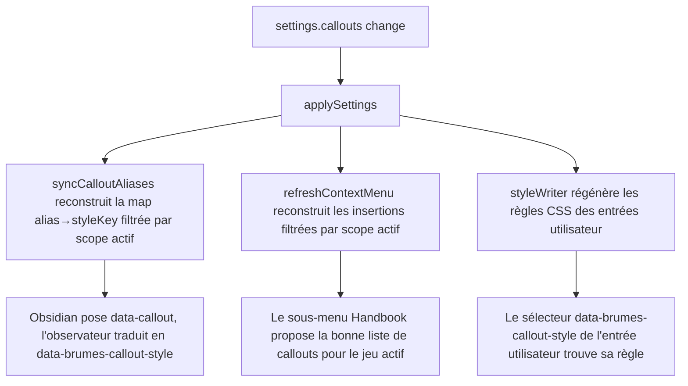

<!-- Fill or omit these sections; never add, rename, or reorder one. -->

# Instruction: Rendu et alias au moment de l'édition

## Architecture projection

> Tree of the final files. ✅ create · ✏️ modify · ❌ delete

```txt
.
├── src/features/callouts
│   ├── aliasSupport.ts    ✏️ buildAliasMap généralisé : parcourt callouts filtré par scope, plus de branches par jeu
│   ├── contextMenu.ts     ✏️ getAvailableCalloutInsertions généralisé sur la même liste filtrée
│   └── styleWriter.ts     ✅ génère le CSS des entrées utilisateur (native: false) dans l'élément <style> possédé par le plugin
└── src/BrumesPlugin.ts    ✏️ applySettings régénère alias + menu + style à chaque changement de callouts

Aucune suppression de fichier ; _callouts.scss de City of Mist et Legend in the Mist restent tels quels, ils habillent les entrées natives.
```

## User Journey



## Tasks to do

### `1)` Généraliser `aliasSupport.ts`

> Une seule fonction qui lit `callouts`, plus deux branches figées par jeu.

1. `buildAliasMap(settings, activePackId)` parcourt `settings.callouts`, garde une entrée si `scope === "all"` ou `scope === activePackId`, et construit la map `alias → styleKey` à partir de ses `aliases`.
2. `syncCalloutAliases` et `getCalloutElements` ne changent pas de responsabilité, seule la source de la map change.
3. Deux entrées de scopes différents ne peuvent pas déclarer le même alias : si `migrateAliases`/la validation de la phase 1 laisse passer un doublon inter-scope malgré tout, la première entrée trouvée dans l'ordre de la liste gagne, un avertissement est journalisé une fois.

### `2)` Généraliser `contextMenu.ts`

> Le sous-menu d'insertion suit la même liste filtrée, sans dupliquer la logique de scope.

1. `getAvailableCalloutInsertions(settings, activePackId)` remplace les deux tableaux figés par un filtrage de `settings.callouts` identique à celui de `buildAliasMap`.
2. `CalloutInsertion` reste inchangé dans sa forme (`template`, alias à insérer) ; seule la source change.
3. `buildCalloutInsertion`/`insertCallout` ne changent pas : ils consomment déjà une `CalloutInsertion`.

### `3)` Écrire le CSS des entrées utilisateur

> Réutiliser le point d'écriture unique déjà en place pour les jetons de pack plutôt qu'ouvrir un second `<style>`.

1. `styleWriter.ts` prend `settings.callouts.filter(c => !c.native)` et produit, par entrée, un bloc `.callout[data-brumes-callout-style="<styleKey>"] { ... }` : `font-family: var(--font-header-theme)` ou `var(--font-text-theme)` selon `font` ; `background-color: <hex>` si `color.kind === "fixed"`, ou une variable déjà liée au thème (ex. `var(--background-secondary)`) si `color.kind === "theme"` ; masque le titre si `template === "body-only"`.
2. Le bloc généré s'ajoute au même élément `<style id="brumes-game-style">` que `applyGameStyle` écrit déjà (`src/features/modes/styleElement.ts`), pas un second élément — un seul point d'écriture, un seul point de nettoyage.
3. Une entrée native (`native: true`) ne produit aucun bloc ici : son CSS reste entièrement dans `_callouts.scss`.

### `4)` Rebrancher `applySettings`

> Un changement de `callouts` doit se voir immédiatement, sans recharger le greffon.

1. `applySettings` appelle `syncCalloutAliases`, `refreshContextMenu` et le nouveau `styleWriter` chaque fois que `settings.callouts` a changé, au même point où il appelle déjà `applyGameStyle`.
2. Un changement de jeu actif (le scope filtré change) redéclenche les trois sans que l'utilisateur touche à l'écran Callouts.

## Test acceptance criteria

<!-- Each criterion is an observable behavior, not a command. -->

| Task | Acceptance criteria |
| ---- | -------------------- |
| 1 | Une entrée au scope `"all"` s'applique quel que soit le jeu actif ; une entrée au scope `"legend-in-the-mist"` n'apparaît pas dans la map alias quand City of Mist est actif. |
| 2 | Le sous-menu contextuel Handbook liste exactement les callouts dont le scope couvre le jeu actif, natifs et utilisateur confondus. |
| 3 | Un callout utilisateur en couleur fixe garde exactement le même hex en thème clair et sombre ; un callout en couleur liée au thème change avec le thème sans qu'aucun réglage ne l'exige. |
| 3 | Retirer un callout utilisateur retire aussi son bloc CSS de l'élément `<style>` possédé par le plugin, sans résidu. |
| 4 | Ajouter un callout dans l'écran de réglages le rend utilisable dans une note sans recharger le greffon. |
