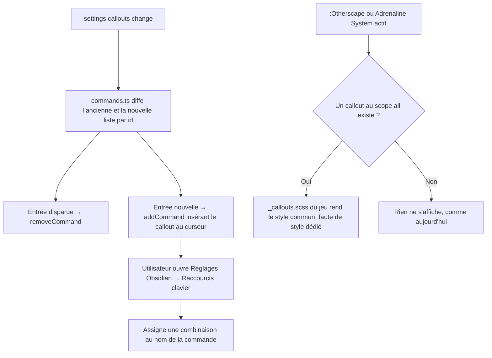

<!-- Fill or omit these sections; never add, rename, or reorder one. -->

# Instruction: Raccourcis clavier et couverture des 4 jeux

## Architecture projection

> Tree of the final files. ✅ create · ✏️ modify · ❌ delete

```txt
.
├── src/features/callouts
│   └── commands.ts             ✅ addCommand/removeCommand dynamiques, un id stable par entrée de callouts
├── src/BrumesPlugin.ts         ✏️ applySettings diffuse les entrées vers commands.ts, onunload retire les commandes posées
├── src/styles/otherscape
│   ├── _callouts.scss          ✅ couche minimale @mixin global, sur le modèle de City of Mist
│   └── index.scss              ✏️ @use callouts, @include callouts.global dans le wrapper .brumes--otherscape
├── src/styles/adrenaline
│   ├── _callouts.scss          ✅ couche minimale @mixin global, sur le modèle de City of Mist
│   └── index.scss              ✏️ @use callouts, @include callouts.global dans le wrapper .brumes--adrenaline
└── src/settings/index.ts       ✏️ note d'aide : l'assignation du raccourci se fait dans Réglages → Raccourcis clavier

Aucune suppression de fichier.
```

## User Journey



## Tasks to do

### `1)` Enregistrer une commande par entrée

> Chaque callout de la liste devient assignable à un raccourci, sans que Handbook capture lui-même une touche.

1. `commands.ts` expose `syncCalloutCommands(plugin, callouts)` : construit un id stable (`callout-insert-<id>`), appelle `plugin.addCommand` pour toute entrée nouvelle. Le nom affiché reprend le nom du callout tel quel quand `scope === "all"` ; il est suffixé par le nom du jeu (« Note (Legend in the Mist) ») quand le scope est un seul jeu, systématiquement et pas seulement en cas de collision détectée — règle déterministe, indépendante des autres entrées présentes. Ça désambiguïse d'emblée les deux entrées natives nommées « Note » (City of Mist / Legend in the Mist).
2. La commande utilise `editorCheckCallback` : elle n'est proposée (palette, panneau Raccourcis clavier) que si `scope === "all"` ou si le jeu actif du coffre correspond au scope de l'entrée — une entrée scopée à un seul jeu n'insère jamais son callout dans le mauvais jeu et ne pollue pas la palette quand ce jeu n'est pas actif.
3. Une entrée supprimée ou dont le scope change de façon à disparaître de la liste courante déclenche `plugin.removeCommand` avec le même id.
4. `applySettings` appelle `syncCalloutCommands` au même point que `syncCalloutAliases`/le style writer de la phase 3.
5. `onunload` retire toutes les commandes posées, sur le modèle du nettoyage déjà fait pour l'élément `<style>` possédé par le plugin.

### `2)` Documenter l'assignation

> Éviter qu'un utilisateur cherche un champ de raccourci qui n'existe pas dans l'onglet Handbook.

1. Une note sous chaque entrée de l'écran A (phase 2) : « Raccourci : Réglages → Raccourcis clavier → rechercher "<nom du callout>" (ou "<nom du callout> (<jeu>)" si l'entrée est scopée à un seul jeu) ».
2. Pas de champ d'assignation dans `calloutsModal.ts` : le nom de la commande Obsidian reprend le nom du callout, suffixé par le jeu quand le scope n'est pas « Tous les jeux » (règle de la tâche 1.1), pour que la recherche dans le panneau natif aboutisse sans ambiguïté même entre deux entrées de même nom sur des jeux différents.

### `3)` Couvrir :Otherscape et Adrenaline System

> Un callout au scope « Tous les jeux » doit produire un rendu, même minimal, sur les deux jeux qui n'ont aujourd'hui aucune couche de callout.

1. `_callouts.scss` de chacun des deux jeux reprend uniquement le `@mixin global` de City of Mist (teintes par `data-callout`, pas les styles `clue`/`move`/etc. qui restent propres à City of Mist et Legend in the Mist) — un socle Obsidian correctement teinté, pas une réplique des styles maison des deux autres jeux.
2. `index.scss` de chacun des deux jeux `@use` le nouveau partial et `@include callouts.global;` à l'intérieur de son wrapper `.brumes--<jeu>`, exactement comme City of Mist le fait déjà pour son propre `_callouts.scss`.
3. Un callout utilisateur au scope `"all"` avec une couleur fixe ou liée au thème (phase 3) s'affiche correctement sur ces deux jeux sans modification supplémentaire, puisque son CSS est déjà écrit dans l'élément `<style>` possédé par le plugin, indépendamment du jeu.

## Test acceptance criteria

<!-- Each criterion is an observable behavior, not a command. -->

| Task | Acceptance criteria |
| ---- | -------------------- |
| 1 | Ajouter un callout dans les réglages fait apparaître une commande à son nom dans la palette de commandes Obsidian (Ctrl+P) sans recharger le greffon. |
| 1 | Supprimer un callout utilisateur retire sa commande de la palette ; décharger puis recharger le greffon ne laisse aucune commande orpheline. |
| 1 | Les deux entrées natives « Note » (City of Mist, Legend in the Mist) apparaissent sous deux noms distincts dans la palette de commandes et le panneau Raccourcis clavier ; la commande d'une entrée scopée à un seul jeu n'apparaît pas dans la palette quand un autre jeu est actif. |
| 3 | Un callout au scope « Tous les jeux » avec une couleur fixe s'affiche identiquement sur City of Mist, Legend in the Mist, :Otherscape et Adrenaline System. |
| 3 | Un callout Obsidian natif (`> [!info]`) reste correctement teinté sur :Otherscape et Adrenaline System après l'ajout de leur `_callouts.scss`, sans régression visuelle sur les deux autres jeux. |
