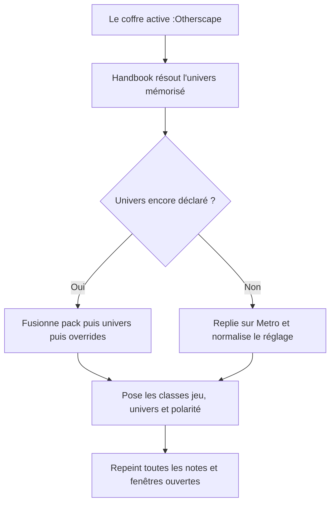
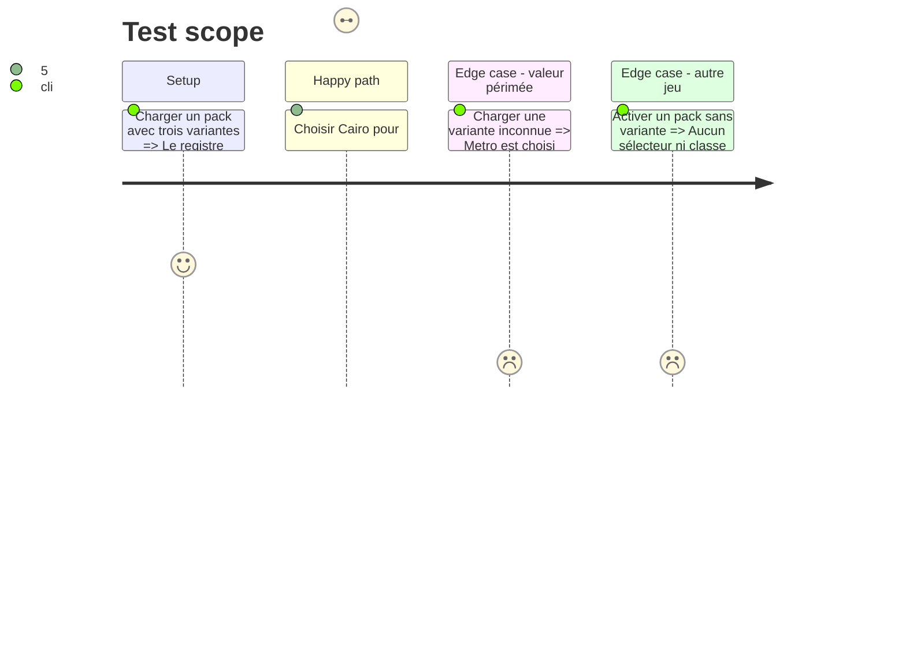

# Instruction: Sources visuelles et contrat générique de variante

## Architecture projection

> Tree of the final files. ✅ create · ✏️ modify · ❌ delete

```txt
.
├── aidd_docs/tasks/2026_09/2026_09_09_otherscape-schema-variants
│   └── visual-findings.md                         ✅ consigne les registres attestés et les motifs retenus
├── src
│   ├── BrumesPlugin.ts                            ✏️ résout et applique la variante active
│   ├── features/modes
│   │   └── domModeClass.ts                        ✏️ pose et nettoie la classe de variante dans chaque document
│   ├── games
│   │   ├── otherscape.ts                          ✏️ déclare Metro, Cairo et Tokyo
│   │   ├── registry.ts                            ✏️ enregistre un jeu avec ses variantes et résout leur repli
│   │   └── variants.ts                            ✅ porte les types et la fusion internes sans changer `GamePack`
│   └── settings
│       ├── index.ts                               ✏️ affiche le sélecteur d'univers conditionnel
│       └── types.ts                               ✏️ persiste et normalise la variante par jeu
├── tools
│   ├── assert-game-variants.mjs                   ✅ lance les assertions de résolution et de nettoyage
│   ├── assertGameVariants.harness.mts             ✅ couvre replis, fusion et classes DOM
│   └── assert-settings-ui.mjs                     ✏️ couvre le sélecteur conditionnel
└── package.json                                   ✏️ expose l'assertion de variantes

Aucune suppression de fichier.
```

## User Journey



## Test Scope



## Wireframe

```txt
┌──────────────────────────────────────────┐
│ (1) Jeu                                 │
│     [sélecteur du jeu]                   │
│ (2) Univers                             │
│     [sélecteur Metro/Cairo/Tokyo]        │
│ (3) Apparence                           │
│     [sélecteur de polarité disponible]   │
└──────────────────────────────────────────┘
```

1. Jeu : choix global existant.
2. Univers : région présente seulement lorsque le pack actif déclare des variantes.
3. Apparence : choix disponible seulement lorsque la variante active possède plusieurs polarités attestées.

## Tasks to do

### `1)` Établir les références visuelles

> Transformer les trois livres et Mist HUD en décisions vérifiables avant d'écrire les jetons.

1. Échantillonner dans chaque PDF au moins une page de thème, une fiche de profil, une page courante et une ouverture de chapitre.
2. Relever séparément palette, densité, fontes de remplacement, cadres, séparateurs, marqueurs de type et texture reproductible en CSS.
3. Décider pour chaque univers si un registre clair complet est attesté ; ne pas confondre une carte claire isolée avec une maquette claire applicable au coffre.
4. Consigner les éléments communs venant de Mist HUD et ceux qui restent propres à Metro, sans copier les URLs d'assets ni les sélecteurs Foundry.

### `2)` Étendre l'enregistrement interne d'un jeu

> Une variante entoure le pack sérialisable sans modifier son contrat.

1. Introduire une enveloppe interne de registre associant un `GamePack` inchangé à une collection optionnelle de variantes et à un identifiant par défaut.
2. Donner à chaque variante un libellé, ses couches de style et ses polarités attestées ; ne pas ajouter d'assets ni de formes tant que le rendu CSS autonome n'en a pas besoin.
3. Garder `GamePack`, `fromSchema.ts` et l'aller-retour des documents de pack inchangés ; les trois jeux existants sans variante conservent leur chemin et leur style calculé.
4. Garder l'enveloppe dans Handbook : le dépôt frère `v0.4.0` est la source des contenus, pas d'un format de variantes qu'il ne contient pas.
5. Fusionner les jetons champ par champ et couche par couche avec `registration.pack.style`, puis `variant.style`, puis `overrides.style` ; une couche omise par la variante conserve ainsi la valeur commune du pack.
6. Continuer à exporter `GAME_PACKS` comme la liste dérivée des packs nus, dans le même ordre, afin que réglages, assets et classes de mode ne dépendent pas de l'enveloppe interne.

### `3)` Résoudre et persister l'univers global

> Le choix vaut pour tout le coffre et survit aux changements de jeu.

1. Persister la variante par identifiant de pack afin qu'un aller-retour entre jeux retrouve le dernier univers choisi.
2. Normaliser une valeur absente ou inconnue vers la variante par défaut déclarée par le pack.
3. N'afficher le sélecteur que pour un pack qui possède plusieurs variantes ; une variante unique s'applique sans contrôle inutile.
4. Lorsqu'une variante ne possède qu'une polarité, l'appliquer indépendamment de « suivre Obsidian » et masquer le choix de polarité ; lorsqu'elle en possède deux, conserver les choix Suivre Obsidian, Clair et Sombre.
5. À chaque changement, recalculer le style, rafraîchir les vues Markdown et conserver les overrides utilisateur en dernière priorité.

### `4)` Scoper et nettoyer le DOM

> Une variante ne laisse aucun résidu dans une fenêtre principale ou détachée.

1. Poser une classe sûre telle que `brumes--variant-cairo` à côté de la classe du jeu.
2. Retirer toutes les anciennes classes de variante lors d'un changement de jeu, d'univers ou au déchargement.
3. Étendre les assertions de style et de réglages à la variante globale.

## Test acceptance criteria

| Task | Acceptance criteria |
| ---- | ------------------- |
| 1 | `visual-findings.md` cite les pages examinées et distingue, pour Metro, Cairo et Tokyo, les registres sombres attestés des éventuels registres clairs. |
| 1 | Chaque valeur visuelle retenue se rattache à un PDF ou à Mist HUD ; aucune palette claire n'est décrite comme « dérivée ». |
| 2 | City of Mist et Legend in the Mist, qui ne déclarent aucune variante, produisent exactement le même style calculé qu'avant. |
| 2 | Le modèle de variante ne crée aucun fichier ni dépendance d'apparence dans `schema-in-the-mist`. |
| 2 | Sérialiser puis relire les `GamePack` existants reste identique ; l'enveloppe de registre et ses variantes ne passent jamais par `fromSchema.ts`. |
| 2 | Une variante partielle ne vide aucune couche commune, et une valeur d'`overrides.json` gagne toujours sur la même valeur du pack ou de la variante. |
| 2 | Les consommateurs actuels de `GAME_PACKS` reçoivent toujours les trois mêmes packs, dans le même ordre et sans changement de type. |
| 3 | Le réglage Univers apparaît uniquement pour :Otherscape et propose Metro, Cairo et Tokyo, Metro étant le repli déterministe. |
| 3 | Une variante sombre uniquement reste sombre sous un thème Obsidian clair ; une variante à deux polarités suit ou force correctement le choix disponible. |
| 3 | Passer de Metro à Cairo ou Tokyo repeint toutes les notes ouvertes sans rechargement d'Obsidian et sans modifier leur contenu. |
| 4 | Changer de jeu ou désactiver Handbook retire toutes les classes et déclarations de l'univers précédent, y compris dans une fenêtre détachée. |
| 4 | `pnpm assert:game-variants`, `pnpm assert:settings-ui` et `pnpm assert:style-scope` passent. |
