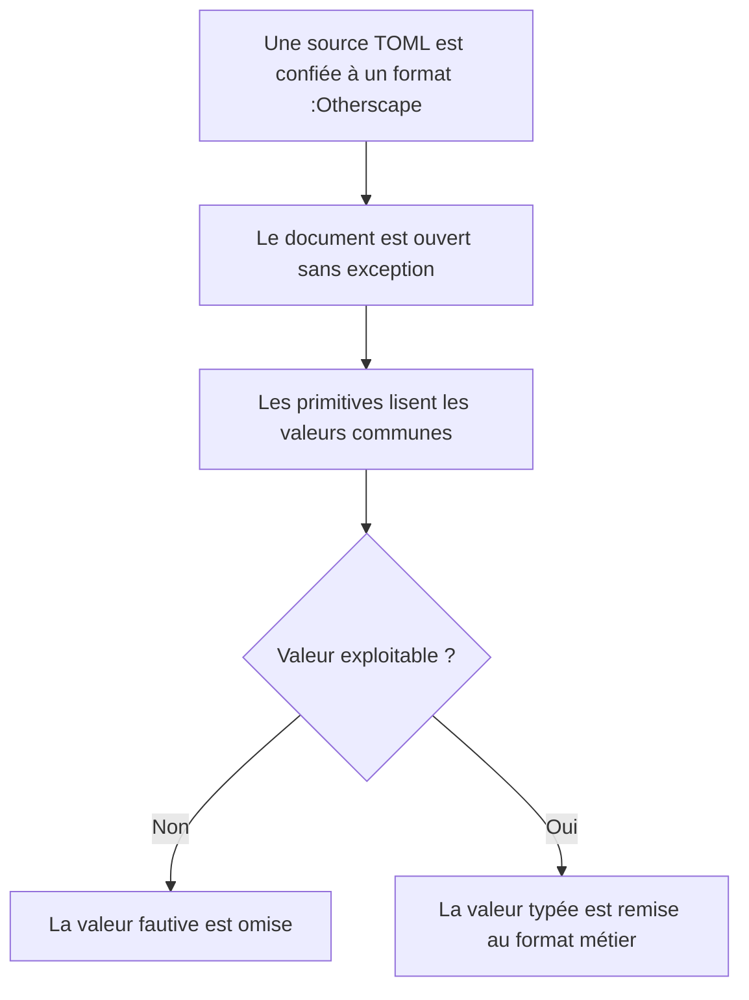
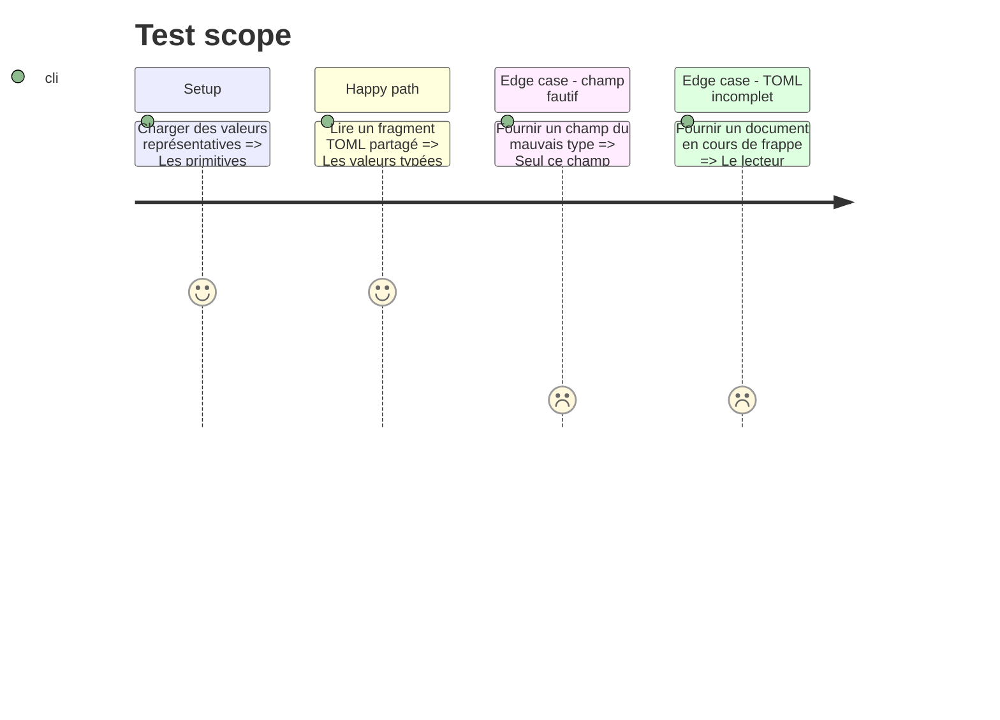

# Instruction: Socle TOML partagé des formats :Otherscape

## Architecture projection

> Tree of the final files. ✅ create · ✏️ modify · ❌ delete

```txt
.
├── src
│   └── features
│       ├── blocks
│       │   └── schemaValues.ts                     ✏️ ajoute les lecteurs numériques et booléens partagés
│       └── otherscape
│           ├── document.ts                         ✅ ouvre les documents TOML sans grammaire parallèle
│           └── types.ts                            ✅ centralise meta, threats, specials et références de kits
├── tools
│   ├── assert-otherscape-primitives.mjs            ✅ lance les assertions du socle de lecture
│   └── assertOtherscapePrimitives.harness.mts      ✅ couvre valeurs partagées et erreurs tolérées
└── package.json                                    ✏️ expose l'assertion du socle

Aucune suppression de fichier.
```

## User Journey



## Test Scope



## Tasks to do

### `1)` Fixer les conventions des six formats

> Les phases métier doivent ajouter les blocs sans rouvrir leur contrat commun.

1. Fixer les identifiants `os-theme`, `os-theme-kit`, `os-challenge`, `os-power-set`, `os-character-trope` et `os-loadout-item`.
2. Fixer une clé booléenne stable par bloc, ajoutée seulement lorsque son bloc rejoint le registre.
3. Ne pas déclarer `os-theme-card` comme alias : la page de test n'est pas une compatibilité publiée.

### `2)` Construire les primitives de document

> Partager la mécanique TOML sans aplatir les différences de schéma.

1. Réutiliser `smol-toml`, `SchemaMeta` et les lecteurs tolérants existants.
2. Ajouter les conversions communes strictement nécessaires aux nombres non négatifs, booléens, listes de références et listes d'objets.
3. Fournir un lecteur TOML qui retourne `null` sur une syntaxe incomplète ou invalide et ne tente aucune grammaire parallèle.
4. Ne jamais charger le dépôt frère à l'exécution : les interfaces locales projettent explicitement les schémas de contenu `v0.4.0` (`5ef5a4f`).
5. Préserver les chaînes de tags telles quelles afin que la syntaxe inline existante, dont `~{tag}` pour un tag brûlé, reste interprétée par `renderTagSpan` plutôt que par le lecteur de schéma.

### `3)` Prouver les primitives seules

> Le socle doit rester vérifiable avant que le premier bloc soit enregistré.

1. Tester l'ouverture TOML, les métadonnées, les listes d'objets et les nombres bornés avec un harnais autonome.
2. Prouver qu'un document mal formé retourne `null` et qu'une valeur optionnelle fautive ne jette pas.
3. Laisser les primitives de rendu dans la première phase métier qui en a réellement besoin, puis les partager à partir d'un usage concret.

## Test acceptance criteria

| Task | Acceptance criteria |
| ---- | ------------------- |
| 1 | Les six identifiants et leurs clés de réglage sont consignés sans alias historique ni modification du registre à ce stade. |
| 2 | Les primitives lisent les valeurs communes sans accès réseau ni import du dépôt frère au runtime. |
| 2 | Un champ optionnel mal typé est omis tandis qu'un TOML invalide retourne `null` sans exception. |
| 3 | `pnpm assert:otherscape-primitives` passe avant l'ajout du premier bloc métier. |
