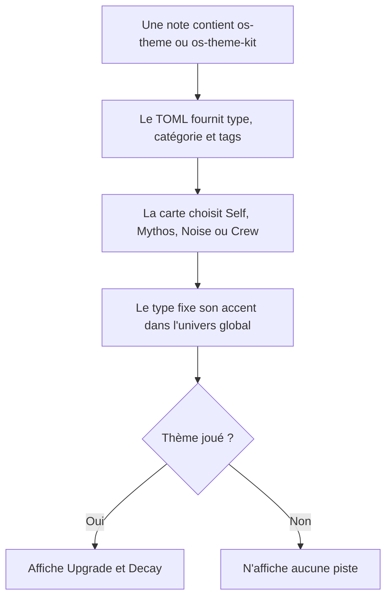
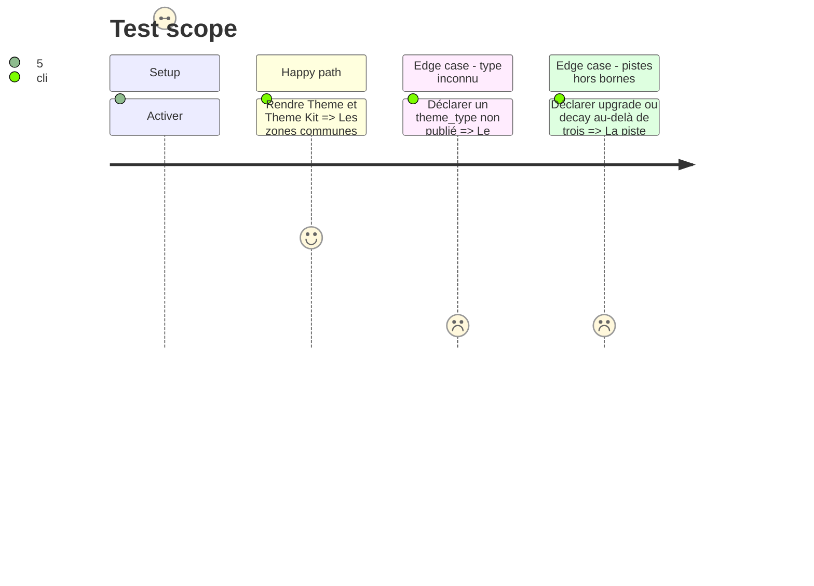

# Instruction: Theme et Theme Kit

## Architecture projection

> Tree of the final files. ✅ create · ✏️ modify · ❌ delete

```txt
.
├── src
│   ├── features
│   │   ├── blocks
│   │   │   ├── registry.ts                         ✏️ enregistre Theme et Theme Kit
│   │   │   └── tomlExports.ts                      ✏️ ajoute leurs commandes de copie
│   │   └── osThemes
│   │       ├── block.ts                            ✅ déclare `os-theme` et `os-theme-kit`
│   │       ├── parser.ts                           ✅ transforme les deux documents TOML en données de rendu
│   │       ├── renderer.ts                         ✅ rend leur anatomie commune et leurs différences
│   │       ├── schema.ts                           ✅ projette et sérialise les deux schémas publiés
│   │       └── shape.ts                            ✅ décrit les zones des deux cartes
│   ├── settings
│   │   ├── index.ts                                ✏️ ajoute les deux bascules :Otherscape
│   │   └── types.ts                                ✏️ ajoute deux clés `features.*` stables
│   └── styles
│       ├── otherscape
│       │   ├── _themes.scss                        ✅ habille les deux cartes selon type et univers
│       │   └── index.scss                          ✅ compose les partials :Otherscape
│       └── styles.scss                             ✏️ charge le style :Otherscape
└── corpus
    ├── refus/os-theme*.toml                        ✅ couvre identité, type et pistes fautifs
    ├── refus/os-theme-kit*.toml                    ✅ couvre identité, type et listes fautifs
    ├── temoins/os-theme.toml                       ✅ thème joué complet
    └── temoins/os-theme-kit.toml                   ✅ kit complet

Aucune suppression de fichier.
```

## User Journey



## Test Scope



## Wireframe

```txt
┌──────────────────────────────────────────┐
│ (1) Type · catégorie        (2) source  │
├──────────────────────────────────────────┤
│ (3) Titre                                │
│ (4) Quête                                │
├────────────────────┬─────────────────────┤
│ (5) Power tags     │ (6) Weakness tags  │
├────────────────────┴─────────────────────┤
│ (7) Upgrade · Decay, si thème joué       │
└──────────────────────────────────────────┘
```

1. Type et catégorie : identité imprimée du thème.
2. Source : attribution compacte issue de `meta`.
3. Titre : `title_tag`, traité comme le premier pouvoir de la carte.
4. Quête : motivation du thème.
5. Power tags : liste principale.
6. Weakness tags : contreparties séparées visuellement.
7. Pistes : trois marques chacune, absentes du Theme Kit.

## Tasks to do

### `1)` Lire et restituer les deux schémas

> Aucun champ publié ne se perd entre la note et le rendu.

1. Modéliser `title_tag`, `theme_type`, `category`, `power_tags`, `weakness_tags`, `quest`, `upgrade`, `decay` et `meta` avec les mêmes noms et bornes que les schémas.
2. Refuser une carte sans `title_tag` ou sans type reconnu ; dégrader séparément les listes, pistes et métadonnées fautives.
3. Sérialiser un TOML canonique sans listes vides ni chaînes vides.

### `2)` Partager l'anatomie sans confondre les formats

> Kit vierge et thème joué se ressemblent, mais ne portent pas le même état.

1. Rendre les six zones communes depuis un constructeur partagé.
2. Ajouter Upgrade et Decay uniquement à `os-theme`, avec trois marques et une valeur de zéro à trois.
3. Poser des classes d'état pour Self, Mythos, Noise et Crew sans inscrire leur couleur dans le renderer.
4. Enregistrer les deux blocs, leurs bascules, leurs modèles d'insertion et leurs commandes de copie dans la même livraison.
5. Faire passer les power et weakness tags par `renderTagSpan`, y compris la marque `~{tag}`, sans altérer la chaîne lors de l'aller-retour TOML.

### `3)` Décliner les trois univers

> Une même donnée prend l'identité globale du coffre.

1. Donner à Metro le contraste et les marqueurs de type observés dans le livre et Mist HUD.
2. Donner à Cairo ses formes, séparateurs et accents issus du PDF Cairo.
3. Donner à Tokyo ses formes, séparateurs et accents issus du PDF Tokyo.
4. N'écrire des sélecteurs clairs que pour les univers dont le registre clair a été validé en phase 1.

## Test acceptance criteria

| Task | Acceptance criteria |
| ---- | ------------------- |
| 1 | Les exemples `theme` et `theme-kit` du dépôt frère rendent tous leurs champs lisibles et survivent à l'aller-retour TOML. |
| 1 | Un `theme_type` hors de `self`, `mythos`, `noise`, `crew` ne produit jamais une carte au type mensonger. |
| 2 | Theme Kit n'affiche ni Upgrade ni Decay ; Theme affiche exactement trois emplacements par piste et le bon nombre de marques remplies. |
| 2 | Self, Mythos, Noise et Crew restent distinguables sans dépendre uniquement de la couleur. |
| 2 | Une configuration existante normalise les deux nouvelles bascules à `true`, et leurs insertions n'apparaissent que sous :Otherscape. |
| 2 | Un tag brûlé reste barré et identifiable après lecture, copie TOML et relecture. |
| 3 | Le même témoin change visiblement de langage graphique lorsque l'univers global passe de Metro à Cairo puis Tokyo, sans changement du TOML. |
| 3 | Les cartes restent lisibles à largeur mobile et n'introduisent aucun défilement horizontal dans une note. |
