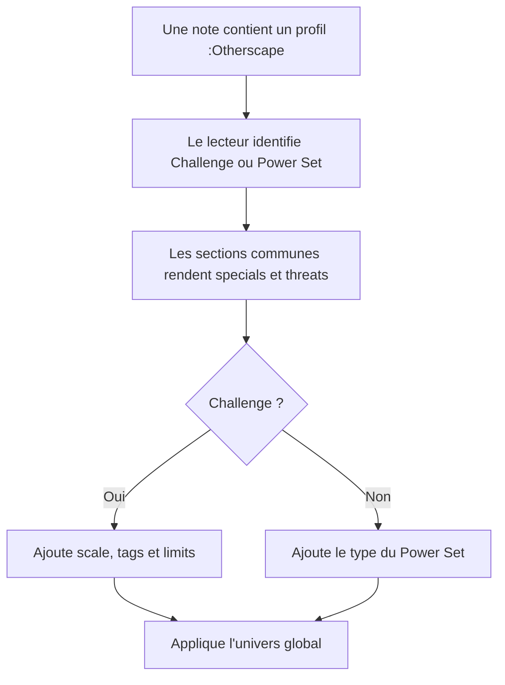
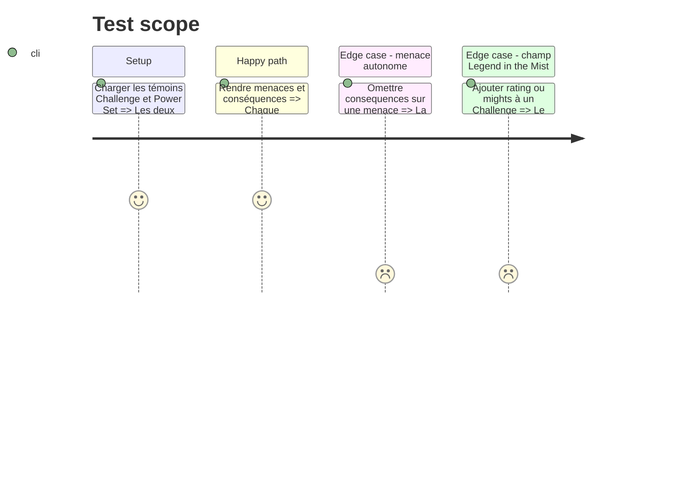

# Instruction: Challenge et Power Set

## Architecture projection

> Tree of the final files. ✅ create · ✏️ modify · ❌ delete

```txt
.
├── src
│   ├── features
│   │   ├── blocks
│   │   │   ├── registry.ts                         ✏️ enregistre Challenge et Power Set
│   │   │   └── tomlExports.ts                      ✏️ ajoute leurs commandes de copie
│   │   └── osChallenges
│   │       ├── block.ts                            ✅ déclare `os-challenge` et `os-power-set`
│   │       ├── parser.ts                           ✅ lit leurs documents et leurs listes imbriquées
│   │       ├── renderer.ts                         ✅ partage threats, consequences et specials
│   │       ├── schema.ts                           ✅ projette et sérialise les deux schémas
│   │       └── shape.ts                            ✅ décrit deux profils proches mais distincts
│   ├── settings
│   │   ├── index.ts                                ✏️ ajoute les deux bascules :Otherscape
│   │   └── types.ts                                ✏️ ajoute deux clés `features.*` stables
│   └── styles/otherscape
│       ├── _challenges.scss                        ✅ dessine profils et power sets par univers
│       └── index.scss                              ✏️ charge le nouveau partial
└── corpus
    ├── refus/os-challenge*.toml                    ✅ couvre name, limits et threats
    ├── refus/os-power-set*.toml                    ✅ couvre name, type et listes imbriquées
    ├── temoins/os-challenge.toml                   ✅ challenge complet
    └── temoins/os-power-set.toml                   ✅ power set complet

Aucune suppression de fichier.
```

## User Journey



## Test Scope



## Wireframe

```txt
┌──────────────────────────────────────────┐
│ (1) Nom · type/scale        (2) source  │
│ (3) Description                          │
├────────────────────┬─────────────────────┤
│ (4) Limits         │ (5) Specials        │
├────────────────────┴─────────────────────┤
│ (6) Threats et conséquences              │
│ (7) Conséquences générales               │
└──────────────────────────────────────────┘
```

1. En-tête : nom puis type ou scale selon le format.
2. Source : attribution compacte.
3. Description : prose principale.
4. Limits : réservées au Challenge.
5. Specials : règles spéciales communes.
6. Threats : déclencheur et conséquences locales.
7. Conséquences générales : effets non rattachés à une menace.

## Tasks to do

### `1)` Modéliser les divergences publiées

> Réutiliser les primitives sans ramener les champs de Legend in the Mist.

1. Pour Challenge, lire `name`, `description`, `scale`, `tags_and_statuses`, `limits`, `specials`, `threats`, `general_consequences` et `meta`.
2. Pour Power Set, lire `name`, `type`, `description`, `specials`, `threats`, `general_consequences` et `meta`.
3. Garder `threats[].consequences` optionnel et ne jamais inventer `rating`, `mights`, `roles` ou `is_immune`.
4. Préserver les bornes numériques et les booléens publiés lors de la lecture et de la sérialisation.

### `2)` Partager le rendu des profils

> Une menace garde toujours ses propres conséquences.

1. Mutualiser description, specials, threats, conséquences générales et source.
2. Rendre scale, tags et limits uniquement sur Challenge ; rendre `type` uniquement sur Power Set.
3. Réutiliser les rendus de tags, prose et limits existants lorsque leur sémantique est identique.
4. Enregistrer les deux blocs, leurs bascules, leurs modèles d'insertion et leurs commandes de copie dans la même livraison.

### `3)` Habiller les deux profils par univers

> Le profil reste dense mais scannable dans les trois identités.

1. Décliner cadres, en-têtes, séparateurs et accents depuis les pages de profils échantillonnées.
2. Garder une hiérarchie stable entre identité, limites, règles spéciales et menaces, même lorsque les couleurs changent.
3. Faire replier les grilles en une colonne aux faibles largeurs et éviter les trous de lecture entre sections.

## Test acceptance criteria

| Task | Acceptance criteria |
| ---- | ------------------- |
| 1 | Les exemples publiés Challenge et Power Set rendent et réécrivent tous leurs champs sans introduire de champ propre à Legend in the Mist. |
| 1 | Une menace sans `consequences` se rend comme une menace autonome, conformément au schéma. |
| 2 | Une conséquence locale reste sous sa menace ; une conséquence générale apparaît dans une zone distincte. |
| 2 | Masquer une zone via `overrides.json` retire uniquement cette zone et laisse les autres intactes. |
| 2 | Les bascules et insertions Challenge/Power Set n'apparaissent que sous :Otherscape et sont actives par défaut après normalisation. |
| 3 | Metro, Cairo et Tokyo sont reconnaissables sur le même profil, tandis que l'ordre et le contenu des sections restent identiques. |
| 3 | Un profil partiel et un profil très rempli restent lisibles sans chevauchement à largeur de note étroite. |
