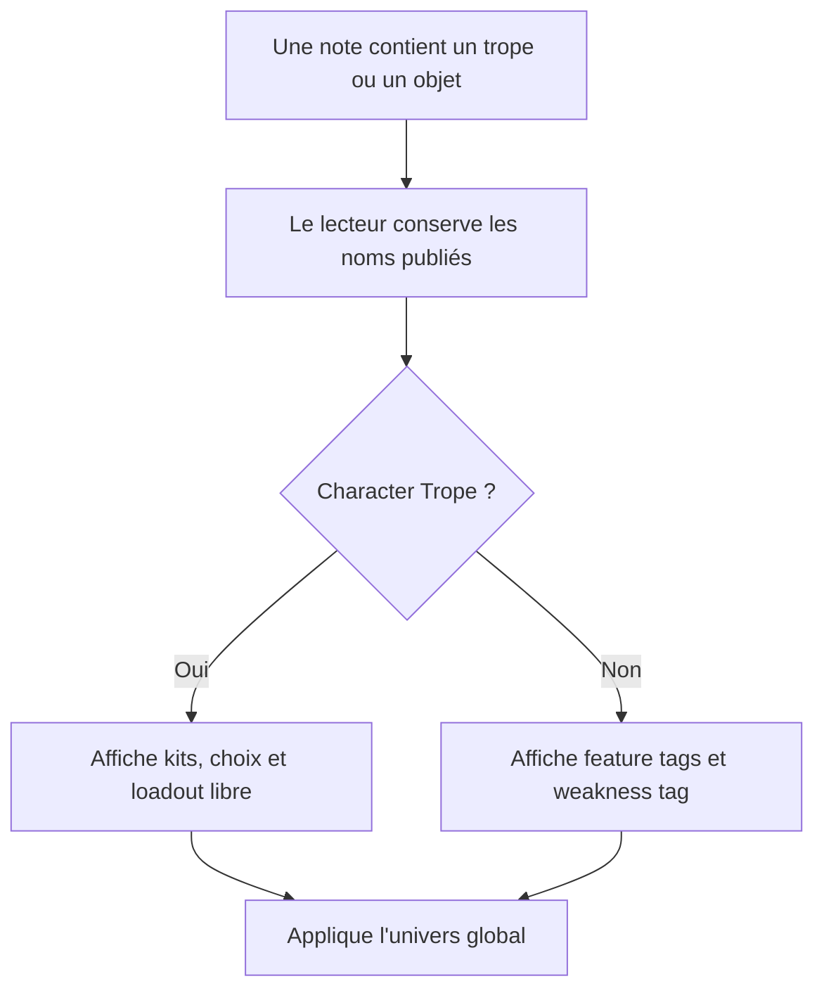
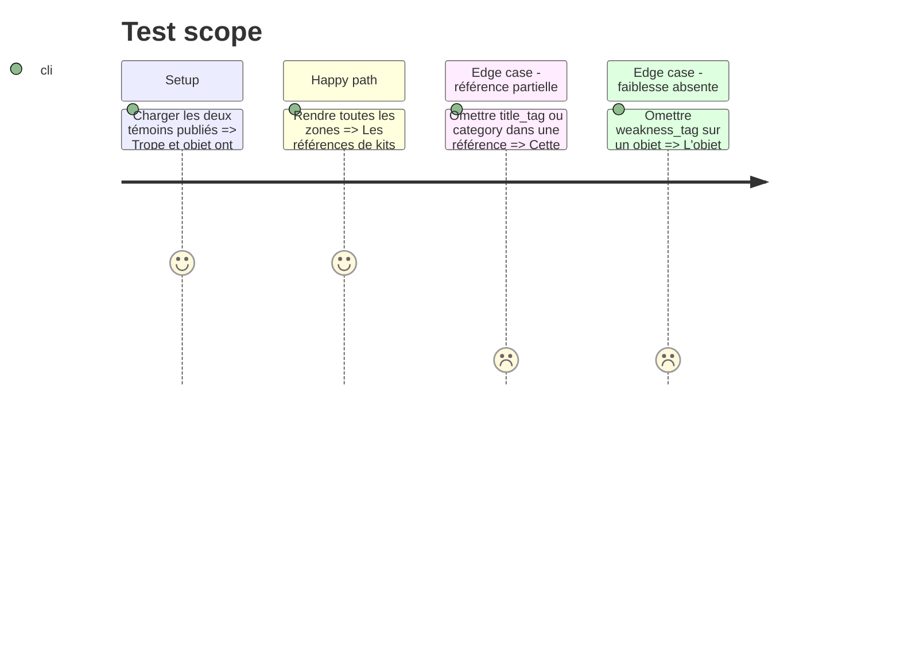

# Instruction: Character Trope et Loadout Item

## Architecture projection

> Tree of the final files. ✅ create · ✏️ modify · ❌ delete

```txt
.
├── src
│   ├── features
│   │   ├── blocks
│   │   │   ├── registry.ts                         ✏️ enregistre Trope et Loadout Item
│   │   │   └── tomlExports.ts                      ✏️ ajoute leurs commandes de copie
│   │   └── osCharacterCreation
│   │       ├── block.ts                            ✅ déclare `os-character-trope` et `os-loadout-item`
│   │       ├── parser.ts                           ✅ lit références de kits et entrées de catalogue
│   │       ├── renderer.ts                         ✅ rend packages de départ et équipement
│   │       ├── schema.ts                           ✅ projette et sérialise les deux schémas
│   │       └── shape.ts                            ✅ décrit leurs zones indépendantes
│   ├── settings
│   │   ├── index.ts                                ✏️ ajoute les deux bascules :Otherscape
│   │   └── types.ts                                ✏️ ajoute deux clés `features.*` stables
│   └── styles/otherscape
│       ├── _character-creation.scss                ✅ habille tropes et objets par univers
│       └── index.scss                              ✏️ charge le nouveau partial
└── corpus
    ├── refus/os-character-trope*.toml              ✅ couvre name et références de kits
    ├── refus/os-loadout-item*.toml                 ✅ couvre name et tags
    ├── temoins/os-character-trope.toml             ✅ trope complet
    └── temoins/os-loadout-item.toml                ✅ objet complet

Aucune suppression de fichier.
```

## User Journey



## Test Scope



## Wireframe

```txt
┌──────────────────────────────────────────┐
│ (1) Nom · catégorie         (2) source  │
│ (3) Description                          │
├────────────────────┬─────────────────────┤
│ (4) Theme Kits     │ (5) Choices         │
├────────────────────┴─────────────────────┤
│ (6) Loadout                             │
└──────────────────────────────────────────┘

┌──────────────────────────────────────────┐
│ (1) Nom · catégorie         (2) source  │
│ (3) Description                          │
│ (4) Feature tags                        │
│ (5) Weakness tag                        │
└──────────────────────────────────────────┘
```

1. Identité : nom et rubrique du contenu.
2. Source : attribution compacte.
3. Description : présentation en prose.
4. Références ou feature tags : contenu principal selon le format.
5. Choices ou weakness tag : contrepartie propre au format.
6. Loadout : suggestions textuelles du trope, sans résolution de catalogue.

## Tasks to do

### `1)` Respecter les références et non-références du schéma

> Deux champs nommés `category` n'ont pas nécessairement le même sens.

1. Lire le `category` racine du trope comme rubrique de tropes.
2. Lire `theme_kits` et `choices` comme paires `{ title_tag, category }`, où `category` désigne cette fois le themebook.
3. Garder `loadout` comme liste de chaînes libres et ne jamais le résoudre contre `os-loadout-item`.
4. Lire l'objet de catalogue avec `feature_tags` et un unique `weakness_tag` optionnel.

### `2)` Concevoir deux rendus compacts

> Ces formats sont consultés comme fiches de référence, pas comme profils de combat.

1. Regrouper les références de kits en cartes ou lignes qui gardent le titre et la catégorie ensemble.
2. Distinguer clairement kits imposés, choix et équipement suggéré.
3. Rendre l'objet de loadout comme une entrée de catalogue compacte dont le premier feature tag peut reprendre le nom sans être supprimé silencieusement.
4. Enregistrer les deux blocs, leurs bascules, leurs modèles d'insertion et leurs commandes de copie dans la même livraison.

### `3)` Décliner Metro, Cairo et Tokyo

> Les éléments de création suivent le même univers que les thèmes et profils.

1. Réutiliser les jetons globaux et les motifs d'univers établis, sans recopier la géométrie des autres partials.
2. Garder les références de kits lisibles avec des noms longs et des catégories maison.
3. Vérifier les états optionnels dans chaque polarité attestée.

## Test acceptance criteria

| Task | Acceptance criteria |
| ---- | ------------------- |
| 1 | Le trope conserve séparément sa rubrique racine et la catégorie de chaque référence de kit. |
| 1 | Les chaînes de `loadout` ne deviennent jamais des liens automatiques vers un Loadout Item. |
| 1 | Un Loadout Item accepte zéro ou un `weakness_tag`, jamais une liste inventée par Handbook. |
| 2 | Les listes longues, les choix absents et les noms de catégories répétés restent compréhensibles dans le rendu. |
| 2 | Les bascules et insertions Trope/Loadout Item n'apparaissent que sous :Otherscape et sont actives par défaut après normalisation. |
| 3 | Les deux blocs changent avec l'univers global sans modifier leur contenu ni leur structure DOM métier. |
| 3 | Les zones optionnelles absentes ne laissent ni titre orphelin ni espace réservé vide. |
