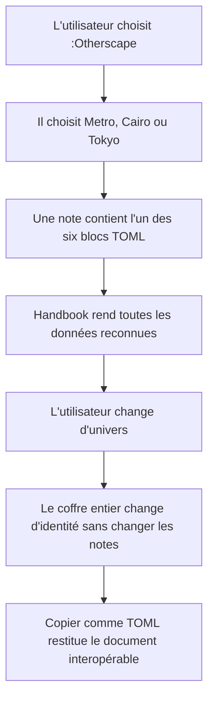
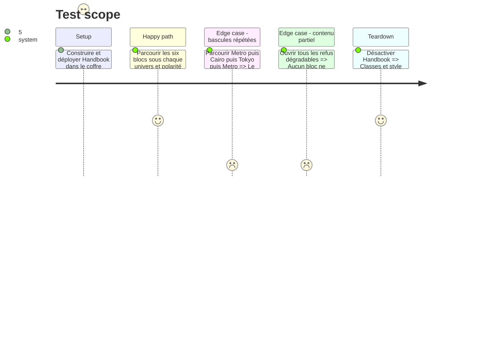

# Instruction: Cohérence visuelle, validation croisée et livraison

## Architecture projection

> Tree of the final files. ✅ create · ✏️ modify · ❌ delete

```txt
.
├── CHANGELOG.md                                    ✏️ documente les six blocs et les trois univers
├── CLAUDE.md                                       ✏️ remplace l'état « :Otherscape non implémenté »
├── README.md                                       ✏️ documente les identifiants, le TOML et le réglage Univers
├── corpus
│   ├── refus                                       ✏️ complète les cas limites découverts en intégration
│   └── temoins                                     ✏️ stabilise un témoin représentatif par bloc
├── src
│   ├── styles/otherscape
│   │   ├── _character-creation.scss                ✏️ harmonisation finale
│   │   ├── _challenges.scss                        ✏️ harmonisation finale
│   │   ├── _themes.scss                            ✏️ harmonisation finale
│   │   └── index.scss                              ✏️ portée et responsive finaux
│   └── settings/index.ts                           ✏️ finalise l'aide utilisateur :Otherscape
├── tools
│   ├── assertStyleScope.harness.mts                ✏️ interdit les fuites entre jeux, univers et polarités
│   └── dumpDom.harness.mts                         ✏️ stabilise les douze blocs
└── /home/tnn/Documents/Perso/RPG/otherscape
    └── Handbook - Test blocs Otherscape.md          ✏️ remplace les blocs expérimentaux par les six TOML

Aucune suppression de fichier suivie.
```

## User Journey



## Test Scope



## Tasks to do

### `1)` Verrouiller la cohérence des trois univers

> Les six blocs doivent former une famille dans chaque univers, pas dix-huit maquettes indépendantes.

1. Comparer titres, corps, tags, séparateurs, rayons, ombres et rythmes verticaux entre les trois familles de blocs.
2. Garder les différences Metro/Cairo/Tokyo dans les jetons ou sélecteurs de variante ; extraire un mixin lorsqu'une géométrie est réellement commune.
3. Vérifier contraste, focus, zoom, longueurs extrêmes et réduction à une colonne.
4. Confirmer une dernière fois les polarités publiées contre `visual-findings.md` et retirer toute variante non sourcée.

### `2)` Valider les deux dépôts contre le même contrat

> Le producteur strict et le consommateur tolérant doivent s'accorder sur les mêmes exemples.

1. Exécuter génération et validation dans `schema-in-the-mist v0.4.0` pour les six exemples de contenu.
2. Exécuter dans Handbook les assertions de corpus, variantes, settings, override et portée CSS.
3. Vérifier que chaque copie TOML issue de Handbook valide dans le dépôt de schémas et se relit avec un rendu textuellement équivalent.
4. Exécuter build et les deux portées de lint exigées par le projet.

### `3)` Refaire le banc visuel du coffre

> La capture initiale en code brut devient la preuve de bout en bout.

1. Après autorisation d'écriture hors workspace, remplacer les blocs courts expérimentaux par les six témoins TOML ; sans cette autorisation, fournir le contenu prêt à coller et poursuivre les assertions dans le dépôt.
2. Recharger le plugin après déploiement, puis capturer les six rendus sous Metro, Cairo et Tokyo.
3. Tester les polarités attestées, le changement d'univers sans rechargement et une fenêtre détachée.
4. Ne jamais écraser le `data.json` du coffre pendant le déploiement.

### `4)` Mettre la documentation à l'heure

> Le dépôt ne doit plus annoncer « Nothing yet! » après livraison.

1. Documenter les six identifiants et montrer un exemple TOML minimal.
2. Expliquer que l'univers est global au coffre et que les notes restent portables entre Metro, Cairo et Tokyo.
3. Créditer Mist HUD pour l'inspiration et sa licence MIT sans laisser croire que ses assets sont redistribués.
4. Écrire les nouveaux libellés visibles et messages en français, tout en conservant les noms de champs anglais du contrat TOML.
5. Mettre à jour le changelog et la mémoire projet sans annoncer de fonctionnalité non vérifiée.

## Test acceptance criteria

| Task | Acceptance criteria |
| ---- | ------------------- |
| 1 | Dans chaque univers, les six blocs partagent une hiérarchie et un rythme reconnaissables tout en gardant leurs anatomies propres. |
| 1 | Chaque combinaison livrée respecte le contraste du texte, le focus visible et l'absence de débordement horizontal. |
| 2 | `schema-in-the-mist` génère et valide tous ses exemples ; Handbook passe `pnpm assert:corpus`, `pnpm assert:otherscape-primitives`, `pnpm assert:game-variants`, `pnpm assert:settings-ui`, `pnpm assert:style-scope` et `pnpm assert:override`. |
| 2 | `pnpm build`, `./node_modules/.bin/eslint src --ext .ts` et `pnpm lint` sortent sans erreur. |
| 3 | La page de test ne montre plus aucun bloc `os-*` en code brut lorsque ses bascules sont actives. |
| 3 | Metro, Cairo et Tokyo peuvent être parcourus sans redémarrer Obsidian et un retour à Metro ne conserve aucun détail des deux autres. |
| 3 | Une fenêtre détachée et la fenêtre principale affichent le même univers actif. |
| 3 | L'absence d'autorisation sur le coffre externe ne bloque pas les tests automatisés ni la livraison du contenu de banc prêt à coller. |
| 4 | README, réglages, changelog et mémoire projet décrivent les six blocs et ne contiennent plus l'annonce d'une prise en charge :Otherscape future. |
