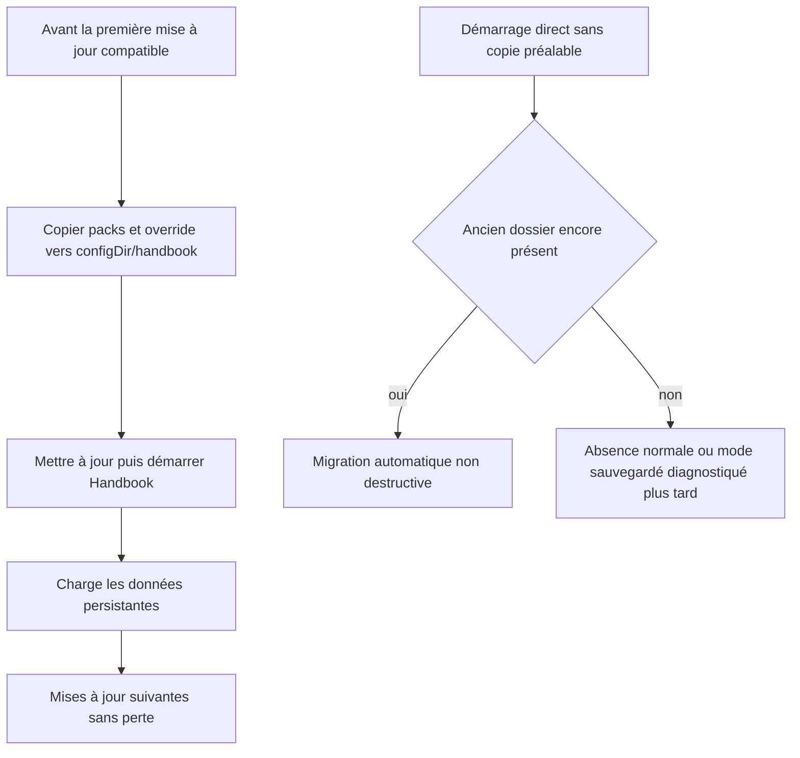
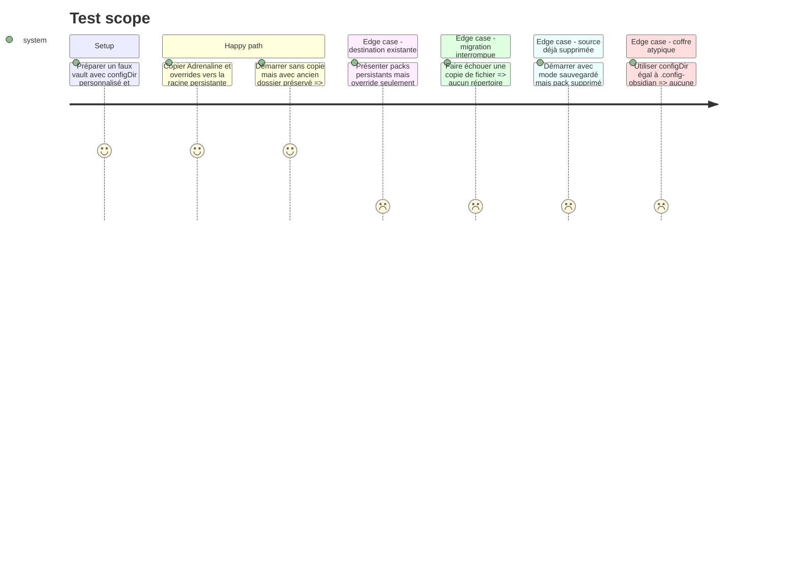

<!-- Fill or omit these sections; never add, rename, or reorder one. -->

# Instruction: Stockage durable et migration non destructive

## Architecture projection

> Tree of the final files. ✅ create · ✏️ modify · ❌ delete

```txt
obsidian-handbook/
├── src/
│   ├── BrumesPlugin.ts                    ✏️ prépare le stockage persistant avant le registre et les réglages
│   └── games/
│       ├── storage.ts                     ✅ centralise chemins, repli legacy et migration répétable
│       ├── customPacks.ts                 ✏️ découvre les packs dans la racine persistante
│       ├── overrides.ts                   ✏️ lit les overrides persistants avec repli legacy
│       └── assets.ts                      ✏️ conserve formats v1, confinement et refus des formats exécutables
├── tools/
│   ├── assert-game-storage.mjs            ✅ lance le harnais de migration
│   ├── gameStorage.harness.mts            ✅ prouve migration, précédence et reprise après erreur
│   ├── customPacks.harness.mts            ✏️ utilise les chemins basés sur configDir
│   └── overrideRoundTrip.harness.mts      ✏️ couvre le nouvel emplacement des overrides
└── package.json                           ✏️ expose l'assertion de stockage
```

## User Journey



## Test Scope



## Tasks to do

### `1)` Racine de données persistante

> Tous les fichiers installés ou écrits par l'utilisateur sortent du répertoire remplaçable du plugin.

1. Créer des helpers qui dérivent `<configDir>/handbook`, `<configDir>/handbook/packs` et `<configDir>/handbook/overrides.json` depuis `plugin.app.vault.configDir`.
2. Conserver les chemins `<plugin.manifest.dir>/packs` et `<plugin.manifest.dir>/overrides.json` sous des noms explicitement legacy, sans les utiliser comme destination après migration.
3. Préparer la racine avant `loadCustomGamePacks`, `initGameRegistry` et `loadSettings` dans `onload()`.

### `2)` Migration répétable et sûre

> Une installation existante est récupérée une fois sans risque pour une destination déjà créée.

1. Fournir et documenter d'abord la copie pré-update vers la racine persistante ; elle est obligatoire pour préserver un override que BRAT pourrait supprimer avant le premier démarrage du nouveau code.
2. Lorsque la source legacy existe encore, copier récursivement ses fichiers dans une destination temporaire sœur, en conservant les chemins relatifs et le confinement.
3. Ne jamais écraser une destination persistante existante ; traiter `packs/` et `overrides.json` indépendamment afin que la présence de l'un n'empêche pas de récupérer l'autre.
4. Publier la destination seulement après copie complète ; en cas d'échec, laisser la source intacte, nettoyer seulement le temporaire contrôlé et journaliser un diagnostic actionnable.
5. Migrer `overrides.json` selon la même règle de précédence et conserver la lecture legacy comme repli pendant un cycle de compatibilité.
6. Si un mode sauvegardé désigne un pack désormais absent, enrichir le diagnostic existant avec le nouveau chemin de réinstallation. Ne rien journaliser pour un pack simplement absent : cet état est normal et indistinguable d'une désinstallation volontaire.
7. Expliquer dans la documentation que seul un backup peut restaurer un override supprimé avant migration ; le runtime ne prétend pas détecter qu'un override existait.

### `3)` Chargement et provenance

> La nouvelle racine ne modifie ni la portabilité d'un pack ni le confinement de ses assets.

1. Faire découvrir les formats `packs/<id>/pack.json` et `packs/*.json` depuis la racine persistante.
2. Propager le nouveau chemin d'installation inchangé jusqu'à `resolveGameAssets` ; maintenir le refus des racines absolues et traversées `..`.
3. Formaliser la liste v1 déjà utilisée (`png`, `jpg`, `jpeg`, `webp`, `gif`, `svg` pour les images ; `woff2`, `woff`, `ttf`, `otf` pour les fontes), refuser HTML/JavaScript et les extensions inconnues avant toute résolution, sans casser les assets intégrés City/Legend ni les packs legacy.
4. Lire l'override persistant à chaque commande de rechargement, pas seulement au démarrage.

### `4)` Harnais de non-régression

> Le scénario exact d'une mise à jour BRAT devient une preuve automatisée.

1. Simuler une copie pré-update suivie du remplacement complet du dossier plugin, puis le filet de migration lorsque le legacy survit.
2. Couvrir configDir personnalisé, packs/override présents indépendamment, mode sauvegardé sans pack, copie interrompue, assets confinés, formats v1 conservés et extensions exécutables refusées.
3. Ajouter l'assertion au script agrégé de vérification de la phase 5.

## Test acceptance criteria

| Task | Acceptance criteria |
| ---- | ------------------- |
| 1 | Les chemins actifs sont `<vault>/<configDir>/handbook/packs` et `<vault>/<configDir>/handbook/overrides.json`, quel que soit le nom de configDir. |
| 2 | Une installation copiée vers la racine persistante avant mise à jour reste disponible après suppression complète du répertoire du plugin. |
| 2 | Le système ne promet aucune récupération automatique lorsque BRAT a déjà supprimé la seule copie legacy ; seul un mode sauvegardé devenu introuvable produit un diagnostic de réinstallation. |
| 2 | Une destination existante n'est jamais écrasée et une migration interrompue ne devient jamais la source active. |
| 2 | Des packs persistants n'empêchent pas la migration d'un override legacy manquant, et inversement. |
| 3 | Les assets restent résolus sous le répertoire du pack migré et aucune traversée ne sort de celui-ci. |
| 3 | Les SVG/TTF v1 de City/Legend continuent à fonctionner ; HTML, JavaScript et extensions inconnues sont refusés avant de produire une URL CSS. |
| 4 | `npm run assert:game-storage`, `assert:custom-packs` et `assert:override` sortent verts. |
