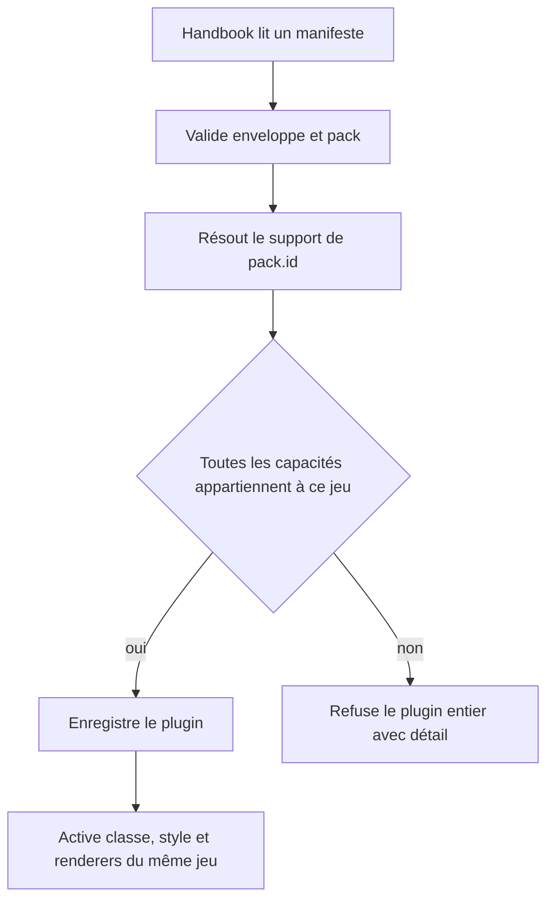
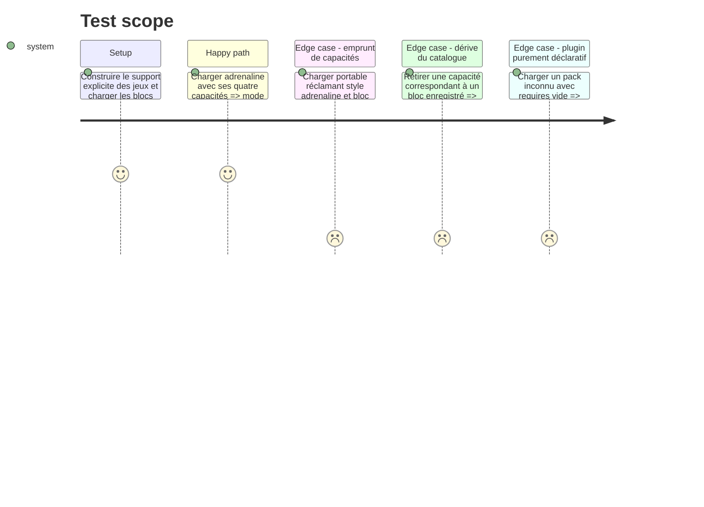

<!-- Fill or omit these sections; never add, rename, or reorder one. -->

# Instruction: Capacités garanties par identifiant de jeu

## Architecture projection

> Tree of the final files. ✅ create · ✏️ modify · ❌ delete

```txt
obsidian-handbook/
├── src/games/
│   ├── capabilities.ts                    ✏️ décrit les capacités réellement fournies par jeu
│   └── pluginManifest.ts                  ✏️ valide requires après lecture de pack.id
└── tools/
    ├── customPacks.harness.mts            ✏️ vérifie activation et refus inter-jeux
    └── assertAdrenalineTheme.harness.mts  ✏️ rend les capacités Adrenaline déclarées
```

## User Journey



## Test Scope



## Tasks to do

### `1)` Support indexé par jeu

> Une capacité ne vaut que pour le mode sous lequel son implémentation est réellement activée.

1. Remplacer le tableau global par un registre `GameSupport` indexé par id de jeu, listant séparément blocs et style structurel.
2. Garder ce registre indépendant de `BRUMES_BLOCKS` pour éviter le cycle d'initialisation ; conserver la comparaison dans le harnais.
3. Autoriser un jeu inconnu avec `requires: []`, mais aucune capacité d'un jeu connu sous un autre id.

### `2)` Validation sémantique du manifeste

> Le lecteur connaît `pack.id` avant de conclure sur `requires`.

1. Lire et valider `pack` avant le contrôle des capacités, puis passer son id au résolveur de support.
2. Distinguer dans le diagnostic une capacité inconnue d'une capacité existante mais fournie pour un autre jeu.
3. Préserver les contrôles de protocole, SemVer, version minimale, champs inconnus et rejet atomique.

### `3)` Preuve d'activation réelle

> Le test ne se limite plus à trouver une chaîne dans un catalogue.

1. Pour le manifeste Adrenaline canonique, initialiser le registre, construire le style et rendre un témoin de chacun des trois blocs.
2. Affirmer que les racines rendues, la classe de mode et le sélecteur CSS portent tous `adrenaline`.
3. Ajouter les cas négatifs d'emprunt de style, d'emprunt de bloc et de mélange partiellement valide.

## Test acceptance criteria

| Task | Acceptance criteria |
| ---- | ------------------- |
| 1 | Chaque capacité non vide est rattachée à exactement un `pack.id` réellement supporté. |
| 2 | Un pack `portable` réclamant une capacité Adrenaline est refusé avec un diagnostic qui nomme l'id et la capacité. |
| 2 | Un pack inconnu sans capacité reste un thème déclaratif valide. |
| 3 | Le manifeste Adrenaline active effectivement son style et rend ses trois formats sous le même id. |
| 3 | `npm run assert:custom-packs` et `npm run assert:adrenaline-theme` sortent verts. |
