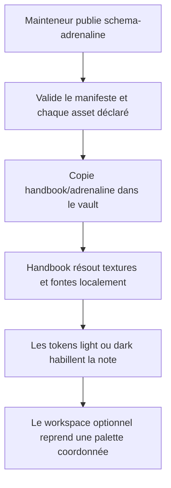
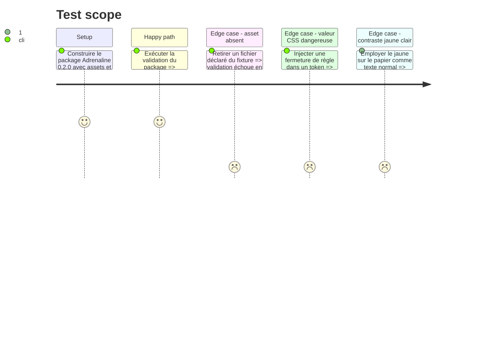

<!-- Fill or omit these sections; never add, rename, or reorder one. -->

# Instruction: Contrat visuel et assets dans schema-adrenaline

## Architecture projection

> Tree of the final files. ✅ create · ✏️ modify · ❌ delete

```txt
schema-adrenaline/
├── handbook/
│   └── adrenaline/
│       ├── pack.json                      ✏️ publie tokens light/dark, workspace, callouts, fontes et motifs
│       ├── README.md                      ✏️ documente le contenu visuel, les fallbacks et les licences
│       └── assets/
│           ├── paper-grain.webp           ✅ texture claire originale et légère
│           ├── dark-organic.webp          ✅ texture sombre originale et légère
│           ├── warning-stripe.webp        ✅ motif de signalisation original
│           └── fonts/
│               ├── adrenaline-body.woff2  ✅ face serif redistribuable et sous-ensemble utile
│               └── adrenaline-display.woff2 ✅ face display redistribuable et sous-ensemble utile
├── LICENSES/
│   ├── ADRENALINE-ASSETS.md               ✅ provenance des motifs originaux
│   ├── FONT-BODY.txt                      ✅ licence exacte de la fonte de lecture
│   └── FONT-DISPLAY.txt                   ✅ licence exacte de la fonte de titres
├── tools/
│   └── validate-handbook-pack.ts          ✅ valide manifeste, tokens et présence des assets
├── package.json                           ✏️ passe à 0.2.0 et branche la validation Handbook dans check
└── README.md                              ✏️ expose la version du package et sa responsabilité visuelle
```

## User Journey



## Test Scope



## Tasks to do

### `1)` Identité visuelle par polarité

> Light et dark deviennent deux présentations éditoriales, pas deux inversions chromatiques.

1. Passer le dépôt et le plugin de jeu à `version: 0.2.0`, puis fixer `minimumHandbookVersion: 2.7.0` sans changer `manifestVersion`.
2. En light, déclarer papier ivoire, encres sombres, titres rouge profond, filets, cartouches et texture papier.
3. En dark, déclarer charbon, encres claires, panneaux rouges, texture organique et accent jaune réservé au signal.
4. Ajouter des tokens sémantiques stables pour surface de page, texture, cartouche, règle, signal et backplate ; ne pas encoder leur géométrie dans le pack.

### `2)` Callouts et workspace entièrement tokenisés

> Toute couleur spécifique à Adrenaline devient remplaçable depuis le package.

1. Déclarer surface, encre, titre, bordure et familles sémantiques de callouts dans chaque polarité.
2. Définir dans `workspace` les surfaces primaire/secondaire, textes normal/muted/faint, bordures, accent, hover et root split.
3. Garder les fontes de page dans `note` et éviter textures/motifs dans le workspace.
4. Ajuster le jaune light ou le limiter à une variable décorative afin qu'aucun texte normal ne repose sur la combinaison 3.87:1.

### `3)` Assets distribuables

> Le package transporte sa matière visuelle sans copier le PDF de référence.

1. Créer trois WebP raster originaux, répétables, peu opaques et compressibles : grain papier, réseau organique sombre et bande de signalisation.
2. Choisir une serif de lecture et une display condensée à caractère usé/distressed sous licence redistribuable ; inclure uniquement les faces nécessaires, avec Latin étendu et les glyphes français des témoins, puis des fallbacks système.
3. Déclarer images et fontes via `assets`, sous `assets/`, avec une notice de licence ou de création pour chaque fichier.
4. Mesurer et publier le poids de chaque asset, sous-ensembler les fontes et optimiser les textures sans imposer un seuil arbitraire ; ne contenir aucun scan, logo ou texte extrait du livret.

### `4)` Validation autonome du package

> `schema-adrenaline` refuse une intégration Handbook incomplète avant publication.

1. Vérifier l'enveloppe v1, SemVer, id/dossier, polarités, noms de custom properties et caractères CSS interdits.
2. Vérifier que chaque image et fonte déclarée existe sous la racine confinée, possède une extension autorisée par le contrat v1 et une provenance/licence.
3. Contrôler les paires textuelles principales à 4.5:1 et les grands titres à 3:1 ; traiter le signal jaune comme décoratif s'il ne satisfait pas le premier seuil.
4. Ajouter cette validation à `npm run check` sans dépendre d'un checkout Handbook.

## Test acceptance criteria

| Task | Acceptance criteria |
| ---- | ------------------- |
| 1 | Le manifeste 0.2.0 déclare deux compositions sémantiques complètes et reste un document sans CSS ni code exécutable. |
| 2 | Chaque couleur de callout et chaque surface/text/border/accent du workspace existe en light et dark dans le pack. |
| 3 | Le répertoire copié contient tous les assets déclarés et leurs licences, aucun extrait du PDF, et son rapport de poids permet de repérer toute régression matérielle. |
| 3 | Les fontes sous-ensemblées affichent sans fallback accidentel les accents, ligatures et ponctuations françaises du témoin. |
| 3 | Le corps reste une serif sobre et la face usée/condensée est limitée aux titres courts et cartouches. |
| 4 | `npm run check` dans `schema-adrenaline` échoue sur asset absent, chemin sortant, token dangereux ou contraste textuel insuffisant, et passe sur le package publié. |
