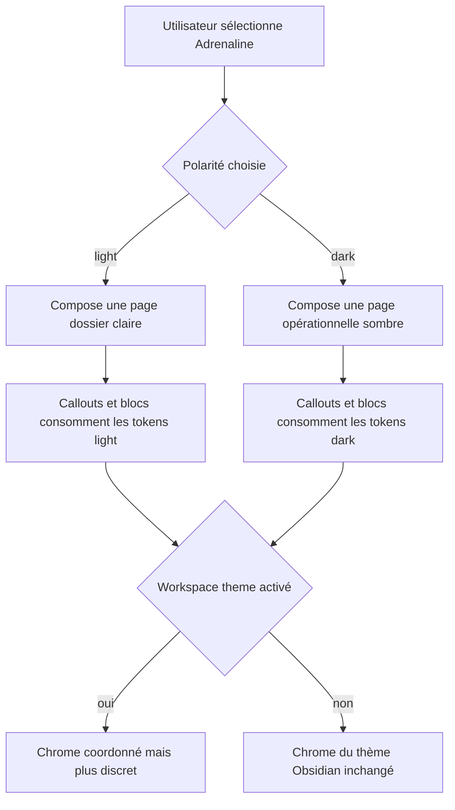
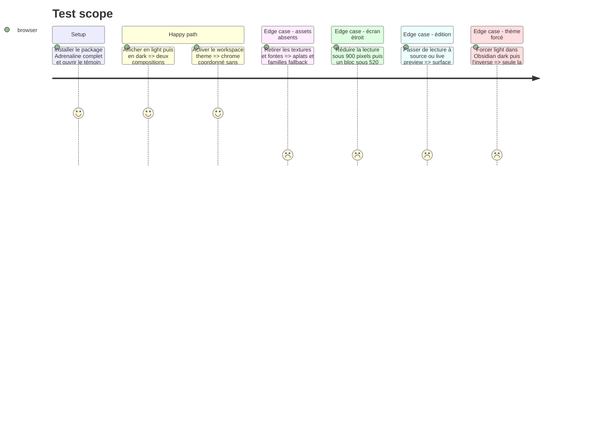

<!-- Fill or omit these sections; never add, rename, or reorder one. -->

# Instruction: Compositions light/dark et callouts dans Handbook

## Architecture projection

> Tree of the final files. ✅ create · ✏️ modify · ❌ delete

```txt
obsidian-handbook/
├── package.json                            ✏️ passe l'hôte à 2.7.0 avant de lire le pack 0.2.0
├── manifest.json                           ✏️ expose la version hôte 2.7.0 à Obsidian
├── versions.json                           ✏️ enregistre la compatibilité Obsidian de 2.7.0
├── src/styles/
│   ├── styles.scss                         ✏️ corrige la documentation de propriété des valeurs externes
│   └── adrenaline/
│       ├── index.scss                      ✏️ assemble la composition Adrenaline sous son mode
│       ├── _page.scss                      ✅ structure pages, titres, règles, tables et responsive
│       └── _callouts.scss                  ✏️ remplace la palette fixe par les tokens du pack
└── tools/
    ├── assertAdrenalineTheme.harness.mts   ✏️ couvre tous les partials, polarités et fallbacks
    └── assertStyleScope.harness.mts        ✏️ prouve le confinement note/workspace
```

## User Journey



## Test Scope



## Wireframe

```txt
┌────────────────────────────────────────────────────────────┐
│ (1) Barre du workspace                                     │
├──────────────┬─────────────────────────────────────────────┤
│ (2) Panneau  │ (3) Page claire                            │
│ latéral      │  ┌───────────────────────────────────────┐  │
│              │  │ (4) En-tête / cartouche               │  │
│              │  ├───────────────────────────────────────┤  │
│              │  │ (5) Introduction / métadonnées         │  │
│              │  ├─────────────────┬─────────────────────┤  │
│              │  │ (6) Corps       │ (7) Encadré         │  │
│              │  └─────────────────┴─────────────────────┘  │
└──────────────┴─────────────────────────────────────────────┘

1. Barre : chrome Obsidian coordonné mais secondaire.
2. Panneau : navigation séparée visuellement de la note.
3. Page claire : surface de lecture principale.
4. En-tête : hiérarchie éditoriale et repère de chapitre.
5. Introduction : entrée de page et informations courtes.
6. Corps : flux Markdown standard en deux colonnes de lecture large, une colonne en édition/étroit.
7. Encadré : callout natif maintenu entier dans le flux, sans balisage propriétaire.

┌────────────────────────────────────────────────────────────┐
│ (1) Barre du workspace                                     │
├──────────────┬─────────────────────────────────────────────┤
│ (2) Panneau  │ (3) Page sombre                            │
│ latéral      │  ┌───────────────────────────────────────┐  │
│              │  │ (4) Bandeau / titre                   │  │
│              │  ├───────────────────────────────────────┤  │
│              │  │ (5) Zone éditoriale principale        │  │
│              │  ├───────────────────────┬───────────────┤  │
│              │  │ (6) Module secondaire │ (7) Signal    │  │
│              │  └───────────────────────┴───────────────┘  │
└──────────────┴─────────────────────────────────────────────┘

1. Barre : même ossature de workspace que la présentation claire.
2. Panneau : navigation du vault.
3. Page sombre : composition autonome, pas une simple inversion.
4. Bandeau : entrée forte de la page.
5. Zone principale : flux Markdown standard, éventuellement multicolonne en lecture large.
6. Module secondaire : bloc ou callout natif maintenu entier.
7. Signal : callout d'avertissement, accent exceptionnel à haute visibilité.
```

## Tasks to do

### `1)` Version hôte compatible

> Le runtime annonce la version minimale que le nouveau manifeste exige avant de l'utiliser dans les tests ou le vault.

1. Bumper Handbook de 2.6.0 à 2.7.0 avec le mécanisme de version existant, en gardant package, manifeste et table de versions synchronisés.
2. Faire lire aux harnais la version du manifeste/package au lieu de conserver un littéral 2.6.0 susceptible de dériver.
3. Vérifier que le package Adrenaline 0.2.0 est accepté par 2.7.0 et refusé par 2.6.0 avec le diagnostic de version existant.

### `2)` Composition de page confinée

> Les structures éditoriales ne s'appliquent qu'aux vues Markdown et blocs Adrenaline.

1. Ajouter `_page.scss` sous `.brumes--adrenaline`, avec variantes composées pour thème Obsidian et classes `brumes--colour-light/dark` forcées.
2. Appliquer texture, surface, typographie, règles et cartouches aux vues lecture/source sans habiller le workspace ni les autres modes ; conserver source et live preview en une colonne.
3. Donner au light une hiérarchie dossier/papier et au dark une hiérarchie bandeau/panneau ; utiliser uniquement les variables du pack avec fallbacks solides.
4. Composer le Markdown standard en deux colonnes seulement dans la vue lecture suffisamment large ; faire franchir les colonnes aux titres principaux, éviter les ruptures dans les callouts/blocs, revenir à une colonne sous 900 px et conserver le breakpoint interne des blocs à 520 px.

### `3)` Callouts sous contrat

> Le partial conserve l'anatomie Obsidian mais ne possède plus aucune palette de jeu.

1. Remplacer chaque hex, `black` et famille littérale par les tokens sémantiques de callout.
2. Regrouper les types natifs par intention (information, succès, question, avertissement, danger, exemple, citation) sans multiplier les valeurs quasi identiques.
3. Réserver le motif de signalisation au groupe avertissement/danger et fournir un fond opaque derrière tout texte.
4. Assurer une variante dark réelle, pas le pastel light posé sur le fond noir.

### `4)` Workspace retenu

> Le chrome suit la polarité uniquement lorsque l'utilisateur active son toggle.

1. Laisser le runtime écrire les tokens workspace exclusivement sur `body.brumes--workspace-theme`.
2. Vérifier les surfaces principales, panneaux, texte, bordures, accent et hover dans les fenêtres principale et détachées.
3. Ne jamais appliquer les textures, cartouches ou motifs de page au chrome Obsidian.

### `5)` Assertions CSS exhaustives

> La frontière de propriété devient une règle automatisée.

1. Étendre la recherche de couleurs chromatiques codées en dur à tous les partials Adrenaline, notamment `_callouts.scss` et `_page.scss` ; autoriser seulement les mots structurels `transparent`, `currentColor` et `inherit`.
2. Affirmer les sélecteurs mode + polarité, les fallbacks d'assets, le breakpoint et l'absence de sélecteur global `.theme-light/.theme-dark`.
3. Affirmer que désactiver le workspace theme ne retire pas la composition de note et ne repeint aucun élément hors note.

## Test acceptance criteria

| Task | Acceptance criteria |
| ---- | ------------------- |
| 1 | `package.json`, `manifest.json` et `versions.json` annoncent tous Handbook 2.7.0 avant que le pack Adrenaline 0.2.0 soit chargé. |
| 1 | Le manifeste Adrenaline est accepté par Handbook 2.7.0 et refusé par 2.6.0 pour sa version minimale. |
| 2 | Les pages light et dark présentent des structures visiblement distinctes et restent confinées aux vues Markdown/blocs Adrenaline. |
| 2 | La lecture large utilise deux colonnes sans nouveau balisage ; source, live preview et lecture sous 900 px restent en une colonne. |
| 2 | Sans texture ou fonte, les fallbacks gardent texte, titres et blocs lisibles sans espace vide réservé. |
| 3 | Aucun hex, couleur chromatique nommée ou famille Adrenaline n'est codé en dur dans `src/styles/adrenaline/` ; seuls `transparent`, `currentColor` et `inherit` peuvent rester structurels. |
| 3 | Les callouts dark n'utilisent aucune surface pastel light et tout texte sur motif possède un fond lisible. |
| 4 | Le workspace reste inchangé toggle désactivé ; activé, il reprend les surfaces et interactions de la polarité sans texture. |
| 5 | `npm run assert:adrenaline-theme` et `npm run assert:style-scope` sortent verts pour thèmes suivis et forcés. |
