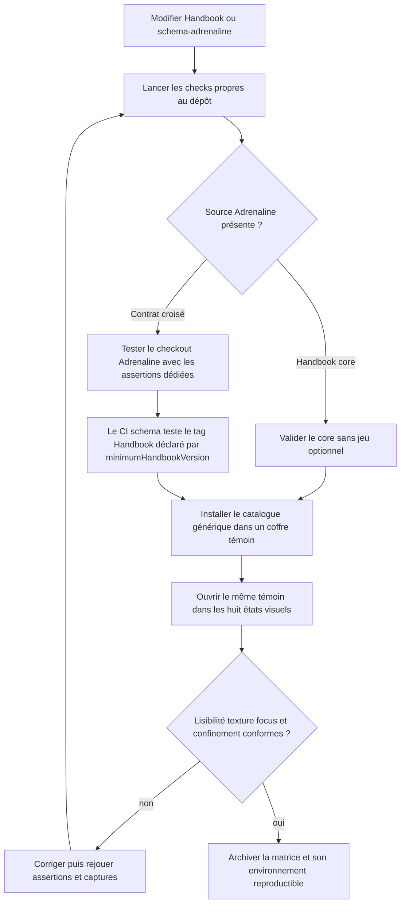
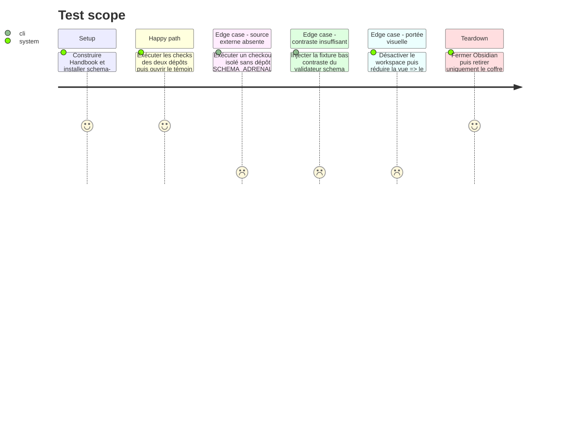

<!-- Fill or omit these sections; never add, rename, or reorder one. -->

# Instruction: Clore la compatibilité, la documentation et la recette visuelle

## Architecture projection

> Tree of the final files. ✅ create · ✏️ modify · ❌ delete

```txt
obsidian-handbook/
├── README.md                                                        ✏️ décrit le catalogue générique, le stockage durable et le contrat CI réel
├── src/styles/adrenaline/_page.scss                                 ✏️ consomme l'opacité de texture et garantit un focus visible dans la portée Adrenaline
├── tools/assertAdrenalineTheme.harness.mts                           ✏️ affirme l'opacité, le focus et leur confinement aux notes/workspace Adrenaline
├── tools/assertStyleScope.harness.mts                                ✏️ remplace l'interdiction globale du workspace par une exception limitée au focus
└── aidd_docs/tasks/2026_09/2026_09_10_adrenaline-separation-hardening/evidence/
    ├── README.md                                                     ✏️ consigne versions, dimensions, matrice, contrôles et verdict
    ├── light-workspace-off.png                                      ❌ remplace le checkpoint antérieur à la finition visuelle
    ├── dark-workspace-off.png                                       ❌ remplace le checkpoint antérieur à la finition visuelle
    ├── light-desktop-workspace-off.png                              ✅ preuve canonique
    ├── light-desktop-workspace-on.png                               ✅ preuve canonique
    ├── dark-desktop-workspace-off.png                               ✅ preuve canonique
    ├── dark-desktop-workspace-on.png                                ✅ preuve canonique
    ├── light-narrow-workspace-off.png                               ✅ preuve canonique
    ├── light-narrow-workspace-on.png                                ✅ preuve canonique
    ├── dark-narrow-workspace-off.png                                ✅ preuve canonique
    └── dark-narrow-workspace-on.png                                 ✅ preuve canonique
```

## User Journey



## Test Scope



## Tasks to do

### `1)` Documenter le contrat croisé réellement livré

> Handbook décrit le catalogue générique et la frontière de CI réellement appliquée entre les deux dépôts, sans ressusciter un pin Adrenaline local.

1. Dans le README Handbook, remplacer le protocole fondé sur `compat/schema-adrenaline.ref` par l'installation d'une source générique suivant une release, un tag ou une branche.
2. Expliquer que `npm run check` et la release Handbook restent indépendants des jeux optionnels, tandis que les assertions `assert:adrenaline-*` valident explicitement un checkout fourni par `SCHEMA_ADRENALINE_ROOT`.
3. Décrire le contrat partenaire observé dans le CI schema-adrenaline : dériver le tag immuable de `minimumHandbookVersion`, exécuter les assertions dédiées du host puis installer le catalogue avec cette release.
4. Conserver un ordre de publication sans cycle : publier d'abord un host rétrocompatible, relever ensuite `minimumHandbookVersion` et publier schema-adrenaline ; aucun commit schema n'est épinglé dans Handbook. La documentation du dépôt partenaire reste hors du commit atomique de cette phase Handbook.

### `2)` Consolider la procédure de stockage et de migration

> Une personne qui met Handbook à jour sait quoi copier, où le conserver et ce que l'automatisation ne peut pas récupérer.

1. Garder la copie manuelle pré-update avant toute instruction d'installation ou de mise à jour vers 2.7.0.
2. Employer `<configDir>/handbook/packs` et `<configDir>/handbook/overrides.json` comme seules destinations durables ; ne citer le dossier du plugin que comme source legacy à copier.
3. Documenter séparément migration des packs et des overrides, priorité de la destination existante, réinstallation atomique par Schema sources et impossibilité de restaurer un fichier déjà supprimé par BRAT.
4. Maintenir la portée fonctionnelle : toutes les vues Markdown ouvertes suivent le mode, le workspace reste un toggle indépendant, et Handbook comme Lantern consomment le même dépôt schema-adrenaline.

### `3)` Fermer les écarts d'accessibilité et de texture

> Les tokens déclarés par le pack ont un effet observable et le clavier reste visible sans dépendre du thème Obsidian choisi.

1. Faire consommer `--adrenaline-page-texture-opacity` par un pseudo-élément décoratif isolé derrière le contenu, sans interaction pointeur, et le supprimer à l'impression ; ne pas appliquer ce calque au workspace ni aux autres modes.
2. Ajouter un traitement `:focus-visible` limité aux vues Adrenaline et au workspace Adrenaline activé, fondé sur `--interactive-accent` et `--background-primary`, dont le package contrôle le contraste mutuel à 3:1 ; confirmer visuellement les autres surfaces.
3. Étendre `assert:adrenaline-theme` pour refuser la disparition de l'opacité ou du focus lorsqu'un checkout schema est fourni ; conserver ce check parmi les assertions externes, pas dans `npm run check`.
4. Adapter `assert:style-scope`, qui appartient au check core, pour autoriser `brumes--workspace-theme` uniquement dans le sélecteur `:focus-visible` et continuer à refuser texture, callouts ou composition de note dans le workspace.
5. S'appuyer sur le validateur schema-adrenaline existant pour les paires de texte à 4.5:1 et les grands titres/accents UI à 3:1, y compris son cas négatif de faible contraste.

### `4)` Produire une recette visuelle reproductible

> Une matrice complète remplace les deux checkpoints incomplets et permet de juger la composition réellement rendue par Obsidian.

1. Utiliser uniquement `tools/fixtures/adrenaline-visual.md`, qui couvre h1-h3, texte, listes, tableau, code, tags, sept familles de callouts et trois blocs Adrenaline fictifs.
2. Construire Handbook, installer schema-adrenaline par Schema sources dans un coffre témoin et consigner les commits, versions Obsidian/Handbook/pack et thème hôte ; utiliser `1440×1000` pour desktop et `500×900` pour narrow.
3. Capturer huit états du même témoin : light/dark × desktop/narrow × workspace off/on, avec des noms stables, la même ancre de note, le même zoom et un lien témoin focalisé au clavier ; régénérer aussi les deux états déjà présents plutôt que de les présenter comme preuves finales.
4. Parcourir séparément la note entière pour vérifier la lisibilité sur texture, l'absence de texture dans le workspace, le passage à une colonne étroite, les trois blocs et les sept callouts ; avec le workspace activé, déplacer aussi le focus au clavier vers un contrôle du chrome et consigner son résultat dans la checklist de `evidence/README.md`.
5. Confirmer que le témoin et les assets restent originaux ou sous licence et ne reproduisent aucune page ni aucun texte du PDF.

## Test acceptance criteria

| Task | Acceptance criteria |
| ---- | ------------------- |
| 1 | Le README Handbook ne mentionne plus `compat/schema-adrenaline.ref`, décrit le flux partenaire fondé sur `minimumHandbookVersion` et distingue clairement le check core des assertions Adrenaline dédiées. |
| 2 | La documentation ne recommande aucun stockage utilisateur sous le dossier installé du plugin, exige la copie avant la première mise à jour concernée et ne promet jamais de restaurer une source déjà effacée. |
| 3 | L'opacité de texture modifie réellement la note sans atteindre workspace, impression ou autres jeux ; le focus clavier Adrenaline utilise une paire accent/surface primaire validée à 3:1 et reste visiblement distinct sur les autres surfaces contrôlées. Les assertions externe et core échouent respectivement si le contrat visuel disparaît ou si sa portée déborde. |
| 3 | Le validateur schema-adrenaline refuse une paire sous 4.5:1 pour le texte ou sous 3:1 pour les grands titres et accents UI couverts. |
| 4 | Huit captures nommées couvrent light/dark × `1440×1000`/`500×900` × workspace off/on sur le même témoin, à ancre et zoom constants avec le lien témoin focalisé, et leur environnement et verdict sont consignés dans `evidence/README.md`. |
| 4 | Les vues étroites restent en une colonne, le workspace désactivé reste neutre, tous les contrôles vérifiés gardent un focus visible et aucune image ni aucun texte du PDF n'est redistribué. |
