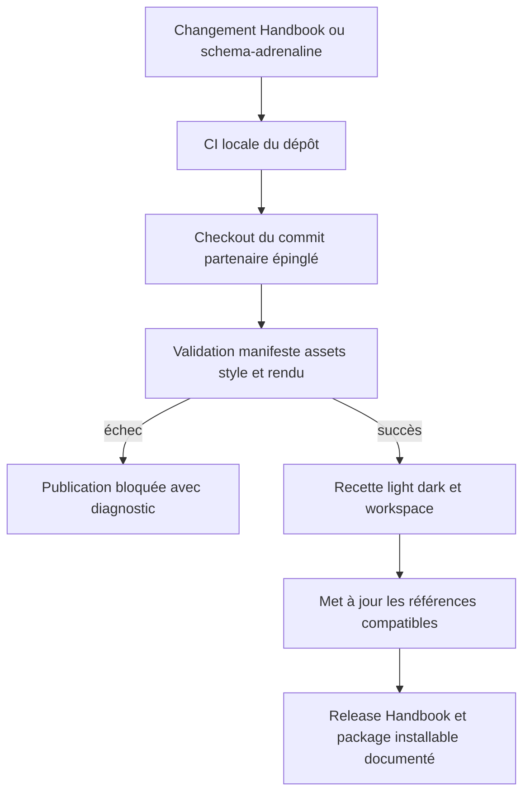
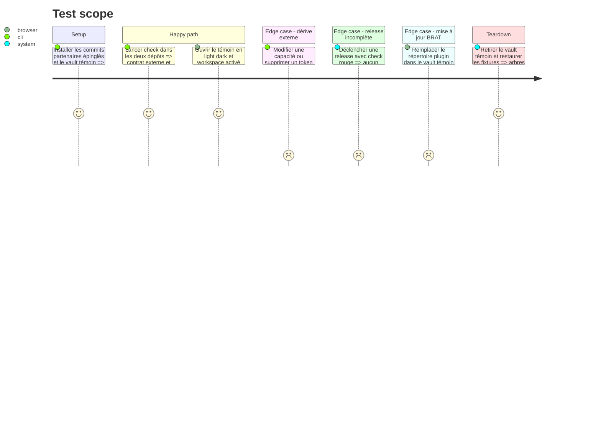

<!-- Fill or omit these sections; never add, rename, or reorder one. -->

# Instruction: Compatibilité croisée, documentation et recette visuelle

## Architecture projection

> Tree of the final files. ✅ create · ✏️ modify · ❌ delete

```txt
obsidian-handbook/
├── .github/workflows/
│   ├── ci.yml                             ✅ vérifie le schema-adrenaline épinglé
│   └── release.yml                        ✏️ bloque la release sur le check complet
├── compat/
│   └── schema-adrenaline.ref              ✅ fixe le commit externe supporté
├── tools/
│   ├── check.mjs                          ✅ agrège build, assertions et source externe
│   └── fixtures/adrenaline-visual.md       ✅ témoin stable des éléments éditoriaux
├── package.json                           ✏️ expose npm run check
└── README.md                              ✏️ documente stockage, migration, portée et installation

schema-adrenaline/
├── .github/workflows/ci.yml               ✅ vérifie le package contre Handbook épinglé
└── README.md                              ✏️ documente la mise à jour coordonnée des références
```

## User Journey



## Test Scope



## Tasks to do

### `1)` Contrat croisé reproductible

> Chaque dépôt teste un commit partenaire connu plutôt que de supposer sa compatibilité.

1. Stocker un seul SHA complet de `schema-adrenaline` dans Handbook et exécuter les lecteurs/harnais sur ce checkout exact.
2. Dans schema-adrenaline, dériver le tag Handbook exact de `minimumHandbookVersion` (`2.7.0` → `2.7.0`) et valider le manifeste contre cette release immuable, sans second fichier de pin.
3. Coordonner la première livraison en publiant d'abord Handbook 2.7.0 avec fallbacks contre le package 0.1.0, puis Adrenaline 0.2.0 contre ce tag, puis mettre à jour le SHA schema dans Handbook.
4. Documenter ce protocole séquentiel pour qu'aucune dépendance circulaire à deux SHAs ne soit créée.

### `2)` Gate de release Handbook

> Une compilation seule ne suffit plus à publier le plugin.

1. Ajouter `npm run check` qui enchaîne build, lint et toutes les assertions sans modifier les sources.
2. Faire exécuter ce check par la CI de branches/PR et par le workflow de tag avant `gh release create`.
3. Fournir `SCHEMA_ADRENALINE_ROOT` au check à partir du checkout épinglé et échouer explicitement si la source manque.

### `3)` Documentation opérationnelle

> La procédure utilisateur pointe uniquement vers l'emplacement durable.

1. Remplacer toutes les destinations `.obsidian/plugins/obsidian-handbook/packs` et l'ancien override par `<configDir>/handbook/packs` et `<configDir>/handbook/overrides.json`.
2. Placer avant toute instruction de mise à jour 2.7.0 la copie manuelle pré-update des packs et overrides ; documenter ensuite leurs migrations indépendantes, la précédence, la réinstallation d'un pack et l'impossibilité de détecter/restaurer un override déjà supprimé.
3. Expliquer que le mode habille toutes les vues Markdown ouvertes, que le workspace est indépendant via toggle, et que Handbook/Lantern partagent `schema-adrenaline`.

### `4)` Recette visuelle et accessibilité

> Les deux compositions sont jugées sur un témoin stable avant release.

1. Créer une note couvrant h1–h3, paragraphes, listes, tableau, code, tags, les sept familles de callouts et les trois blocs Adrenaline.
2. Capturer light et dark à largeur desktop et étroite, puis workspace activé/désactivé ; conserver les preuves dans le dossier de tâche ou l'artefact CI, pas dans le package distribué.
3. Vérifier le contraste sur les zones les plus chargées des textures : corps ≥ 4.5:1, grands titres ≥ 3:1, focus visible ≥ 3:1.
4. Comparer au PDF par caractéristiques — papier, charbon, hiérarchie, cartouches, signal — sans reproduire ses pages ni son texte.

## Test acceptance criteria

| Task | Acceptance criteria |
| ---- | ------------------- |
| 1 | Handbook teste un SHA schema explicite ; schema-adrenaline teste le tag hôte immuable déclaré par `minimumHandbookVersion`, et chacun échoue sur une incompatibilité réelle. |
| 2 | Un tag Handbook ne produit aucune release lorsque build, lint, stockage, capacités, thème ou contrat externe échoue. |
| 3 | La documentation ne recommande plus aucun stockage utilisateur sous le dossier du plugin, exige la copie avant la première mise à jour et ne promet pas de restaurer une source déjà effacée. |
| 4 | Quatre états desktop light/dark × workspace on/off et les vues étroites sont vérifiés sur le même témoin. |
| 4 | Tous les textes/focus mesurés respectent leurs seuils sur les zones texturées et aucun contenu du PDF n'est redistribué. |
