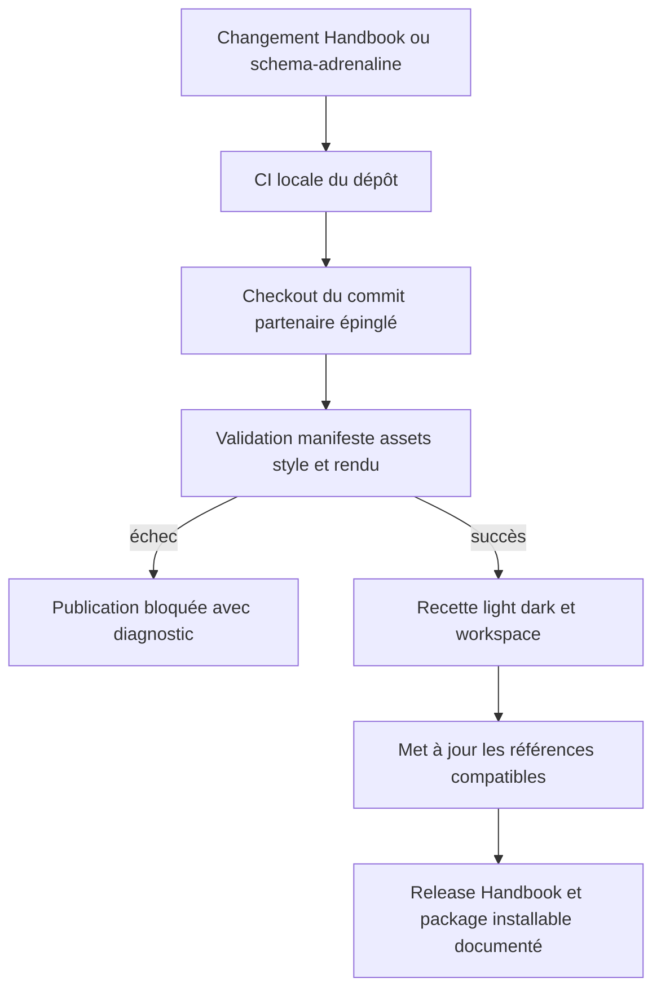
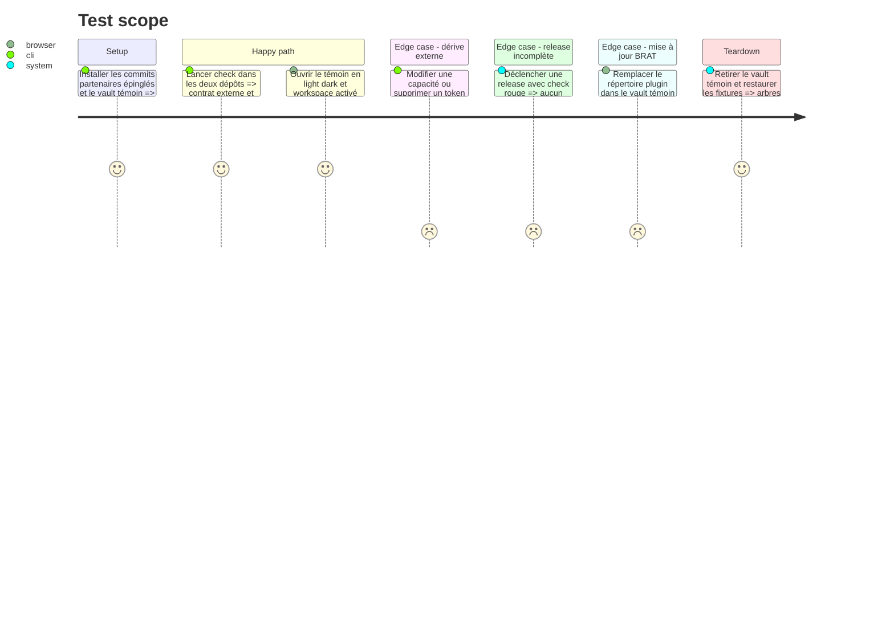

<!-- Fill or omit these sections; never add, rename, or reorder one. -->

# Instruction: Compatibilité croisée, documentation et recette visuelle

## Architecture projection

> Tree of the final files. ✅ create · ✏️ modify · ❌ delete

```txt
obsidian-handbook/
├── .github/workflows/
│   ├── ci.yml                             ✅ vérifie le schema-adrenaline épinglé
│   └── release.yml                        ✏️ bloque la release sur le check complet
├── compat/
│   └── schema-adrenaline.ref              ✅ fixe le commit externe supporté
├── tools/
│   ├── check.mjs                          ✅ agrège build, assertions et source externe
│   └── fixtures/adrenaline-visual.md       ✅ témoin stable des éléments éditoriaux
├── package.json                           ✏️ expose npm run check
└── README.md                              ✏️ documente stockage, migration, portée et installation

schema-adrenaline/
├── .github/workflows/ci.yml               ✅ vérifie le package contre Handbook épinglé
└── README.md                              ✏️ documente la mise à jour coordonnée des références
```

## User Journey



## Test Scope



## Tasks to do

### `1)` Contrat croisé reproductible — **remplacé par le plan `2026_09_10_schema-repositories`**

> Chaque dépôt teste un commit partenaire connu plutôt que de supposer sa compatibilité.

Le pin unique décrit ci-dessous (`compat/schema-adrenaline.ref`) a été livré dans
`62acc20`, puis retiré dans `0c90541` : le plan `schema-repositories` (`status: implemented`)
l'a remplacé par un mécanisme générique — catalogue de starter kits et références
de dépôts déclarées dans le manifeste, plutôt qu'un fichier de pin spécifique à
Adrenaline. `compat/schema-adrenaline.ref` **n'existe plus** dans le dépôt.

Reste vrai malgré le remplacement : `npm run assert:adrenaline-source` et
`npm run assert:adrenaline-theme` exigent toujours `SCHEMA_ADRENALINE_ROOT` (voir
leurs harnais dans `tools/`) et échouent explicitement si la variable est absente
ou pointe vers un checkout introuvable — la vérification contre un commit
partenaire concret existe, mais en dehors de `npm run check` (voir tâche 2).

Reste à faire si on veut clore cette tâche : documenter dans le README/CHANGELOG
que le contrat croisé Adrenaline passe désormais par le mécanisme générique de
`schema-repositories`, pas par un fichier `.ref` dédié — le `README.md` actuel
(lignes ~166-172) décrit encore l'ancien mécanisme et contredit le code.

~~1. Stocker un seul SHA complet de `schema-adrenaline` dans Handbook et exécuter les lecteurs/harnais sur ce checkout exact.~~
~~2. Dans schema-adrenaline, dériver le tag Handbook exact de `minimumHandbookVersion` (`2.7.0` → `2.7.0`) et valider le manifeste contre cette release immuable, sans second fichier de pin.~~
~~3. Coordonner la première livraison en publiant d'abord Handbook 2.7.0 avec fallbacks contre le package 0.1.0, puis Adrenaline 0.2.0 contre ce tag, puis mettre à jour le SHA schema dans Handbook.~~
~~4. Documenter ce protocole séquentiel pour qu'aucune dépendance circulaire à deux SHAs ne soit créée.~~

### `2)` Gate de release Handbook — **implémenté**

> Une compilation seule ne suffit plus à publier le plugin.

1. ✅ `npm run check` (`tools/check.mjs`) enchaîne `build`, `lint` et tous les scripts `assert:*` sans modifier les sources.
2. ✅ `.github/workflows/ci.yml` (push/PR) et `.github/workflows/release.yml` (tag, avant `gh release create`/`upload`) exécutent ce check.
3. ⚠️ Non fait tel que décrit : `check.mjs` n'injecte pas `SCHEMA_ADRENALINE_ROOT` et n'échoue pas explicitement si la source manque — il **exclut** `assert:adrenaline-source` et `assert:adrenaline-theme` du check commun (voir `externalSchemaAssertions` dans `tools/check.mjs`), décision reprise par `schema-repositories` pour ne plus bloquer le core sur un jeu non embarqué. Le contrat externe Adrenaline reste vérifiable séparément (`SCHEMA_ADRENALINE_ROOT=<checkout> npm run assert:adrenaline-theme`) mais n'est plus une condition de release.

### `3)` Documentation opérationnelle

> La procédure utilisateur pointe uniquement vers l'emplacement durable.

1. Remplacer toutes les destinations `.obsidian/plugins/obsidian-handbook/packs` et l'ancien override par `<configDir>/handbook/packs` et `<configDir>/handbook/overrides.json`.
2. Placer avant toute instruction de mise à jour 2.7.0 la copie manuelle pré-update des packs et overrides ; documenter ensuite leurs migrations indépendantes, la précédence, la réinstallation d'un pack et l'impossibilité de détecter/restaurer un override déjà supprimé.
3. Expliquer que le mode habille toutes les vues Markdown ouvertes, que le workspace est indépendant via toggle, et que Handbook/Lantern partagent `schema-adrenaline`.

### `4)` Recette visuelle et accessibilité

> Les deux compositions sont jugées sur un témoin stable avant release.

1. ✅ Créer une note couvrant h1–h3, paragraphes, listes, tableau, code, tags, les sept familles de callouts et les trois blocs Adrenaline. — `tools/fixtures/adrenaline-visual.md` ("Dossier 17 — Station Aurore") couvre tout : h1/h2/h3, paragraphe avec lien/code inline/tag, liste, tableau, bloc de code, les sept familles (`info`, `success`, `question`, `warning`, `danger`, `example`, `quote`) et les trois blocs Adrenaline.

2. ⏳ Capturer light et dark à largeur desktop et étroite, puis workspace activé/désactivé. — Aucun outil de cette session ne pilote l'application Electron Obsidian réelle (seule l'automatisation navigateur est disponible) ; sur décision explicite, la capture reste manuelle, dans un vrai coffre, comme le 2026-09-10. État actuel dans `evidence/` : `light-workspace-off.png` et `dark-workspace-off.png` seulement (2 des 4 états minimum requis par le critère d'acceptation — workspace-on et largeur étroite manquent encore pour les deux polarités). Cette tâche reste ouverte tant que ces captures n'existent pas.

3. ✅ Vérifier le contraste sur les zones les plus chargées des textures : corps ≥ 4.5:1, grands titres ≥ 3:1, focus visible ≥ 3:1. — Calculé (formule WCAG standard) à partir des valeurs réelles de `schema-adrenaline/handbook/adrenaline/pack.json` (v0.2.0) :
   - Corps de texte : 15.07:1 (light), 16.02:1 (dark) — largement au-dessus de 4.5:1.
   - Titres (h1 en cartouche, h2, h3) : de 6.85:1 à 16.27:1 selon la polarité — au-dessus de 3:1.
   - Les sept familles de callouts (texte sur leur surface propre) : de 10.49:1 à 15.75:1 dans les deux polarités.
   - ⚠️ Zone texturée (fond de page, `background-blend-mode: soft-light`) : `--adrenaline-page-texture-opacity` est déclaré par le pack mais **jamais lu** par `_page.scss` — la texture s'applique à pleine intensité, pas à l'opacité voulue par le pack. Vu la marge (15-16:1 en fond plat), un échec sous 4.5:1 sur le corps de texte est improbable même en plein blend, mais ce n'est pas mesuré pixel par pixel (pas d'accès aux `.webp` réels) — à confirmer visuellement lors de la capture 4.2.
   - ⚠️ Focus visible : aucun style de focus propre à Adrenaline (`grep focus` sur `src/styles/adrenaline/*.scss` ne remonte rien) — le focus hérite entièrement du thème hôte Obsidian, sans jeton dédié dans le pack. Non vérifiable depuis le code seul ; à confirmer visuellement lors de la capture 4.2.
   - `--color-yellow`/`--adrenaline-signal` en light échouent (3.87:1 et 2.87:1) mais ne sont utilisés comme texte nulle part dans le SCSS Handbook actuel (signal = liseré décoratif uniquement) — signalé à `schema-adrenaline` (issue [#5](https://github.com/RebelliousSmile/schema-adrenaline/issues/5)) plutôt que corrigé ici, puisque la valeur appartient au pack.

4. ✅ Comparer au PDF par caractéristiques — papier, charbon, hiérarchie, cartouches, signal — sans reproduire ses pages ni son texte. — Comparé à `design/critique/2026_09_10-z1l04-livret-police.md` (audit du 2026-09-10, distinction 46/100). Le pack actuel n'a pas dérivé depuis cet audit : le ratio corps/fond en light recalculé ici (15.07:1) correspond exactement à la ligne « Light body / paper » de la critique, et l'échec du jaune clair (3.87:1) est identique et toujours présent (voir point 3). Les manques structurels que la critique pointait pour distinguer vraiment les deux polarités (compositions light/dark différenciées plutôt qu'inversion de teinte, cartouches tamponnées, texture de papier fibreux, signal rare) sont des choix de valeurs/assets qui relèvent de `schema-adrenaline`, hors du périmètre comportement/sélecteurs/géométrie que Handbook possède (tableau Decisions du plan) ; aucun contenu du PDF (page, texte) n'est reproduit ni dans le pack ni dans le témoin `adrenaline-visual.md`, qui est entièrement fictif.

## Test acceptance criteria

| Task | Acceptance criteria |
| ---- | ------------------- |
| 1 | Handbook teste un SHA schema explicite ; schema-adrenaline teste le tag hôte immuable déclaré par `minimumHandbookVersion`, et chacun échoue sur une incompatibilité réelle. |
| 2 | Un tag Handbook ne produit aucune release lorsque build, lint, stockage, capacités, thème ou contrat externe échoue. |
| 3 | La documentation ne recommande plus aucun stockage utilisateur sous le dossier du plugin, exige la copie avant la première mise à jour et ne promet pas de restaurer une source déjà effacée. |
| 4 | Quatre états desktop light/dark × workspace on/off et les vues étroites sont vérifiés sur le même témoin. |
| 4 | Tous les textes/focus mesurés respectent leurs seuils sur les zones texturées et aucun contenu du PDF n'est redistribué. |
