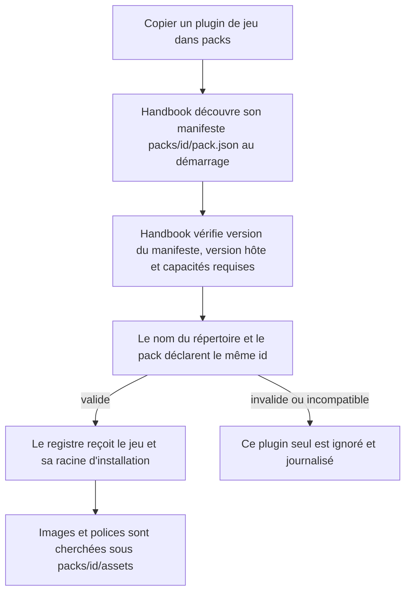
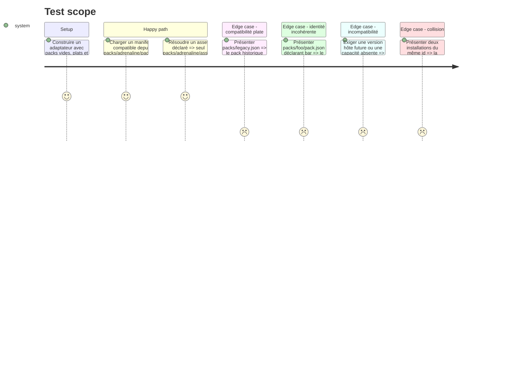

<!-- Fill or omit these sections; never add, rename, or reorder one. -->

# Instruction: Plugins de jeu installables par répertoire

## Architecture projection

> Tree of the final files. ✅ create · ✏️ modify · ❌ delete

```txt
obsidian-handbook/
├── src/
│   ├── BrumesPlugin.ts                     ✏️ transmet la provenance du paquet actif à la résolution des assets
│   └── games/
│       ├── assets.ts                       ✏️ résout les assets d'un paquet installé dans son répertoire confiné
│       ├── capabilities.ts                 ✅ catalogue les capacités de rendu déclaratives fournies par Handbook
│       ├── customPacks.ts                  ✏️ découvre `packs/<id>/pack.json` et conserve `packs/*.json`
│       ├── pluginManifest.ts               ✅ lit et vérifie le manifeste versionné d'un plugin de jeu
│       ├── registry.ts                     ✏️ fusionne des installations portant pack et provenance
│       └── variants.ts                     ✏️ porte la racine d'assets optionnelle dans la registration interne
└── tools/
    └── customPacks.harness.mts             ✏️ couvre dossiers, ordre, identité et confinement des assets
```

## User Journey



## Test Scope



## Tasks to do

### `1)` Découverte des plugins de jeu

> Un sous-répertoire copié dans `packs/` constitue un plugin Handbook autonome, dont `pack.json` est le manifeste déclaratif.

1. Faire évoluer `loadCustomGamePacks` pour lire, à un seul niveau, chaque `<plugin>/packs/<id>/pack.json` en plus des anciens `<plugin>/packs/*.json`.
2. Trier tous les candidats par chemin relatif avant lecture afin de conserver une résolution de collision déterministe.
3. Exiger pour un paquet-répertoire que le basename du dossier soit identique à `pack.id`; refuser et journaliser seulement le candidat incohérent.
4. Réserver le document `GamePack` nu au format plat historique. Pour un plugin-répertoire, lire cette enveloppe exacte dans `pack.json` ; `pack` garde le contrat lu par `readGamePack` :

   ```json
   {
     "manifestVersion": 1,
     "version": "0.1.0",
     "minimumHandbookVersion": "2.6.0",
     "requires": ["block:example", "style:example"],
     "pack": {
       "id": "example",
       "label": "Example",
       "style": {}
     }
   }
   ```

5. Introduire un type interne `InstalledGamePlugin` qui associe le `GamePack` lu, les métadonnées du manifeste et son chemin source, sans ajouter ces informations au format documentaire du jeu.
6. Conserver les garanties actuelles : dossier absent silencieux, JSON fautif isolé, erreur I/O non bloquante, message une fois par candidat.
7. Nommer les nouveaux types et commentaires autour de `GamePlugin`/`InstalledGamePlugin` plutôt que d'étendre l'ambiguïté de « custom pack » ; conserver les anciens noms publics seulement lorsqu'une compatibilité l'impose.

### `2)` Compatibilité avec l'hôte

> Un plugin n'entre dans le registre que si Handbook sait honorer tout ce qu'il annonce.

1. Créer le lecteur de manifeste avec une seule version de protocole acceptée au départ ; refuser les versions inconnues au lieu de les interpréter partiellement.
2. Valider `version` et `minimumHandbookVersion` comme SemVer, puis comparer le minimum à `plugin.manifest.version` sans dépendre d'un accès réseau.
3. Publier un catalogue interne explicite de capacités stables, sans importer `BRUMES_BLOCKS` dans la couche `games` — cet import rebouclerait par `blocks/registry → games/registry` pendant l'initialisation. Faire vérifier par le harnais que les capacités `block:*` correspondent bien aux blocs enregistrés ; les styles structurels, non introspectables depuis le CSS compilé, restent nommés explicitement.
4. Refuser atomiquement un plugin dont une capacité requise manque, en citant la version ou les capacités manquantes dans le journal.
5. Déclarer pour Adrenaline les capacités `block:adrenaline-pj`, `block:adrenaline-pnj`, `block:adrenaline-monstre` et `style:adrenaline` ; ne pas confondre ces capacités d'hôte avec du code fourni par le plugin.

### `3)` Provenance et assets confinés

> La portabilité du dossier ne doit pas dépendre du chemin absolu du coffre.

1. Propager la provenance d'installation dans `GameRegistration` et à travers `initGameRegistry`, sans changer l'identité des tableaux exportés.
2. Pour un plugin-répertoire, résoudre `pack.assets.root` relativement à son répertoire, avec `assets` comme valeur par défaut ; refuser les chemins absolus et traversées `..`. Les noms d'images et de polices se résolvent ensuite sous cette racine confinée.
3. Conserver la résolution actuelle pour les jeux intégrés et les anciens fichiers JSON plats.
4. Dans `BrumesPlugin`, résoudre les assets à partir de la registration active plutôt que du seul `GamePack`, y compris après un changement rapide de mode.

### `4)` Harnais du nouveau contrat d'installation

> Le harnais existant devient la preuve de compatibilité des deux formes d'installation.

1. Étendre le faux adapter avec la liste des sous-répertoires et leurs `pack.json`.
2. Affirmer la découverte, l'ordre, la collision, l'incohérence dossier/id, l'isolation des erreurs, les refus de version/capacité et la compatibilité du format plat.
3. Enregistrer les chemins consultés par la résolution des assets et affirmer qu'un paquet-répertoire ne sort jamais de son `assets/`.
4. Comparer le catalogue explicite des capacités `block:*` aux ids de `BRUMES_BLOCKS` dans le harnais, où les deux couches peuvent être chargées après initialisation, afin qu'un ajout ou retrait de bloc ne les fasse pas dériver silencieusement.

## Test acceptance criteria

| Task | Acceptance criteria |
| ---- | ------------------- |
| 1 | Copier `packs/adrenaline/pack.json` rend le pack disponible au démarrage ; supprimer le répertoire le retire au démarrage suivant. |
| 1 | Un répertoire invalide ou dont le nom diffère de l'id déclaré est ignoré seul et son chemin n'est journalisé qu'une fois par session. |
| 1 | Un fichier historique `packs/legacy.json` continue à être chargé. |
| 2 | Un manifeste de version inconnue, demandant une version future de Handbook ou une capacité absente est refusé en entier avec un diagnostic précis. |
| 2 | Toutes les exigences satisfaites font entrer le plugin exactement une fois dans le registre. |
| 3 | Une image ou police d'un plugin-répertoire est recherchée sous `packs/<id>/assets/` par défaut, ou sous son `assets.root` relatif, sans pouvoir sortir de `packs/<id>/`. |
| 3 | Les jeux intégrés et packs plats gardent leur comportement d'assets actuel. |
| 4 | `npm run assert:custom-packs` couvre les deux formats, leur compatibilité, leurs collisions et leur provenance, et sort vert. |
