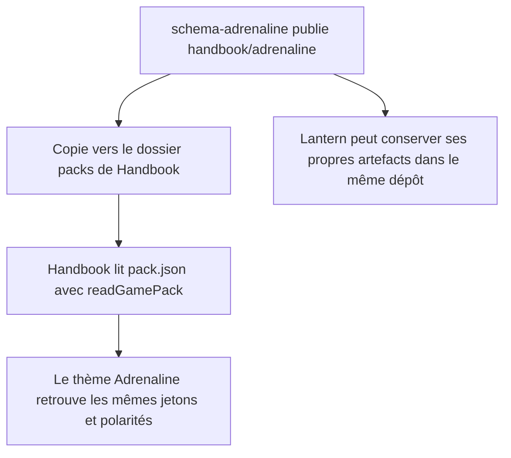
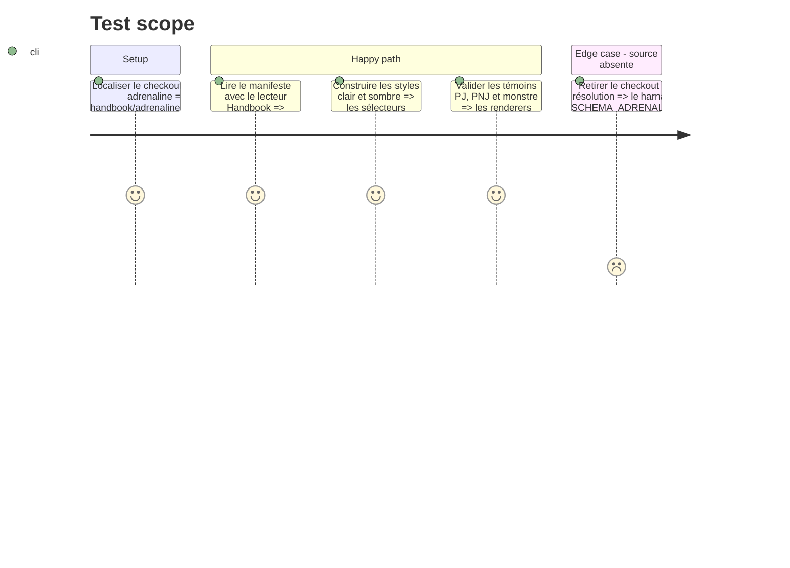

<!-- Fill or omit these sections; never add, rename, or reorder one. -->

# Instruction: Source Adrenaline déplacée dans schema-adrenaline

## Architecture projection

> Tree of the final files. ✅ create · ✏️ modify · ❌ delete

```txt
schema-adrenaline/
├── README.md                               ✏️ décrit les artefacts destinés à Handbook et Lantern
└── handbook/
    └── adrenaline/
        ├── README.md                       ✅ procédure de copie et frontière fonctionnelle
        └── pack.json                       ✅ manifeste canonique versionné et apparence Adrenaline

obsidian-handbook/
├── src/games/
│   ├── adrenaline.ts                      ❌ la copie TypeScript intégrée n'est plus une source concurrente
│   └── registry.ts                        ✏️ retire Adrenaline de DECLARED_GAMES
└── tools/
    ├── assert-adrenaline-theme.mjs         ✏️ localise `schema-adrenaline` comme le harnais source
    ├── assertAdrenalineSource.harness.mts  ✏️ valide aussi le paquet publié par le consommateur Handbook
    └── assertAdrenalineTheme.harness.mts   ✏️ construit le thème depuis le `pack.json` externe
```

## User Journey



## Test Scope



## Tasks to do

### `1)` Publier le paquet canonique

> `schema-adrenaline` devient l'unique source du manifeste du plugin de jeu Adrenaline.

1. Créer `handbook/adrenaline/pack.json`, manifeste déclaratif du plugin de jeu, avec la version de protocole supportée, sa propre version, la version minimale de Handbook, ses quatre capacités requises et un champ `pack`.
2. Dans `pack`, développer exactement les jetons produits aujourd'hui par `accent`, `palette` et `tokens` dans `src/games/adrenaline.ts`.
3. Garder `id: "adrenaline"`, le label, les polarités clair/sombre et toutes les valeurs visuelles actuelles ; n'ajouter ni JavaScript, ni TypeScript, ni CSS exécutable au paquet.
4. Avant de supprimer la source TypeScript, produire son document via `toGamePackDocument` et affirmer une égalité profonde avec le champ `pack` externe ; cette preuve couvre tous les jetons, pas seulement un sous-ensemble structurel.
5. Documenter dans le README local le chemin cible, le redémarrage nécessaire, la suppression comme désinstallation, la compatibilité déclarée et le fait que les parseurs/renderers restent fournis par Handbook.
6. Mettre à jour le README racine de `schema-adrenaline` pour présenter `schemas/` comme contrat partagé, `handbook/` comme artefact installable et réserver `lantern/` aux futurs besoins de Lantern sans créer de dossier vide.

### `2)` Retirer la déclaration intégrée

> Sans copie du paquet, Handbook ne connaît plus le mode Adrenaline.

1. Supprimer l'import et l'entrée `adrenalinePack` de `DECLARED_GAMES`.
2. Supprimer `src/games/adrenaline.ts` afin d'éviter deux sources capables de diverger.
3. Ne supprimer ni les familles `src/features/adrenaline*`, ni les exports TOML, ni `src/styles/adrenaline/` : ils constituent le moteur interne de rendu, pas le paquet installable.

### `3)` Déplacer les preuves vers la source externe

> Les tests doivent échouer si le paquet publié dérive de ce que Handbook sait lire et rendre.

1. Faire localiser `schema-adrenaline` par le harnais de thème avec la même stratégie que `assert-adrenaline-source` et la variable `SCHEMA_ADRENALINE_ROOT`.
2. Lire `handbook/adrenaline/pack.json`, le passer au lecteur de manifeste puis à `readGamePack`, et l'utiliser pour les assertions de polarité et de CSS auparavant fondées sur l'import TypeScript.
3. Étendre l'assertion source pour vérifier les métadonnées du plugin, l'id, le label, les deux polarités et les jetons structurels indispensables aux feuilles PJ, PNJ et monstre.
4. Conserver les validations croisées existantes des exemples et témoins contre les cibles Zod de `schema-adrenaline`.

## Test acceptance criteria

| Task | Acceptance criteria |
| ---- | ------------------- |
| 1 | `schema-adrenaline/handbook/adrenaline/` est copiable tel quel et son `pack.json` reproduit l'apparence Adrenaline claire et sombre actuelle. |
| 1 | Le manifeste annonce une version, un minimum Handbook et toutes les capacités internes nécessaires ; une égalité profonde prouve que son `pack` n'a perdu aucun jeton de la source TypeScript retirée. |
| 1 | Le dépôt explique sans ambiguïté que Handbook et Lantern sont ses consommateurs, sans annoncer un dépôt supplémentaire. |
| 2 | Une installation Handbook sans répertoire Adrenaline ne contient plus `adrenaline` dans `GAME_PACKS`; avec le répertoire copié, elle le contient une fois. |
| 2 | Aucun code externe n'est exécuté et les blocs PJ, PNJ et monstre restent compilés dans Handbook. |
| 3 | `npm run assert:adrenaline-source` et `npm run assert:adrenaline-theme` utilisent le plugin de jeu de `schema-adrenaline` et sortent verts. |
