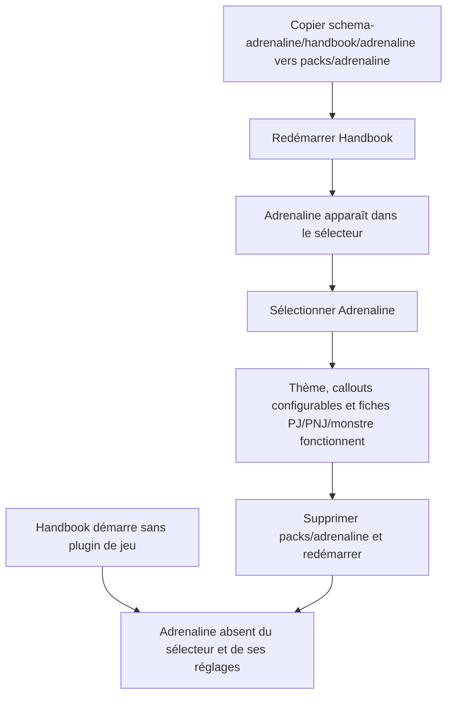
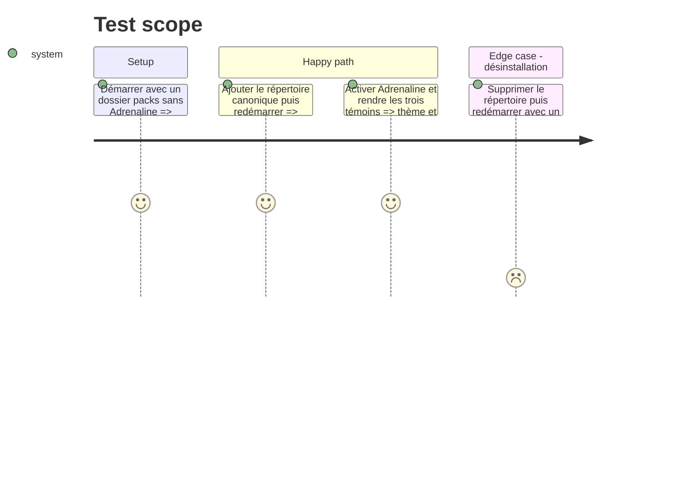

<!-- Fill or omit these sections; never add, rename, or reorder one. -->

# Instruction: Optionalité complète dans Handbook et documentation

## Architecture projection

> Tree of the final files. ✅ create · ✏️ modify · ❌ delete

```txt
obsidian-handbook/
├── README.md                               ✏️ documente installation et désinstallation par copie du répertoire
├── CLAUDE.md                               ✏️ consigne la frontière paquet externe / moteur interne
├── src/
│   ├── features/callouts/types.ts          ✏️ cesse de fermer les scopes sur une liste comprenant Adrenaline en dur
│   ├── features/callouts/migrateAliases.ts ✏️ préserve les scopes sûrs même quand leur plugin est absent
│   └── settings/index.ts                   ✏️ n'affiche les réglages Adrenaline que si le pack est enregistré
└── tools/
    ├── assert-callouts.mjs                  ✏️ couvre un scope fourni par un plugin installé
    ├── assert-settings-ui.mjs               ✏️ exige la visibilité conditionnelle de la section Adrenaline
    └── customPacks.harness.mts              ✏️ prouve les états absent, installé et retiré au redémarrage
```

## User Journey



## Test Scope



## Tasks to do

### `1)` Retirer les surfaces visibles orphelines

> Rien dans l'interface ne doit proposer Adrenaline lorsque son paquet manque.

1. Créer la section de réglages Adrenaline seulement si `findGamePack("adrenaline")` répond ; lorsqu'elle existe, conserver les trois toggles actuels.
2. Ouvrir `CalloutScope` aux identifiants sûrs de jeux au lieu de conserver `adrenaline` dans une union et une constante statiques : accepter `all` ou un id conforme à `isValidGamePackId`, même si son plugin est momentanément absent. La modale continue à proposer uniquement `GAME_PACKS`, mais la normalisation ne détruit pas une configuration qui doit revenir à la réinstallation.
3. Conserver les feature flags Adrenaline dans les réglages pour qu'une désinstallation/réinstallation retrouve les préférences de l'utilisateur.
4. Vérifier que les processeurs de blocs déjà enregistrés rendent leur source brute tant que le mode Adrenaline ne peut pas être actif.
5. Adapter `assert-settings-ui` et `assert-callouts` pour couvrir respectivement la section conditionnelle, un scope provenant d'un plugin installé et la conservation de ce scope pendant une désinstallation.

### `2)` Prouver installation et retrait

> Le cycle complet doit dépendre seulement de la présence du répertoire au démarrage.

1. Ajouter au harnais un démarrage sans pack, un démarrage avec `packs/adrenaline/pack.json`, puis un nouveau démarrage après retrait.
2. Affirmer la présence conditionnelle dans le registre, les classes de mode et la normalisation d'un mode sauvegardé.
3. Affirmer qu'après retrait un mode sauvegardé `adrenaline` retombe sur le jeu par défaut avec le journal existant, sans conserver de classe ni de style Adrenaline.
4. Exécuter les assertions du registre, du thème Adrenaline, des documents Adrenaline et de leur source Zod.

### `3)` Documenter la distribution à dépôt unique

> Le chemin entre la source et le coffre doit être copiable sans interprétation.

1. Ajouter au README Handbook la source `schema-adrenaline/handbook/adrenaline`, la destination `.obsidian/plugins/obsidian-handbook/packs/adrenaline`, puis les étapes redémarrer/sélectionner/supprimer, sous le terme « plugin de jeu Handbook ».
2. Dire explicitement que `schema-adrenaline` sert Handbook et Lantern et qu'aucun second dépôt Adrenaline n'est requis.
3. Documenter la compatibilité des anciens `packs/*.json`, la convention moderne `packs/<id>/pack.json` et la racine locale `assets/`.
4. Mettre à jour la mémoire projet pour définir le cycle de vie du plugin de jeu (découverte au démarrage, activation par sélection, désinstallation par retrait) et distinguer l'optionalité du mode et des données de l'optionalité binaire : le code de rendu Adrenaline reste dans le bundle Handbook.

## Test acceptance criteria

| Task | Acceptance criteria |
| ---- | ------------------- |
| 1 | Sans pack installé, Adrenaline n'apparaît ni dans le sélecteur de jeu ni comme section de réglages, et aucun scope codé en dur n'est requis pour le réinstaller. |
| 1 | Réinstaller le pack restaure les toggles Adrenaline précédemment sauvegardés. |
| 1 | Un callout au scope `adrenaline` reste dans les réglages pendant l'absence du plugin, demeure invisible hors de ce mode, puis redevient utilisable après réinstallation. |
| 2 | Les assertions couvrent successivement absence, installation et retrait ; un mode sauvegardé devenu indisponible revient proprement au défaut. |
| 2 | Les trois renderers Adrenaline et leurs exports TOML restent compatibles avec les schémas de `schema-adrenaline`. |
| 3 | Un lecteur du README peut installer et désinstaller Adrenaline en copiant ou supprimant un seul répertoire, sans créer ni consulter un second dépôt de jeu. |
