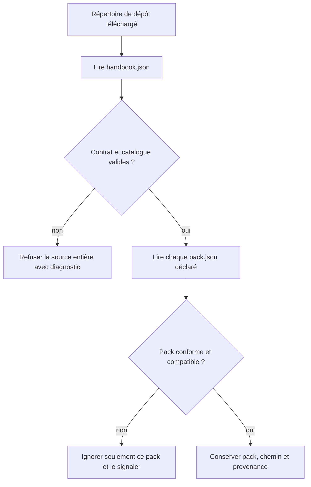
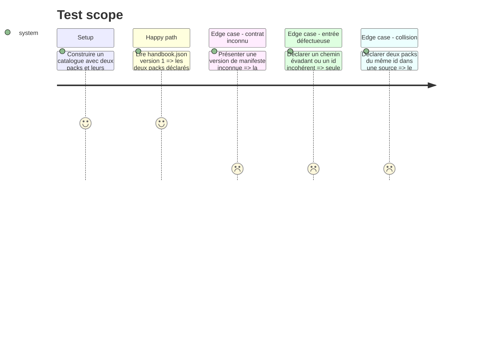

# Instruction: Contrat de dépôt et catalogue

## Architecture projection

> Tree of the final files. ✅ create · ✏️ modify · ❌ delete

```txt
obsidian-handbook/
├── src/games/
│   ├── repositoryManifest.ts              ✅ lit et valide `handbook.json` et son catalogue de packs
│   ├── sources.ts                         ✅ porte les types persistables d’une source et de sa référence
│   ├── pluginManifest.ts                  ✏️ rattache un pack installé à une source et lit ses variantes déclaratives
│   ├── customPacks.ts                     ✏️ découvre les répertoires issus d’une source en plus du format historique
│   ├── registry.ts                        ✏️ conserve provenance et variantes de dépôt dans les registrations
│   └── variants.ts                        ✏️ porte les variantes lues depuis un manifeste de pack externe
├── tools/
│   ├── repositoryManifest.harness.mts     ✅ prouve le contrat racine, ses erreurs isolées et son catalogue multi-pack
│   └── customPacks.harness.mts            ✏️ prouve que les packs provenant d’une source conservent identité et provenance
└── package.json                           ✏️ expose le nouveau harnais à `npm run check`
```

## User Journey



## Test Scope



## Tasks to do

### `1)` Définir le manifeste racine versionné

> Un dépôt de schémas expose un unique catalogue lisible par Handbook, sans dépendre de ses conventions de dossiers implicites.

1. Définir `handbook.json` version 1 : version de manifeste, identité de dépôt, métadonnées de présentation extensibles et tableau de packs déclarés.
2. Pour chaque entrée, exiger un id de pack sûr, un chemin relatif de manifest et une version SemVer ; après lecture, exiger que l’id et la version du `pack.json` correspondent à l’entrée de catalogue ; autoriser des informations d’affichage sans les rendre nécessaires au chargement.
3. Refuser les champs structurants inconnus et les chemins absolus, `..` ou doublons ; produire un diagnostic précis, sans tenter d’interpréter une version future.
4. Séparer le lecteur strict du manifeste racine de `readGamePack`, qui reste le lecteur tolérant du document de jeu lui-même.

### `2)` Modéliser la provenance et les variantes d’une source

> Une registration sait d’où vient son pack, quelle référence l’a produite et où résident ses assets, sans publier ces détails dans le schéma du jeu.

1. Ajouter les types de source : dépôt, clé de stockage dérivée de façon stable et sûre, mode de référence (`latest`, tag, branche), référence demandée, commit/révision résolue, date et état de dernière vérification.
2. Étendre l’enveloppe versionnée `pack.json` avec les variantes visuelles et la variante par défaut aujourd’hui portées par `GameRegistration`, en les validant sans les ajouter au document `GamePack` partagé.
3. Porter l’identité de source, la racine installée et les variantes lues dans l’installation interne, puis dans `GameRegistration`.
4. Préserver la lecture des anciens `packs/*.json` et des packs-répertoires manuels, explicitement marqués comme hérités et sans source distante.
5. Conserver la priorité actuelle des jeux intégrés jusqu’à leur migration de la phase 4 ; documenter les collisions source/source et source/héritage.

### `3)` Prouver le catalogue multi-pack

> La validation d’un dépôt ne laisse jamais un chemin ou une identité non vérifiés entrer dans le registre.

1. Créer un harnais de manifeste avec des fixtures de catalogue multi-pack, versions invalides, chemins dangereux, ids dupliqués et manifeste inconnu.
2. Étendre le harnais des packs pour vérifier la provenance passée au registre et la résolution d’assets confinée au pack déclaré.
3. Ajouter le harnais au vérificateur global afin que le contrat racine soit testé avec tous les changements de format.

## Test acceptance criteria

| Task | Acceptance criteria |
| --- | --- |
| 1 | Un `handbook.json` valide expose plusieurs packs dans l’ordre déclaré, et une version inconnue est refusée avant tout chargement partiel. |
| 1 | Un `pack.json` dont l’id ou la version diffère de son entrée de catalogue est refusé, même si les deux fichiers sont valides isolément. |
| 1 | Aucun chemin de pack ne peut être absolu ni sortir du répertoire de source installé. |
| 2 | Chaque pack venu d’une source enregistrée expose son dépôt, sa référence résolue, sa racine d’assets et ses variantes internes, sans modifier le document public `GamePack`. |
| 2 | Les formats historiques restent découverts avec leur comportement de priorité et d’assets actuel. |
| 3 | Les harnais couvrent catalogue valide, erreurs isolées, doublons et confinement. |
