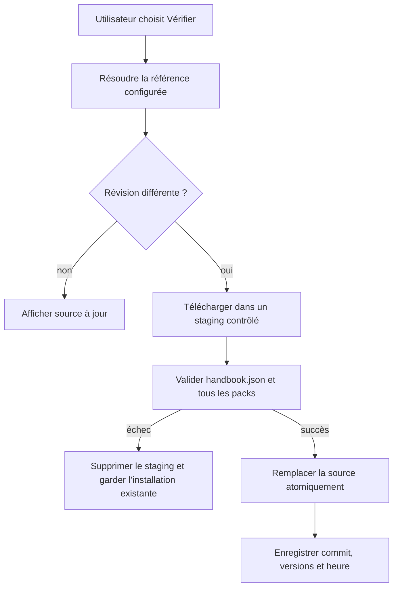
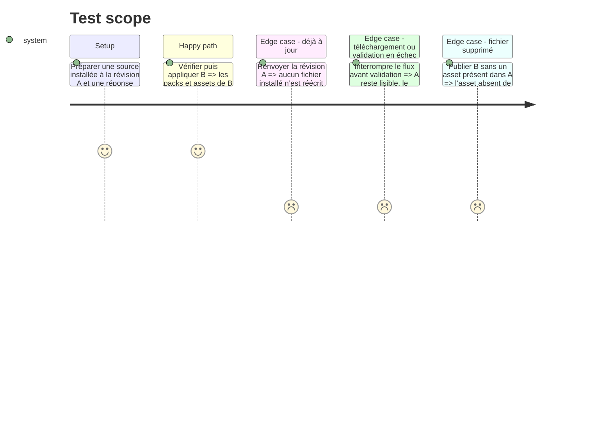

# Instruction: Installation et mise à jour transactionnelles

## Architecture projection

> Tree of the final files. ✅ create · ✏️ modify · ❌ delete

```txt
obsidian-handbook/
├── src/games/
│   ├── githubSources.ts                   ✅ résout releases, tags et branches publiques, puis lit leurs arbres GitHub avec requestUrl
│   ├── sourceInstaller.ts                 ✅ télécharge, valide, prépare et remplace une source atomiquement
│   ├── storage.ts                         ✏️ alloue sources, staging et métadonnées sous le stockage Handbook durable
│   ├── customPacks.ts                     ✏️ charge les packs installés par source sans scanner le réseau
│   └── sources.ts                         ✏️ persiste le résultat de l’installation et les diagnostics actionnables
├── tools/
│   ├── sourceInstaller.harness.mts        ✅ couvre téléchargement simulé, staging, remplacement et reprise après échec
│   ├── githubSources.harness.mts          ✅ couvre les réponses GitHub nécessaires sans accès réseau réel
│   └── gameStorage.harness.mts            ✏️ prouve les nouveaux chemins et la conservation des données existantes
└── package.json                           ✏️ exécute les nouveaux harnais dans check
```

## User Journey



## Test Scope



## Tasks to do

### `1)` Ajouter les emplacements gérés par source

> Les données téléchargées sont isolées des overrides et de l’ancien dossier de packs.

1. Étendre les chemins durables sous `<configDir>/handbook/` avec une racine `sources/<source-id>/`, un répertoire de staging contrôlé et les métadonnées de source.
2. Conserver `packs/` et `overrides.json` comme formats hérités ; ne jamais supprimer ni fusionner du contenu considéré personnel.
3. Réutiliser les primitives adapter existantes pour création, copie, renommage et nettoyage best-effort, avec une récupération sûre après interruption.

### `2)` Résoudre et matérialiser les références GitHub publiques

> Une référence de source devient une révision immuable et un contenu téléchargeable, sans accès direct à BRAT ni exécution externe.

1. Employer `requestUrl` pour consulter l’API GitHub, résoudre une release, un tag ou une branche vers un commit, puis lire son arbre et les contenus bruts nécessaires.
2. Définir les modes : dernière release publiée, tag/release explicitement choisi et branche suivie ; mémoriser le commit résolu dans les trois cas.
3. Lire d’abord `handbook.json`, puis les manifestes déclarés, puis seulement les images et polices que ces manifestes référencent ; ne jamais décompresser une archive distante dans le client.
4. Borner explicitement nombre de fichiers, taille individuelle et taille cumulée, refuser les types et chemins non autorisés, et gérer réponses non réussies ou limites de débit sans modifier l’installation locale.
5. Limiter la première version aux dépôts publics et ne jamais stocker de jeton ; le support privé reste une extension explicitement séparée.

### `3)` Installer comme une transaction

> Une mise à jour de design est un remplacement intégral, jamais une copie partielle ou une fusion silencieuse.

1. Matérialiser dans un staging sous contrôle de Handbook uniquement le catalogue, les manifestes et les assets déclarés, après les limites de sûreté du client GitHub.
2. Lire le manifeste racine et l’ensemble de son catalogue depuis ce staging avant de toucher à l’installation active.
3. Une fois validé, renommer l’installation précédente en sauvegarde transitoire, promouvoir le staging et nettoyer la sauvegarde ; restaurer l’ancienne en cas d’échec de promotion.
4. Ne persister la révision, les versions de packs et le succès de vérification qu’après promotion complète.

### `4)` Tester les échecs aussi sérieusement que la mise à jour

> Une coupure réseau, une release incorrecte ou un asset retiré ne doit jamais laisser un jeu à moitié installé.

1. Isoler le client GitHub derrière une interface injectable et fournir des réponses de test déterministes.
2. Prouver l’absence de réécriture quand la révision est identique, la conservation de l’ancienne source après échec, le nettoyage du staging et la suppression des fichiers retirés par une release valide.
3. Étendre le harnais de stockage avec les migrations existantes et les nouveaux répertoires source.

## Test acceptance criteria

| Task | Acceptance criteria |
| --- | --- |
| 1 | Le stockage de sources ne touche ni aux overrides ni aux packs historiques et survit à une mise à jour de Handbook. |
| 2 | Les trois modes de référence donnent une révision mémorisée ; une erreur réseau, un arbre trop volumineux ou un contenu GitHub interdit conserve l’installation précédente. |
| 3 | Un remplacement valide est atomique du point de vue du prochain chargement, et les fichiers retirés ne subsistent pas. |
| 4 | Les tests simulent état à jour, mise à jour, archive invalide, panne et reprise sans réseau réel. |
