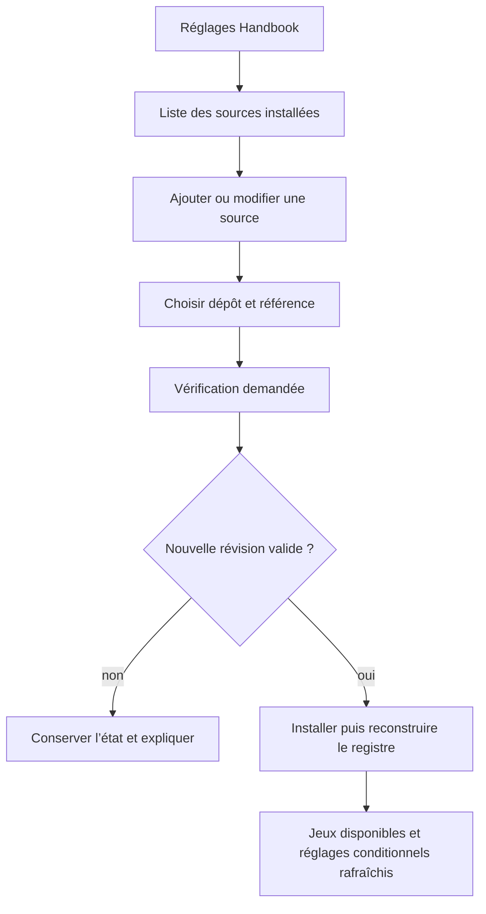
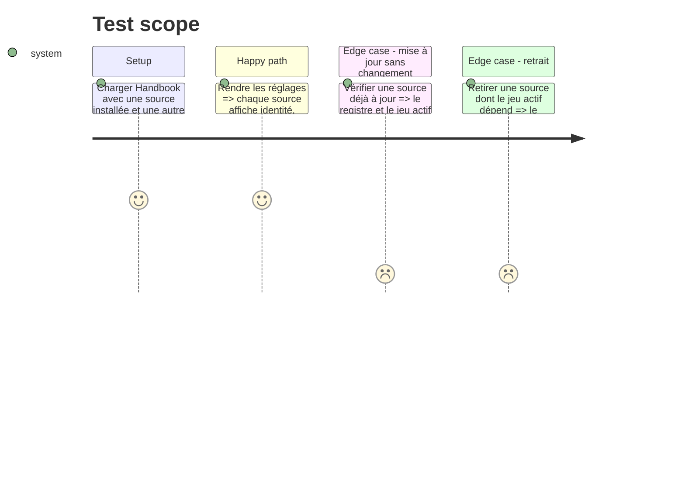

# Instruction: Réglages et cycle de vie des sources

## Architecture projection

> Tree of the final files. ✅ create · ✏️ modify · ❌ delete

```txt
obsidian-handbook/
├── src/
│   ├── BrumesPlugin.ts                     ✏️ recharge registre, styles et réglages après une installation explicitement demandée
│   ├── settings/
│   │   ├── index.ts                        ✏️ ajoute la section Sources de schémas et conserve les sections de jeux conditionnelles
│   │   └── sourceModal.ts                  ✅ saisit ou modifie dépôt et référence sans fournir de choix de starter kit
│   └── games/
│       └── sources.ts                      ✏️ expose des opérations de vérification et d’installation adaptées à l’UI
├── tools/
│   ├── settingsSources.harness.mts         ✅ vérifie la structure de la section et les états affichables
│   └── customPacks.harness.mts             ✏️ prouve le rechargement du registre après installation et retrait de source
└── package.json                            ✏️ lance les assertions de réglages de sources
```

## User Journey



## Test Scope



## Wireframe

```txt
┌──────────────────────────────────────────────────────────────────┐
│ (1) Handbook settings                                              │
├──────────────────────────────────────────────────────────────────┤
│ (2) Active game                                                    │
│     [ game selector                                                ]│
├──────────────────────────────────────────────────────────────────┤
│ (3) Schema sources                              [ add source ]     │
│  ┌──────────────────────────────────────────────────────────────┐ │
│  │ (4) Source card                                               │ │
│  │ repository · selected reference · installed revision           │ │
│  │ packs from this source · state              [ check ] [ edit ] │ │
│  └──────────────────────────────────────────────────────────────┘ │
├──────────────────────────────────────────────────────────────────┤
│ (5) Existing game and feature settings                            │
└──────────────────────────────────────────────────────────────────┘
```

## Tasks to do

### `1)` Faire des sources un réglage durable

> Les références choisies par l’utilisateur survivent au redémarrage, mais aucune requête ne part pendant le chargement du plugin.

1. Ajouter les sources à `BrumesSettings`, avec normalisation stricte, migration des données existantes et déduplication par dépôt.
2. Ne stocker que dépôt, mode de suivi et référence demandée dans les réglages ; conserver révisions et inventaire installés dans les métadonnées de stockage.
3. Garder un Handbook sans source fonctionnel, avec registre neutre et lecture sûre des anciens réglages de mode.

### `2)` Concevoir les contrôles de sources

> La page de réglages montre l’état réel des sources et laisse l’utilisateur initier chaque vérification.

1. Ajouter une section consacrée aux sources avant les réglages dépendant d’un jeu.
2. Créer la modale de création/édition avec dépôt GitHub, dernière release, tag ou branche ; valider les entrées avant toute opération réseau.
3. Afficher pour chaque source sa référence demandée, sa dernière révision installée, tous les packs connus, l’état et les erreurs actionnables ; tous les packs d’une source validée sont installés dans cette première version.
4. Relier les boutons d’ajout, vérification, application de mise à jour et retrait aux services de phase 2, avec notices de succès et d’échec.
5. Ne proposer aucun choix de starter kit ici : les starter kits sont choisis par l’archive GitHub téléchargée avant l’installation.

### `3)` Recharger Handbook sans redémarrage

> Après une installation réussie, les jeux et leurs assets deviennent immédiatement sélectionnables sans laisser d’état de style ancien.

1. Extraire du `onload` la préparation du stockage et la reconstruction du registre dans une opération réutilisable.
2. Après promotion ou retrait de source, normaliser les réglages, reconstruire le registre, réappliquer le style actif, recharger les assets et rafraîchir les vues Markdown et la page de réglages.
3. Si le jeu actif a disparu, utiliser l’état neutre ou le premier pack disponible plutôt qu’un identifiant intégré en dur.
4. Préserver les préférences de parser, variantes et callouts afin qu’elles réapparaissent quand leur pack revient.

### `4)` Vérifier la surface sans navigateur fragile

> Les assertions maintiennent la structure et les invariants de l’UI sans imiter une application Obsidian complète.

1. Ajouter un harnais ciblant les libellés, l’ordre des sections et les gardes de disponibilité à partir du TypeScript des réglages.
2. Étendre les tests de packs pour les cycles source absente, installée, mise à jour et retirée, avec un mode sauvegardé devenu indisponible.

## Test acceptance criteria

| Task | Acceptance criteria |
| --- | --- |
| 1 | Un redémarrage restaure la liste de sources et ne déclenche aucun contrôle réseau. |
| 2 | Chaque source offre l’ajout, l’édition et la vérification volontaire de sa référence, avec un diagnostic de réussite ou d’échec. |
| 3 | Une source installée ou retirée actualise immédiatement la liste des jeux, les styles et les réglages conditionnels sans redémarrer Handbook. |
| 4 | Les tests couvrent source vide, à jour, mise à jour appliquée et retrait du jeu actif. |
