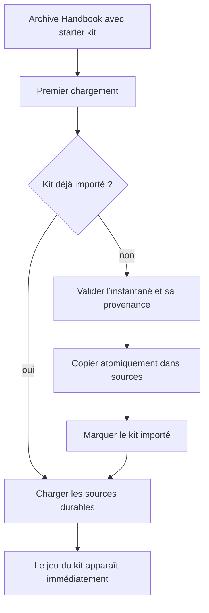
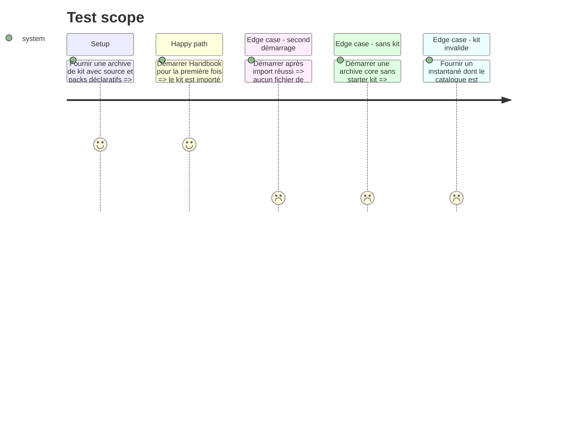

# Instruction: Jeux externalisés et bootstrap de starter kit

## Architecture projection

> Tree of the final files. ✅ create · ✏️ modify · ❌ delete

```txt
obsidian-handbook/
├── src/
│   ├── BrumesPlugin.ts                     ✏️ importe un starter kit intégré une seule fois avant de charger le registre
│   ├── games/
│   │   ├── registry.ts                     ✏️ retire DECLARED_GAMES, son défaut codé en dur et accepte l’état sans jeu
│   │   ├── storage.ts                      ✏️ distingue l’import de starter kit des mises à jour de sources
│   │   ├── starterKits.ts                  ✅ valide et importe l’instantané embarqué avec sa provenance
│   │   ├── city-of-mist.ts                 ❌ remplace les données de pack intégrées par le pack du dépôt de schéma
│   │   ├── legend-in-the-mist.ts           ❌ remplace les données de pack intégrées par le pack du dépôt de schéma
│   │   └── otherscape.ts                   ❌ remplace les données de pack intégrées par le pack du dépôt de schéma
│   ├── settings/types.ts                   ✏️ normalise correctement l’absence initiale de pack
│   └── features/                           ✏️ garde les renderers et styles hôte inactifs sans le pack qui les déclare
├── starter-kits/
│   ├── catalog.json                        ✅ liste les kits de build et les révisions de dépôts qui les composent
│   └── README.md                           ✅ décrit le format d’instantané produit, non éditable à la main
├── tools/
│   ├── starterKits.harness.mts             ✅ prouve l’import unique, l’idempotence et la provenance
│   ├── assert-game-variants.mjs            ✏️ retire l’hypothèse de jeux intégrés permanents
│   └── assert-settings-ui.mjs              ✏️ couvre l’état neutre et le premier jeu issu d’un kit
└── package.json                            ✏️ inclut les assertions de starter kit
```

## User Journey



## Test Scope



## Tasks to do

### `1)` Sortir les données et assets de jeu de Handbook

> Les jeux historiques deviennent des packs publiés par leurs dépôts de schémas, sans supprimer le moteur de rendu qui sait honorer leurs capacités.

1. Dans les dépôts `schema-in-the-mist`, `schema-pbta` et `schema-adrenaline`, ajouter ou normaliser le catalogue `handbook.json`, les `pack.json` et les assets de design de chaque pack.
2. Migrer les valeurs de style, variantes (dont `otherscapeVariants`), formes et assets de `city-of-mist.ts`, `legend-in-the-mist.ts`, `otherscape.ts` et des assets Handbook vers ces packs ; conserver les licences avec les fichiers déplacés.
3. Laisser dans Handbook uniquement les renderers, parseurs, tokens CSS structurels et capacités d’hôte ; ils restent inactifs quand aucun pack ne les déclare.
4. Retirer les trois données de packs TypeScript et tout asset de jeu dont la source canonique est désormais le dépôt de schéma.

### `2)` Autoriser Handbook sans jeu intégré

> Le moteur n’invente plus City of Mist comme solution de repli lorsque le catalogue est vide.

1. Remplacer `DECLARED_GAMES` et `DEFAULT_GAME_PACK_ID` par un état neutre, puis adapter résolution de jeu, classes DOM, styles, réglages et processeurs de blocs à cet état.
2. Conserver les anciennes valeurs de `mode` dans les réglages sans crash ; lorsqu’un pack manque, ne pas appliquer son style et indiquer qu’il peut être restauré en réinstallant sa source.
3. Vérifier que les renderers de jeux absents laissent leur contenu brut ou leurs fallbacks existants et qu’aucun scope de callout sauvegardé n’est détruit.

### `3)` Importer un starter kit exactement une fois

> Une archive de distribution est immédiatement utile, mais n’écrase jamais les décisions ou mises à jour ultérieures de l’utilisateur.

1. Définir le catalogue de build des starter kits : identifiant, sources/révisions figées, pack actif initial et métadonnées de provenance.
2. Prévoir dans l’archive un instantané de contenu source identique à une installation distante validée, sans code exécutable.
3. Au premier démarrage seulement, valider l’instantané puis l’installer à travers le même mécanisme transactionnel que la phase 2 ; écrire un marqueur d’import uniquement après succès.
4. Sélectionner le pack initial du kit si aucun mode utilisable n’est déjà sauvegardé ; ne jamais remplacer un choix existant.

### `4)` Prouver la déliaison complète

> Une build core et une build avec kit exposent des comportements intentionnellement différents, tous deux sûrs.

1. Ajouter des fixtures de kit valides, vides et invalides sans télécharger de dépôt réel.
2. Tester premier lancement, second lancement, échec d’import, absence de kit et retrait ultérieur d’une source importée.
3. Mettre à jour les assertions de variantes, de styles Adrenaline et des réglages pour lire des packs fixtures plutôt que les constantes TypeScript supprimées.

## Test acceptance criteria

| Task | Acceptance criteria |
| --- | --- |
| 1 | Les packs, assets et variantes de chaque jeu migré sont canoniquement publiés par un dépôt de schéma, tandis que Handbook ne contient plus leur donnée de design. |
| 2 | Une build sans kit démarre sans jeu, sans style de jeu ni erreur, et une ancienne préférence de mode manquante est sûre. |
| 3 | Une build avec kit rend immédiatement son jeu initial, puis ne réimporte jamais le snapshot après une mise à jour ou modification de source. |
| 4 | Les tests couvrent précisément core vide, import initial, redémarrage, kit invalide et retrait. |
