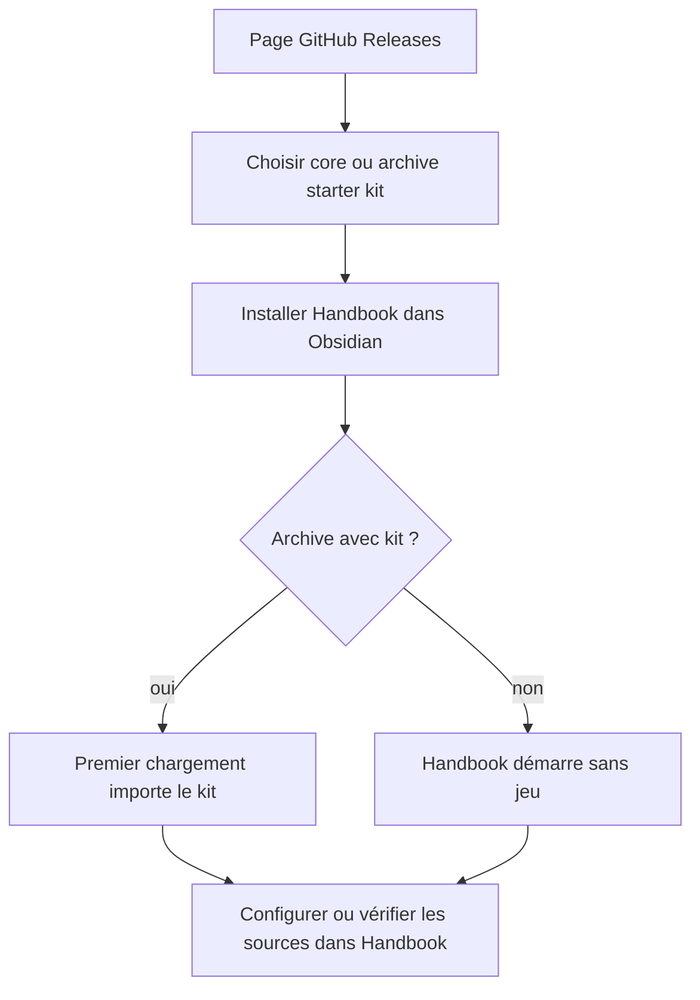
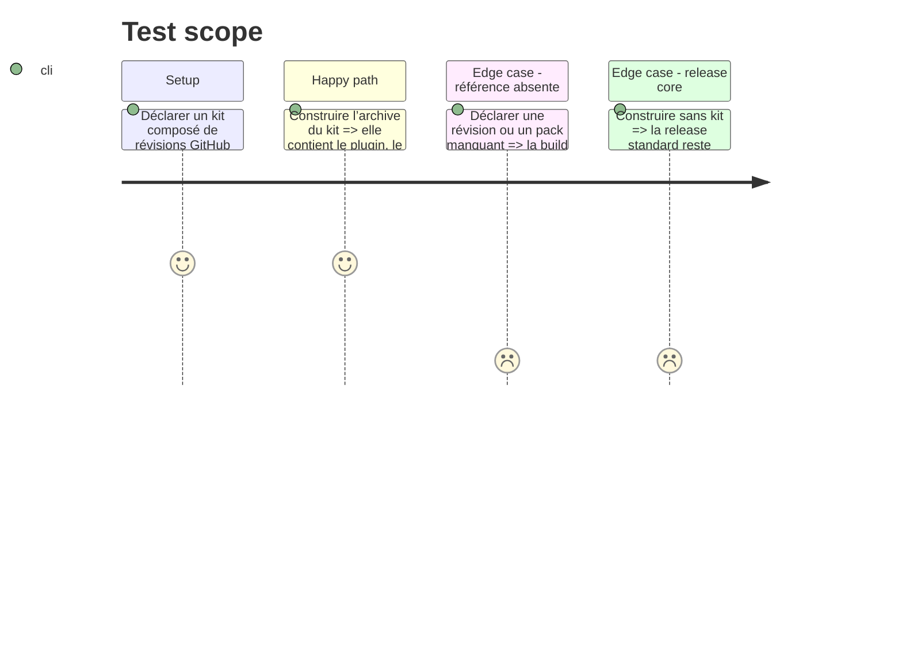

# Instruction: Variantes GitHub, documentation et preuve

## Architecture projection

> Tree of the final files. ✅ create · ✏️ modify · ❌ delete

```txt
obsidian-handbook/
├── .github/workflows/
│   ├── ci.yml                              ✏️ vérifie les catalogues et starter kits figés avec les dépôts nécessaires
│   └── release.yml                         ✏️ construit une archive téléchargeable par starter kit et la release core
├── tools/
│   ├── buildStarterKit.mjs                 ✅ matérialise un snapshot de sources à partir des révisions déclarées
│   ├── assertStarterKitBuild.mjs           ✅ vérifie les archives et leur provenance avant publication
│   └── check.mjs                           ✏️ ne dépend plus exclusivement de schema-adrenaline pour valider Handbook
├── compat/
│   └── schema-adrenaline.ref               ❌ remplace le pin unique par les références de catalogues de starter kits
├── README.md                               ✏️ explique core, starter kits, sources, références et mise à jour volontaire
├── CHANGELOG.md                            ✏️ annonce la migration et les chemins hérités conservés
├── aidd_docs/project/                      ✏️ mémorise le contrat de dépôt, les limites de confiance et la distribution
└── package.json                            ✏️ expose la construction et les assertions de release
```

## User Journey



## Test Scope



## Tasks to do

### `1)` Construire les archives GitHub par starter kit

> GitHub prépare les fichiers avant téléchargement ; aucun script de release ne s’exécute chez l’utilisateur.

1. Faire lire à la CI le catalogue de starter kits et cloner chaque dépôt à la révision déclarée.
2. Vérifier manifestes, chemins, licences et contenu avant de copier les sources dans le staging de l’archive.
3. Construire la release core habituelle et une archive ZIP nommée par starter kit, contenant les trois fichiers Obsidian et son répertoire d’instantané.
4. Joindre toutes les archives à la même release GitHub, avec les sommes ou digests produits par la plateforme ; ne pas modifier le tag après la construction.

### `2)` Réviser la CI et les contrôles de compatibilité

> Les tests ne présument plus qu’Adrenaline est l’unique schéma externe ni que chaque checkout possède les mêmes données.

1. Remplacer `compat/schema-adrenaline.ref` par les références déclarées dans le catalogue de kits et par des fixtures locales appropriées.
2. Faire vérifier par CI le core sans kit, chaque kit annoncé et les assertions de contrat de dépôt, installation et bootstrap.
3. Garder les tests de compatibilité Adrenaline lorsque son kit/référence le demande, sans bloquer la build core sur un jeu non embarqué.

### `3)` Documenter la nouvelle distribution

> Le choix d’un starter kit se fait sur GitHub ; l’application explique ensuite seulement la gestion des sources installées.

1. Réécrire l’installation README pour distinguer archive core et archives starter kits, leurs premiers démarrages et la compatibilité avec BRAT pour le core.
2. Documenter le format de dépôt public, le manifeste `handbook.json`, les modes de référence, la vérification manuelle et l’absence de code externe.
3. Expliquer la migration des copies manuelles dans `packs/`, la séparation des overrides et les limitations initiales : dépôts publics, pas de sélection partielle ni de jeton.
4. Enregistrer dans la mémoire projet le rôle de chaque dépôt de schéma et la règle selon laquelle leurs assets constituent la source de vérité.

### `4)` Préparer une migration lisible

> Les utilisateurs existants peuvent préserver leur rendu et comprendre clairement ce qui change.

1. Ajouter des notes de version pour les packs intégrés devenus starter kits/sources, les packs manuels hérités et les éventuelles étapes d’import initial.
2. Ne supprimer les chemins historiques ou fichiers de compatibilité qu’après que leurs lecteurs et leur documentation ont une voie de remplacement vérifiée.
3. Exécuter `npm run check` sur core et chaque kit, puis une installation manuelle fraîche de chaque archive avant publication.

## Test acceptance criteria

| Task | Acceptance criteria |
| --- | --- |
| 1 | Chaque archive starter kit de la release contient un plugin installable et seulement les sources/révisions que son catalogue déclare. |
| 1 | La release core reste une distribution sans starter kit et aucun hook client n’est requis. |
| 2 | La CI valide séparément core, contrats de dépôts et toutes les variantes de starter kits avant d’attacher les assets. |
| 3 | La documentation permet de choisir une archive sur GitHub, d’identifier la source installée et de mettre à jour volontairement sans consulter BRAT. |
| 4 | Les utilisateurs de packs copiés et les utilisateurs de distributions précédentes disposent d’un parcours de migration non destructif. |
